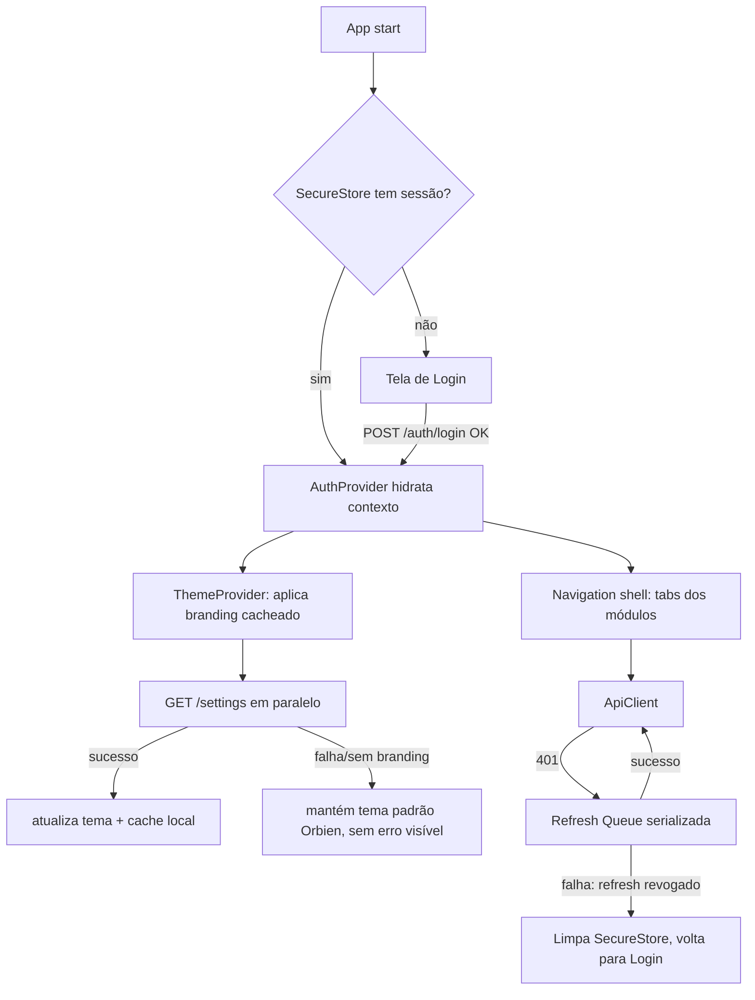

# App Mobile — Design (MOB-01, MOB-02, MOB-03, MOB-11, MOB-12)

**Spec**: `.specs/features/app-mobile/spec.md`
**Status**: Draft
**Escopo desta rodada de Design**: autenticação (MOB-01), refresh serializado
(MOB-02), tema por tenant (MOB-03), scaffold do workspace (MOB-11) e
config dinâmica de identidade multi-variante (MOB-12). Os módulos de
domínio (escala, conteúdo/push, celebrações, PG — MOB-04 a MOB-10) ficam
para uma rodada de Design própria, quando entrarem em Tasks.

---

## Approach Exploration

A decisão que mais afeta o resto do app é **como o app fala com a API e
guarda sessão**, porque tema (MOB-03), OneSignal (MOB-07, fora desta rodada)
e todo módulo de domínio dependem disso.

### Opção A — Espelhar o padrão do `apps/web` (fila de refresh no cliente axios)

Réplica do interceptor de `apps/web/src/lib/api.ts`: instância axios com
interceptor de response, `isRefreshing`/`failedQueue`, 401 dispara refresh
único e reexecuta a fila. Único ajuste: o mobile fala **direto com a API**
(`Authorization: Bearer`), sem rota Next intermediária — o web usa
`/api/session/refresh` porque só o servidor Next vê o cookie; o mobile não
tem essa camada, então o próprio interceptor chama `POST /auth/refresh` e
regrava o `expo-secure-store` diretamente.

- **Prós**: mesmo princípio já validado em produção (`apps/web`); zero
  padrão novo a aprender; a spec (Assumptions, linha "Renovação de sessão")
  já aponta essa direção.
- **Contras**: nenhum specífico a RN — `expo-secure-store` é assíncrono
  (Promise-based), então o interceptor precisa `await` a leitura/escrita,
  diferente do cookie automático do browser; é só adaptação, não redesenho.

### Opção B — Biblioteca de auth dedicada (ex.: `react-query` + `axios` com
retry via plugin de terceiros)

- **Prós**: menos código próprio para manter a fila.
- **Contras**: `CLAUDE.md` já registra que `@tanstack/react-query` está no
  `package.json` do monorepo mas **não é o padrão usado** em nenhum app
  (web busca dado com `useEffect` + axios) — introduzir react-query só no
  mobile cria um terceiro padrão de data-fetching no monorepo sem
  necessidade. Rejeitada por inconsistência deliberada com a convenção já
  registrada.

### Opção C — Delegar renovação ao interceptor nativo do Expo (`expo-auth-session`)

- **Contras**: `expo-auth-session` é desenhado para OAuth/OIDC (fluxo de
  authorization code com IdP externo); o Orbien usa login próprio
  (email+senha+tenant_slug) contra `POST /auth/login` — não há IdP para
  esse fluxo se encaixar. Rejeitada por não corresponder ao protocolo real.

**Recomendação: Opção A.** É a única que reaproveita um padrão já
comprovado no monorepo (mesmo princípio de fila serializada) e não introduz
dependência nova. Confirmado como a direção a seguir para MOB-01/02.

---

## Architecture Overview



`app.config.js` (MOB-12) roda em **build time** (resolve identidade do
profile) e expõe o resultado em runtime via `Constants.expoConfig.extra` —
não faz parte do fluxo de runtime acima, é a camada abaixo de tudo isso.

---

## Code Reuse Analysis

`apps/api` e os fronts são deploys independentes (regra do monorepo:
"Nada que rode na Vercel deve importar código de `apps/api`") — o mobile
segue a mesma regra. Reuso aqui é de **contrato**, não de código importado:

| Contrato de origem | Localização (fonte da verdade) | Como o mobile reusa |
| --- | --- | --- |
| `LoginDto` / resposta de login | `apps/api/src/auth/` (`POST /auth/login` → `{access_token, refresh_token, expires_in}`) | Mobile define `LoginResponse` local com os mesmos campos — sem importar o DTO do Nest. |
| `JwtPayload` (claims) | `apps/api/src/auth/` | Mobile não decodifica o JWT para lógica de negócio (evita duplicar regra que é do backend); só lê `expires_in` para agendar refresh preventivo. |
| `POST /auth/refresh` (`RefreshDto`) | `apps/api/src/auth/` | Interceptor da Opção A chama essa rota com o `refresh_token` do SecureStore. |
| `ResolvedSettings` (branding) | `apps/api/src/settings/settings.service.ts:13-28`, `GET /settings` | Mobile define `Branding` local espelhando `branding: {app_name, primary_color, logo_url, splash_url}`. Confirmado: `GET /settings` **não** tem `@Roles` (`settings.controller.ts:30`) — qualquer usuário autenticado pode chamar, inclusive membro comum; não há bloqueio a resolver aqui. |
| Padrão de fila de refresh | `apps/web/src/lib/api.ts:34-64` | Mesma máquina de estados (`isRefreshing`/`failedQueue`), adaptada para `expo-secure-store` assíncrono e `Authorization: Bearer` em vez de cookie. |

### Integration Points

| Sistema | Método de integração |
| --- | --- |
| `apps/api` `POST /auth/login`, `POST /auth/refresh`, `POST /auth/logout` | HTTPS direto, `Authorization: Bearer <access_token>` nas chamadas autenticadas; login/refresh não levam esse header (ainda não há token). |
| `apps/api` `GET /settings` | Mesma auth Bearer; chamada assim que o `AuthProvider` hidrata, em paralelo à navegação (não bloqueia o shell). |
| EAS (`eas.json`) | Build profiles resolvem `extra` que `app.config.js` lê — sem chamada de rede, é resolução em build time. |

---

## Components

### `AuthClient` (biblioteca interna, não UI)

- **Purpose**: login, logout, guarda de sessão em `expo-secure-store`, fila
  de refresh serializada (Opção A).
- **Location**: `apps/mobile/src/lib/auth/auth-client.ts`
- **Interfaces**:
  - `login(tenantSlug: string, email: string, password: string): Promise<Session>`
  - `logout(): Promise<void>` — chama `POST /auth/logout` best-effort, sempre limpa o SecureStore mesmo se a chamada falhar (não pode deixar o usuário preso logado localmente).
  - `getValidAccessToken(): Promise<string>` — usado pelo `ApiClient`; dispara refresh se expirado, aguarda se um refresh já está em andamento.
- **Dependencies**: `expo-secure-store`, `ApiClient` (chamada crua sem interceptor para as próprias rotas de auth, para não recursar).
- **Reuses**: máquina de estados de `apps/web/src/lib/api.ts:34-64`.

### `ApiClient`

- **Purpose**: cliente HTTP único do app, injeta `Authorization: Bearer`,
  intercepta 401 e delega ao `AuthClient` para renovar + repetir a request original.
- **Location**: `apps/mobile/src/lib/api/client.ts`
- **Interfaces**: `get/post/patch/delete<T>(path, opts): Promise<T>`
- **Dependencies**: `AuthClient`, `Constants.expoConfig.extra.apiUrl` (config, nunca URL hardcoded — mesmo princípio do MOB-12 aplicado à API URL, que também varia por ambiente).
- **Reuses**: mesmo formato de erro que os fronts já tratam (`403` vs. lista vazia — ver Edge Cases da spec).

### `ThemeProvider`

- **Purpose**: aplica `primary_color`/`logo_url` do tenant no shell de
  navegação; evita flash do tema padrão ao reabrir o app (spec MOB-03, AC 3).
- **Location**: `apps/mobile/src/lib/theme/theme-provider.tsx`
- **Interfaces**: `useTheme(): { primaryColor, logoUrl, appName }`
- **Dependencies**: `expo-secure-store` (ou `AsyncStorage` — decisão abaixo em Tech Decisions) para cache local do último branding resolvido; `ApiClient` para `GET /settings`.
- **Reuses**: shape de `ResolvedSettings.branding` (`apps/api/src/settings/settings.service.ts`); fallback documentado no próprio backend (congregação → `branding_configs` → nenhum).

### `app.config.js` + `eas.json` (MOB-12)

- **Purpose**: identidade do app (nome, ícone, bundle id/applicationId,
  scheme, `oneSignalAppId`) resolvida por build profile, nunca hardcoded em
  componente/tela.
- **Location**: `apps/mobile/app.config.js`, `apps/mobile/eas.json`
- **Interfaces**: função `export default ({config}) => ({...config, name, ios, android, extra})`; v1 tem um único profile (`generic`) que resolve para os valores padrão Orbien quando nenhuma env de tenant está setada (spec MOB-12, AC 2).
- **Dependencies**: nenhuma chamada de rede — só `process.env` no momento do build/`expo start`.
- **Reuses**: nada do resto do monorepo (é o primeiro app do workspace a precisar disso — os outros três usam `NEXT_PUBLIC_*` estático, que não serve aqui porque precisa variar o *nome do app na loja*, não só uma env de runtime).

### Navigation shell

- **Purpose**: tab bar com os módulos do escopo (Escala, Conteúdo,
  Celebrações, Grupos) — só o esqueleto nesta rodada, telas de domínio ficam
  para a próxima rodada de Design (MOB-04+).
- **Location**: `apps/mobile/src/app/` (Expo Router, ver Tech Decisions)
- **Dependencies**: `AuthProvider`, `ThemeProvider`.

---

## Data Models

```typescript
// apps/mobile/src/lib/auth/types.ts
interface LoginResponse {
  access_token: string
  refresh_token: string
  expires_in: number // segundos; hoje 900 no backend
}

interface Session {
  accessToken: string
  refreshToken: string
  accessTokenExpiresAt: number // epoch ms, calculado no cliente a partir de expires_in
}

// apps/mobile/src/lib/theme/types.ts
interface Branding {
  app_name: string | null
  primary_color: string | null
  logo_url: string | null
  splash_url: string | null
}
```

**Relationships**: `Session` vive só no `expo-secure-store` (nunca em
memória JS persistente entre cold starts, nunca em `AsyncStorage`, conforme
Assumptions da spec). `Branding` é cacheado em `AsyncStorage` (não precisa
do Keychain — não é segredo) para permitir reaplicar antes da rede
responder (spec MOB-03, AC 3).

---

## Error Handling Strategy

| Error Scenario | Handling | User Impact |
| --- | --- | --- |
| 401 em chamada autenticada, refresh ainda válido | `AuthClient` renova 1x, `ApiClient` repete a request original | Transparente — usuário não percebe |
| 401 em chamada autenticada, refresh revogado/expirado | `AuthClient` limpa SecureStore, `ApiClient` propaga um erro tipado `SessionExpiredError` | App navega para Login |
| `GET /settings` falha (rede ou erro 5xx) | `ThemeProvider` mantém o branding cacheado (ou o padrão Orbien se nunca houve cache) | Sem erro visível — spec MOB-03 AC 2 |
| Sem internet no cold start | `ApiClient` propaga erro de rede distinto de erro de auth | Tela de erro de rede explícita (Edge Cases da spec), nunca tela vazia |
| Duas chamadas expiram junto | Fila do `AuthClient` serializa: a segunda aguarda a Promise da primeira em vez de disparar novo refresh | Transparente |

---

## Risks & Concerns

| Concern | Location (file:line) | Impact | Mitigation |
| --- | --- | --- | --- |
| `expo-secure-store` é assíncrono; um bug de ordenação (ler token antes de gravar) reabriria o mesmo tipo de race que a fila serializada existe para evitar | `apps/mobile/src/lib/auth/auth-client.ts` (a criar) | Duas requests concorrentes poderiam dobrar-refresh e derrubar a família de refresh no backend (mesmo efeito que o Edge Case da spec já cobre) | A fila (Opção A) precisa serializar pelo **estado em memória** (`isRefreshing`), não só pelo SecureStore — mesmo padrão do `apps/web`; task de implementação deve incluir teste de concorrência (duas chamadas simultâneas, 1 refresh disparado). |
| `GET /settings` está liberado para qualquer autenticado hoje (`settings.controller.ts:30`, sem `@Roles`), o que é bom para o mobile — mas se um dia ganhar `@Roles` (ex.: restringindo a admins) por engano, o mobile perderia acesso ao tema para membro comum sem aviso | `apps/api/src/settings/settings.controller.ts:30` | Regressão silenciosa: membro fica sem tema, sem erro (porque MOB-03 AC 2 já manda cair no padrão sem erro visível) — o bug ficaria invisível | Fora do escopo desta feature alterar o backend; registrar aqui para quem mexer em `settings.controller.ts` no futuro. Não é um `AD-NNN` (não é decisão nova, é observação). |
| Nenhum app do monorepo hoje usa Expo Router / navigation — não há convenção local a seguir | — | Risco de inventar padrão que diverge do que o time realmente quer | Ver Tech Decisions abaixo: Expo Router é a recomendação (arquivo-baseado, mesmo mental model de App Router do Next que os 3 fronts já usam) — malha com o que o time já conhece, não com o que RN "geralmente" usa (React Navigation puro). |

---

## Tech Decisions (only non-obvious ones)

| Decision | Choice | Rationale |
| --- | --- | --- |
| Roteamento no mobile | Expo Router (file-based) | Os três fronts já usam Next App Router (file-based); manter o mesmo mental model reduz fricção de contexto ao trocar de app dentro do monorepo. Alternativa (React Navigation configurado manualmente) funciona igual mas não tem esse ganho de familiaridade. |
| Cache de branding | `AsyncStorage`, não `expo-secure-store` | Branding não é segredo (é o que qualquer visitante do site do tenant já vê); Keychain/Keystore é custo desnecessário para dado não sensível — reserva SecureStore só para token, coerente com a distinção que a spec já faz para o `apps/web` (`localStorage` vs. cookie `HttpOnly`, mesmo princípio: sensível vs. não sensível). |
| `app.config.js` roda função pura de `process.env`, sem chamada de API em build time | Config só lê env/`eas.json extra` | Buildar o app não pode depender da API estar no ar; identidade é decidida no momento do build/CI, não em runtime do build tool. |
| App id do OneSignal (MOB-12, AC 4) | Vem de `Constants.expoConfig.extra.oneSignalAppId`, não de import direto de env do SDK | Mesma regra dos outros três campos de identidade — um único mecanismo de config para tudo que precisa variar por profile, em vez de dois (env direta para OneSignal, `app.config.js` para o resto). |

> **Project-level decision** — registrada em `.specs/STATE.md` como
> `AD-002`: single-codebase multi-profile via `app.config.js`/`eas.json`
> é o padrão adotado para `apps/mobile` cobrir Starter e (futura) Premium.
> Ver seção Assumptions do `spec.md` para o texto completo da decisão.
