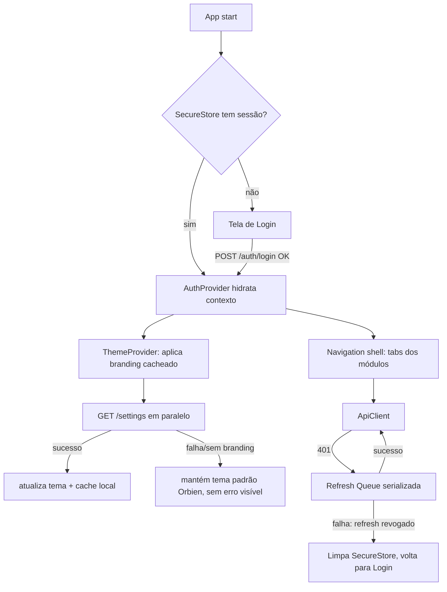
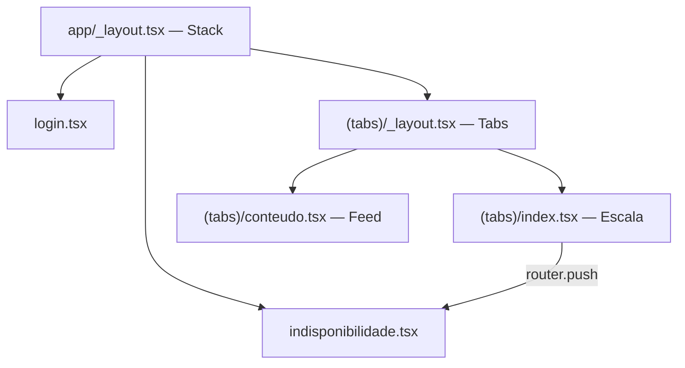
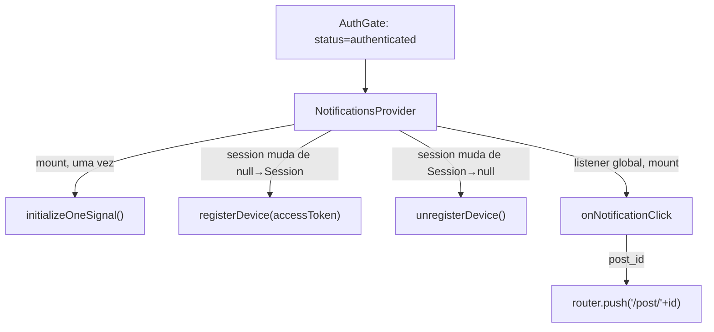

# App Mobile — Design (MOB-01, MOB-02, MOB-03, MOB-11, MOB-12)

**Spec**: `.specs/features/app-mobile/spec.md`
**Status**: Draft
**Escopo desta rodada de Design**: autenticação (MOB-01), refresh serializado
(MOB-02), tema por tenant (MOB-03), scaffold do workspace (MOB-11) e
config dinâmica de identidade multi-variante (MOB-12). Os módulos de
domínio (escala, conteúdo/push, celebrações, PG — MOB-04 a MOB-10) ficam
para uma rodada de Design própria, quando entrarem em Tasks.

---

## Approach Exploration

A decisão que mais afeta o resto do app é **como o app fala com a API e
guarda sessão**, porque tema (MOB-03), OneSignal (MOB-07, fora desta rodada)
e todo módulo de domínio dependem disso.

### Opção A — Espelhar o padrão do `apps/web` (fila de refresh no cliente axios)

Réplica do interceptor de `apps/web/src/lib/api.ts`: instância axios com
interceptor de response, `isRefreshing`/`failedQueue`, 401 dispara refresh
único e reexecuta a fila. Único ajuste: o mobile fala **direto com a API**
(`Authorization: Bearer`), sem rota Next intermediária — o web usa
`/api/session/refresh` porque só o servidor Next vê o cookie; o mobile não
tem essa camada, então o próprio interceptor chama `POST /auth/refresh` e
regrava o `expo-secure-store` diretamente.

- **Prós**: mesmo princípio já validado em produção (`apps/web`); zero
  padrão novo a aprender; a spec (Assumptions, linha "Renovação de sessão")
  já aponta essa direção.
- **Contras**: nenhum specífico a RN — `expo-secure-store` é assíncrono
  (Promise-based), então o interceptor precisa `await` a leitura/escrita,
  diferente do cookie automático do browser; é só adaptação, não redesenho.

### Opção B — Biblioteca de auth dedicada (ex.: `react-query` + `axios` com
retry via plugin de terceiros)

- **Prós**: menos código próprio para manter a fila.
- **Contras**: `CLAUDE.md` já registra que `@tanstack/react-query` está no
  `package.json` do monorepo mas **não é o padrão usado** em nenhum app
  (web busca dado com `useEffect` + axios) — introduzir react-query só no
  mobile cria um terceiro padrão de data-fetching no monorepo sem
  necessidade. Rejeitada por inconsistência deliberada com a convenção já
  registrada.

### Opção C — Delegar renovação ao interceptor nativo do Expo (`expo-auth-session`)

- **Contras**: `expo-auth-session` é desenhado para OAuth/OIDC (fluxo de
  authorization code com IdP externo); o Orbien usa login próprio
  (email+senha+tenant_slug) contra `POST /auth/login` — não há IdP para
  esse fluxo se encaixar. Rejeitada por não corresponder ao protocolo real.

**Recomendação: Opção A.** É a única que reaproveita um padrão já
comprovado no monorepo (mesmo princípio de fila serializada) e não introduz
dependência nova. Confirmado como a direção a seguir para MOB-01/02.

---

## Architecture Overview



`app.config.js` (MOB-12) roda em **build time** (resolve identidade do
profile) e expõe o resultado em runtime via `Constants.expoConfig.extra` —
não faz parte do fluxo de runtime acima, é a camada abaixo de tudo isso.

---

## Code Reuse Analysis

`apps/api` e os fronts são deploys independentes (regra do monorepo:
"Nada que rode na Vercel deve importar código de `apps/api`") — o mobile
segue a mesma regra. Reuso aqui é de **contrato**, não de código importado:

| Contrato de origem | Localização (fonte da verdade) | Como o mobile reusa |
| --- | --- | --- |
| `LoginDto` / resposta de login | `apps/api/src/auth/` (`POST /auth/login` → `{access_token, refresh_token, expires_in}`) | Mobile define `LoginResponse` local com os mesmos campos — sem importar o DTO do Nest. |
| `JwtPayload` (claims) | `apps/api/src/auth/` | Mobile não decodifica o JWT para lógica de negócio (evita duplicar regra que é do backend); só lê `expires_in` para agendar refresh preventivo. |
| `POST /auth/refresh` (`RefreshDto`) | `apps/api/src/auth/` | Interceptor da Opção A chama essa rota com o `refresh_token` do SecureStore. |
| `ResolvedSettings` (branding) | `apps/api/src/settings/settings.service.ts:13-28`, `GET /settings` | Mobile define `Branding` local espelhando `branding: {app_name, primary_color, logo_url, splash_url}`. Confirmado: `GET /settings` **não** tem `@Roles` (`settings.controller.ts:30`) — qualquer usuário autenticado pode chamar, inclusive membro comum; não há bloqueio a resolver aqui. |
| Padrão de fila de refresh | `apps/web/src/lib/api.ts:34-64` | Mesma máquina de estados (`isRefreshing`/`failedQueue`), adaptada para `expo-secure-store` assíncrono e `Authorization: Bearer` em vez de cookie. |

### Integration Points

| Sistema | Método de integração |
| --- | --- |
| `apps/api` `POST /auth/login`, `POST /auth/refresh`, `POST /auth/logout` | HTTPS direto, `Authorization: Bearer <access_token>` nas chamadas autenticadas; login/refresh não levam esse header (ainda não há token). |
| `apps/api` `GET /settings` | Mesma auth Bearer; chamada assim que o `AuthProvider` hidrata, em paralelo à navegação (não bloqueia o shell). |
| EAS (`eas.json`) | Build profiles resolvem `extra` que `app.config.js` lê — sem chamada de rede, é resolução em build time. |

---

## Components

### `AuthClient` (biblioteca interna, não UI)

- **Purpose**: login, logout, guarda de sessão em `expo-secure-store`, fila
  de refresh serializada (Opção A).
- **Location**: `apps/mobile/src/lib/auth/auth-client.ts`
- **Interfaces**:
  - `login(tenantSlug: string, email: string, password: string): Promise<Session>`
  - `logout(): Promise<void>` — chama `POST /auth/logout` best-effort, sempre limpa o SecureStore mesmo se a chamada falhar (não pode deixar o usuário preso logado localmente).
  - `getValidAccessToken(): Promise<string>` — usado pelo `ApiClient`; dispara refresh se expirado, aguarda se um refresh já está em andamento.
- **Dependencies**: `expo-secure-store`, `ApiClient` (chamada crua sem interceptor para as próprias rotas de auth, para não recursar).
- **Reuses**: máquina de estados de `apps/web/src/lib/api.ts:34-64`.

### `ApiClient`

- **Purpose**: cliente HTTP único do app, injeta `Authorization: Bearer`,
  intercepta 401 e delega ao `AuthClient` para renovar + repetir a request original.
- **Location**: `apps/mobile/src/lib/api/client.ts`
- **Interfaces**: `get/post/patch/delete<T>(path, opts): Promise<T>`
- **Dependencies**: `AuthClient`, `Constants.expoConfig.extra.apiUrl` (config, nunca URL hardcoded — mesmo princípio do MOB-12 aplicado à API URL, que também varia por ambiente).
- **Reuses**: mesmo formato de erro que os fronts já tratam (`403` vs. lista vazia — ver Edge Cases da spec).

### `ThemeProvider`

- **Purpose**: aplica `primary_color`/`logo_url` do tenant no shell de
  navegação; evita flash do tema padrão ao reabrir o app (spec MOB-03, AC 3).
- **Location**: `apps/mobile/src/lib/theme/theme-provider.tsx`
- **Interfaces**: `useTheme(): { primaryColor, logoUrl, appName }`
- **Dependencies**: `expo-secure-store` (ou `AsyncStorage` — decisão abaixo em Tech Decisions) para cache local do último branding resolvido; `ApiClient` para `GET /settings`.
- **Reuses**: shape de `ResolvedSettings.branding` (`apps/api/src/settings/settings.service.ts`); fallback documentado no próprio backend (congregação → `branding_configs` → nenhum).

### `app.config.js` + `eas.json` (MOB-12)

- **Purpose**: identidade do app (nome, ícone, bundle id/applicationId,
  scheme, `oneSignalAppId`) resolvida por build profile, nunca hardcoded em
  componente/tela.
- **Location**: `apps/mobile/app.config.js`, `apps/mobile/eas.json`
- **Interfaces**: função `export default ({config}) => ({...config, name, ios, android, extra})`; v1 tem um único profile (`generic`) que resolve para os valores padrão Orbien quando nenhuma env de tenant está setada (spec MOB-12, AC 2).
- **Dependencies**: nenhuma chamada de rede — só `process.env` no momento do build/`expo start`.
- **Reuses**: nada do resto do monorepo (é o primeiro app do workspace a precisar disso — os outros três usam `NEXT_PUBLIC_*` estático, que não serve aqui porque precisa variar o *nome do app na loja*, não só uma env de runtime).

### Navigation shell

- **Purpose**: tab bar com os módulos do escopo (Escala, Conteúdo,
  Celebrações, Grupos) — só o esqueleto nesta rodada, telas de domínio ficam
  para a próxima rodada de Design (MOB-04+).
- **Location**: `apps/mobile/src/app/` (Expo Router, ver Tech Decisions)
- **Dependencies**: `AuthProvider`, `ThemeProvider`.

---

## Data Models

```typescript
// apps/mobile/src/lib/auth/types.ts
interface LoginResponse {
  access_token: string
  refresh_token: string
  expires_in: number // segundos; hoje 900 no backend
}

interface Session {
  accessToken: string
  refreshToken: string
  accessTokenExpiresAt: number // epoch ms, calculado no cliente a partir de expires_in
}

// apps/mobile/src/lib/theme/types.ts
interface Branding {
  app_name: string | null
  primary_color: string | null
  logo_url: string | null
  splash_url: string | null
}
```

**Relationships**: `Session` vive só no `expo-secure-store` (nunca em
memória JS persistente entre cold starts, nunca em `AsyncStorage`, conforme
Assumptions da spec). `Branding` é cacheado em `AsyncStorage` (não precisa
do Keychain — não é segredo) para permitir reaplicar antes da rede
responder (spec MOB-03, AC 3).

---

## Error Handling Strategy

| Error Scenario | Handling | User Impact |
| --- | --- | --- |
| 401 em chamada autenticada, refresh ainda válido | `AuthClient` renova 1x, `ApiClient` repete a request original | Transparente — usuário não percebe |
| 401 em chamada autenticada, refresh revogado/expirado | `AuthClient` limpa SecureStore, `ApiClient` propaga um erro tipado `SessionExpiredError` | App navega para Login |
| `GET /settings` falha (rede ou erro 5xx) | `ThemeProvider` mantém o branding cacheado (ou o padrão Orbien se nunca houve cache) | Sem erro visível — spec MOB-03 AC 2 |
| Sem internet no cold start | `ApiClient` propaga erro de rede distinto de erro de auth | Tela de erro de rede explícita (Edge Cases da spec), nunca tela vazia |
| Duas chamadas expiram junto | Fila do `AuthClient` serializa: a segunda aguarda a Promise da primeira em vez de disparar novo refresh | Transparente |

---

## Risks & Concerns

| Concern | Location (file:line) | Impact | Mitigation |
| --- | --- | --- | --- |
| `expo-secure-store` é assíncrono; um bug de ordenação (ler token antes de gravar) reabriria o mesmo tipo de race que a fila serializada existe para evitar | `apps/mobile/src/lib/auth/auth-client.ts` (a criar) | Duas requests concorrentes poderiam dobrar-refresh e derrubar a família de refresh no backend (mesmo efeito que o Edge Case da spec já cobre) | A fila (Opção A) precisa serializar pelo **estado em memória** (`isRefreshing`), não só pelo SecureStore — mesmo padrão do `apps/web`; task de implementação deve incluir teste de concorrência (duas chamadas simultâneas, 1 refresh disparado). |
| `GET /settings` está liberado para qualquer autenticado hoje (`settings.controller.ts:30`, sem `@Roles`), o que é bom para o mobile — mas se um dia ganhar `@Roles` (ex.: restringindo a admins) por engano, o mobile perderia acesso ao tema para membro comum sem aviso | `apps/api/src/settings/settings.controller.ts:30` | Regressão silenciosa: membro fica sem tema, sem erro (porque MOB-03 AC 2 já manda cair no padrão sem erro visível) — o bug ficaria invisível | Fora do escopo desta feature alterar o backend; registrar aqui para quem mexer em `settings.controller.ts` no futuro. Não é um `AD-NNN` (não é decisão nova, é observação). |
| Nenhum app do monorepo hoje usa Expo Router / navigation — não há convenção local a seguir | — | Risco de inventar padrão que diverge do que o time realmente quer | Ver Tech Decisions abaixo: Expo Router é a recomendação (arquivo-baseado, mesmo mental model de App Router do Next que os 3 fronts já usam) — malha com o que o time já conhece, não com o que RN "geralmente" usa (React Navigation puro). |

---

## Tech Decisions (only non-obvious ones)

| Decision | Choice | Rationale |
| --- | --- | --- |
| Roteamento no mobile | Expo Router (file-based) | Os três fronts já usam Next App Router (file-based); manter o mesmo mental model reduz fricção de contexto ao trocar de app dentro do monorepo. Alternativa (React Navigation configurado manualmente) funciona igual mas não tem esse ganho de familiaridade. |
| Cache de branding | `AsyncStorage`, não `expo-secure-store` | Branding não é segredo (é o que qualquer visitante do site do tenant já vê); Keychain/Keystore é custo desnecessário para dado não sensível — reserva SecureStore só para token, coerente com a distinção que a spec já faz para o `apps/web` (`localStorage` vs. cookie `HttpOnly`, mesmo princípio: sensível vs. não sensível). |
| `app.config.js` roda função pura de `process.env`, sem chamada de API em build time | Config só lê env/`eas.json extra` | Buildar o app não pode depender da API estar no ar; identidade é decidida no momento do build/CI, não em runtime do build tool. |
| App id do OneSignal (MOB-12, AC 4) | Vem de `Constants.expoConfig.extra.oneSignalAppId`, não de import direto de env do SDK | Mesma regra dos outros três campos de identidade — um único mecanismo de config para tudo que precisa variar por profile, em vez de dois (env direta para OneSignal, `app.config.js` para o resto). |

> **Project-level decision** — registrada em `.specs/STATE.md` como
> `AD-002`: single-codebase multi-profile via `app.config.js`/`eas.json`
> é o padrão adotado para `apps/mobile` cobrir Starter e (futura) Premium.
> Ver seção Assumptions do `spec.md` para o texto completo da decisão.

---

# Rodada 2 — MOB-04 (Membros e Voluntários — escala)

**Spec**: `.specs/features/app-mobile/spec.md`, story "P1: Membros e
Voluntários", AC 1-4.
**Status**: Draft
**Escopo desta rodada**: as 4 ACs da story — listar escala (AC1),
confirmar/recusar slot pendente (AC2), check-in em evento (AC3), editar
indisponibilidade (AC4). MOB-05 a MOB-10 continuam fora.

## Gap encontrado ao pesquisar o backend (Knowledge Verification Chain, Step 1)

O sistema de escala antigo (`ScheduleSlot`/`Assignment`,
`apps/api/docs/sprint11.2-fatia4.md`) foi substituído pelo atual
`CelebrationAssignment` (`schema.prisma:1258-1277`). Uma migration antiga
(`20260611135344_add_swap_requests_checkin`) chegou a criar
`volunteer_swap_requests` e um `checked_in_at` em `schedule_assignments` —
mas **nenhum dos dois existe no schema atual**: foram descartados quando o
sistema mudou para `CelebrationAssignment`. Hoje:

- **AC1** (listar escala) — já coberto: `GET /volunteers/my-celebration-assignments`
  (`celebration-volunteer.controller.ts:44`, `celebration-assignment.service.ts:319-375`).
- **AC2** (confirmar/recusar) — já coberto: `PATCH /assignments/:id/respond`
  (`celebration-volunteer.controller.ts:27`, `respondToAssignment`,
  `celebration-assignment.service.ts:276-311`). A spec menciona "trocas,
  SwapRequest" só como referência de princípio (mesma regra de negócio já
  aplicada pela API) — não existe endpoint de troca separado, e não é
  necessário: responder `declined` já é a operação que a API expõe.
- **AC3** (check-in) — **sem backend**. Não há rota, nem campo no modelo.
- **AC4** (indisponibilidade) — já coberto:
  `POST`/`GET /volunteers/unavailability` (`unavailability.controller.ts:30,36`).

**Decisão**: implementar o que falta de AC3 nesta mesma rodada, no
`apps/api`, em vez de cortar a AC do escopo mobile ou fingir que o app
resolve sem servidor. É mudança pequena e localizada (uma coluna + uma
rota), segue exatamente o padrão que `respondToAssignment` já estabelece
para essa mesma tabela, e sem ela o app teria uma aba "Escala" com 3 dos 4
comportamentos da própria user story do MVP.

## Novo endpoint: `PATCH /assignments/:id/check-in`

- **Controller**: `CelebrationRespondController` (mesmo controller de
  `:id/respond` — mesmo recurso, mesmas guards), novo método `checkIn`.
- **Guard/Roles**: `@Roles(...VOLUNTEER_ROLES)` — idêntico a `respond`.
- **Regra de negócio** (`checkInAssignment`, novo método em
  `celebration-assignment.service.ts`, mesmo formato de `respondToAssignment`):
  1. Busca a assignment por `id` + `tenant_id` (RLS/escopo, mesmo padrão).
  2. `ForbiddenException` se `assignment.volunteerProfile.person_id !== personId`
     (mesma checagem "belt-and-suspenders" de `respondToAssignment:295-297`).
  3. `UnprocessableEntityException` se `assignment.status !== confirmed` —
     só se pode fazer check-in de um slot que a pessoa já confirmou (não
     faz sentido check-in de `pending`/`declined`).
  4. `ConflictException` se `checked_in_at` já estiver setado (idempotência
     — segundo toque no botão não deve sobrescrever o horário do primeiro).
  5. `update` com `checked_in_at: new Date()`.
- **Response**: o `CelebrationAssignment` atualizado (mesmo shape de
  `respond`).
- **Sem RLS novo**: `checked_in_at` é coluna em tabela existente
  (`celebration_assignments`), já coberta pela policy de RLS que a tabela
  já tem — não é uma tabela nova, não entra em `00N_rls_*.sql`
  (`AD-001` só se aplica a tabela nova).

### Data Model — alteração

```prisma
model CelebrationAssignment {
  // ...campos existentes
  checked_in_at DateTime? // novo — null até o check-in; setado 1x, imutável depois
}
```

Migration Prisma padrão (`prisma migrate dev`), **não** um script RLS
numerado — só uma coluna nullable em tabela já existente, RLS de linha já
cobre a coluna.

### DTO

Sem body — `PATCH /assignments/:id/check-in` não recebe payload (o
`checked_in_at` é sempre "agora", resolvido no servidor; cliente não deve
poder informar um horário arbitrário).

## Components (mobile)

Não existe tab bar hoje — `app/_layout.tsx` usa um `Stack` único e
`app/index.tsx` é a rota-raiz placeholder pós-login (ver trecho acima,
`ThemedShell`). Introduzir uma tab bar por causa de um módulo só (Escala)
seria arquitetura prematura — essa decisão fica para quando um segundo
módulo de domínio (MOB-06+) justificar o custo. Esta rodada troca o
placeholder de `index.tsx` pela tela real e adiciona uma rota-filha no
mesmo `Stack`.

### Tela "Escala" (rota raiz autenticada)

- **Purpose**: lista os próximos slots do usuário (AC1), permite
  confirmar/recusar um slot `pending` (AC2) e fazer check-in de um slot
  `confirmed` no dia do evento (AC3).
- **Location**: `apps/mobile/src/app/index.tsx` (substitui o placeholder
  atual — texto do nome do app move para o header, que `ThemedShell` já
  preenche via `theme.appName`/`theme.logoUrl`)
- **Dependencies**: `useAuth()` (sessão), `authenticatedRequest` (mesmo
  helper que `theme-provider.tsx` já usa para chamadas autenticadas com
  fila de refresh — ver `auth-client.ts`, Fix F1 do `tasks.md` da rodada 1).
- **Reuses**: `authenticatedRequest<T>()` (já existe, T-F1); padrão de
  estado local (`useState` + `useEffect`) — mesmo princípio do
  `apps/web/src/app/(admin)/voluntarios/page.tsx:169-232` (atualização
  otimista local após responder, sem refetch completo).

### `EscalaClient` (biblioteca interna)

- **Purpose**: wrapper tipado sobre `authenticatedRequest` para as 3 rotas
  de escala (my-assignments, respond, check-in).
- **Location**: `apps/mobile/src/lib/escala/escala-client.ts`
- **Interfaces**:
  - `getMyAssignments(includePast?: boolean): Promise<Assignment[]>`
  - `respondToAssignment(id: string, status: 'confirmed' | 'declined'): Promise<Assignment>`
  - `checkIn(id: string): Promise<Assignment>`
- **Dependencies**: `authenticatedRequest` (auth-client.ts).
- **Reuses**: mesmo princípio de separação `*-client.ts` (lógica) vs. tela
  (UI) que `auth-client.ts`/`theme-provider.tsx` já seguem.

### Tela "Indisponibilidade" (rota-filha)

- **Purpose**: ver/editar datas indisponíveis do mês (AC4).
- **Location**: `apps/mobile/src/app/indisponibilidade.tsx` (nova rota do
  `Stack` existente, navegada a partir de um botão/link na tela de Escala)
- **Dependencies**: `EscalaClient` (extensão com `getUnavailability`/`saveUnavailability`).
- **Reuses**: mesmo contrato de `apps/web/src/components/volunteers/UnavailabilityPanel.tsx`
  (`referenceMonth`/`referenceYear`/`dates[]`), incluindo o padrão de
  cancelamento de request obsoleta (`signal.cancelled`) ao trocar de mês
  rápido.

## Data Models (mobile)

```typescript
// apps/mobile/src/lib/escala/types.ts
interface Assignment {
  id: string
  status: 'pending' | 'confirmed' | 'declined' | 'swapped'
  notified_at: string | null
  responded_at: string | null
  checked_in_at: string | null // novo campo do backend
  celebration: { id: string; name: string }
  ministry: { id: string; name: string }
  scheduled_date: string
  setlist: { songs: SetlistSong[] } | null
}

interface SetlistSong {
  id: string
  sequence: number
  title: string
  key: string | null
  bpm: number | null
  link: string | null
}

interface Unavailability {
  dates: { date: string }[]
}
```

**Relationships**: espelha 1:1 o shape que `getMyAssignments`
(`celebration-assignment.service.ts:353-370`) já devolve, mais o campo
`checked_in_at` novo. Sem estado próprio no cliente além de cache de tela
(sem persistência local — spec não pede offline, Out of Scope da spec
original já corta isso).

## Error Handling Strategy

| Error Scenario | Handling | User Impact |
| --- | --- | --- |
| `respond`/`check-in` em assignment que não é do usuário | `403` do backend (já existe/novo, mesma checagem) | Erro genérico — não deveria acontecer via UI normal (a lista só mostra assignments do próprio usuário), tratado como erro inesperado |
| Check-in de slot ainda `pending`/`declined` | `422` do backend | Botão de check-in só aparece/habilita para status `confirmed` na UI — o erro do backend é a segunda linha de defesa, não a primeira |
| Check-in duplicado (`checked_in_at` já setado) | `409` do backend | UI já esconde o botão após o primeiro check-in bem-sucedido (estado local atualizado); erro tratado como no-op silencioso se a race acontecer |
| `respond`/`check-in`/`unavailability` sem rede | `NetworkError` do `ApiClient` (já existe) | Mesmo tratamento genérico de erro de rede que o resto do app (Edge Cases da spec) |

## Risks & Concerns

| Concern | Location (file:line) | Impact | Mitigation |
| --- | --- | --- | --- |
| Novo endpoint de check-in não tem proteção contra check-in "no dia errado" (ex.: fazer check-in de um evento daqui a 3 semanas) | `celebration-assignment.service.ts` (a criar `checkInAssignment`) | Dado incorreto de presença se alguém chamar a rota fora do fluxo normal da UI | Fora de escopo agora — a spec não pede validação de janela de tempo para check-in (só "enviar o check-in e mostrar confirmação visual imediata", AC3). Registrar aqui para não ser esquecido se um requisito de janela aparecer depois; não é AD-NNN (não é decisão de arquitetura, é lacuna de regra de negócio reconhecida). |
| `EscalaClient`/tela nova é o primeiro consumidor real de `authenticatedRequest` fora do `ThemeProvider` — valida que o helper genérico realmente serve para múltiplos domínios, não só o caso original | `apps/mobile/src/lib/auth/auth-client.ts` (`authenticatedRequest`) | Baixo — é reuso direto, não há sinal de acoplamento ao domínio de tema no helper atual | Nenhuma ação necessária; mencionado para registro, não é um risco que bloqueia. |

## Tech Decisions (only non-obvious ones)

| Decision | Choice | Rationale |
| --- | --- | --- |
| Onde implementar check-in | Novo endpoint em `apps/api` (`celebration_assignments.checked_in_at`), não um campo local no mobile | AC3 pede "enviar o check-in" — implica persistência no servidor (outros dispositivos/telas precisam ver o mesmo estado); sem isso a feature não é real, só um toggle visual local. |
| Reaproveitar `volunteer_swap_requests`/`schedule_assignments` da migration descartada | Não — construir em cima de `CelebrationAssignment`, o modelo atual | O sistema de escala mudou de arquitetura depois daquela migration (schedule_assignments não existe mais); ressuscitar uma tabela órfã do sistema antigo introduziria dois modelos de escala paralelos. `CelebrationAssignment` é a única fonte de verdade viva hoje. |
| Endpoint de check-in aceita corpo vazio | Sem DTO de request | Timestamp de check-in é sempre "agora, no servidor" — aceitar um horário do cliente abriria brecha para presença retroativa/adiantada forjada. |

---

# Rodada 3 — MOB-06 (Conteúdos — feed)

**Spec**: `.specs/features/app-mobile/spec.md`, story "P1: Conteúdos e
Notificações", AC2 (listar posts publicados). AC1/3/4 (registro OneSignal,
push ponta a ponta, deep link) são MOB-07 — fora desta rodada.
**Status**: Draft

## Pesquisa no backend (Knowledge Verification Chain, Step 1)

- `GET /content/posts` (`apps/api/src/content/posts.controller.ts:51-55`,
  `ALL_ROLES` inclui `member` — qualquer autenticado da congregação pode
  chamar, não é rota admin-only mesmo sendo a mesma rota que
  `apps/web`(admin)/conteudo usa para gestão).
- Query: `type?`, `is_draft?` (ignorado para `member` puro — service
  bloqueia), `since?`, `page` (default 1), `limit` (default 20, máx 100) —
  `apps/api/src/content/dto/list-posts-query.dto.ts`.
- Resposta: `{ data: ContentPost[], total: number }` — paginação
  offset/page, **sem** cursor nem `has_more` (`posts.service.ts:66-96`,
  `findAll`). Cliente calcula `page * limit < total` para saber se há
  mais.
- Campos do post (`schema.prisma:895-920`): `id, type, title, body,
  media_url, is_draft, publish_at, published_at, expires_at,
  created_by_user_id, created_at, updated_at`.
- **Achado importante — segmentação de audiência não filtra a listagem**:
  `AudienceSegment`/`PostSegment` só regem *push targeting* (OneSignal
  tags, `notifications.service.ts:34-50,156-219`) — a query de listagem
  (`findAll`) não cruza segmento nenhum, só `published_at IS NOT NULL`
  para `member` puro. Ou seja, hoje todo `member` autenticado vê todos os
  posts publicados da própria congregação, independente de segmento.
  **Confirmado com o usuário**: manter esse comportamento (replicar
  exatamente o que `apps/web` já faz contra a mesma rota) — "segmento de
  audiência" continua sendo só um conceito de notificação (MOB-07), não
  de feed. Implementar filtro de segmento no feed seria mudança de
  produto que afeta os dois fronts (web + mobile) na mesma rota, fora do
  escopo desta spec.
- Reuso confirmado com `apps/web`: `apps/web/src/app/(admin)/conteudo/page.tsx:153-171`
  (`loadPosts`) chama a mesma rota com `useEffect`/promise chain — mobile
  replica o mesmo contrato (`{data, total}`), não um contrato próprio.

## Decisão de navegação: tab bar

A Rodada 2 (Risks & Concerns) já registrou que introduzir tab bar era
prematuro com um módulo de domínio só, e que a decisão ficaria "para
quando um segundo módulo de domínio (MOB-06+) justificar o custo". MOB-06
é esse segundo módulo — dois módulos reais (Escala, Conteúdo) sem tabs
forçaria navegação só por link textual, que já não escala visualmente
bem com dois itens e piora a cada módulo seguinte (MOB-08/09 vêm depois).

**Decisão**: introduzir `app/(tabs)/` (Expo Router, grupo de rota) com
`Tabs` nesta rodada. `app/index.tsx` (tela Escala, hoje rota-raiz) move
para `app/(tabs)/index.tsx`; `app/(tabs)/conteudo.tsx` é a nova aba.
`login.tsx` e `indisponibilidade.tsx` continuam como rotas de `Stack` no
nível raiz (fora do grupo `(tabs)`) — login por ser pré-auth, e
indisponibilidade por ser uma tela de detalhe empurrada a partir da aba
Escala (`router.push`), não uma seção própria de navegação.



`_layout.test.tsx` (root) não é afetado — mocka `expo-router` inteiro e
não renderiza rotas-filhas reais (`Stack` mockado só verifica
`screenOptions`), então a reorganização de arquivos de rota não quebra
esse teste. O teste de `index.tsx` (Escala) move junto para
`app/(tabs)/index.test.tsx`, ajustando só os imports relativos (`../../lib/...`
em vez de `../lib/...`).

## Code Reuse Analysis

| Contrato de origem | Localização | Como o mobile reusa |
| --- | --- | --- |
| `{data, total}` de `GET /content/posts` | `apps/api/src/content/posts.service.ts:66-96` | `ContentClient.getPosts` define `Post`/`PostsPage` local espelhando o shape — mesmo princípio de contrato-não-import das rodadas anteriores. |
| `authenticatedRequest` | `apps/mobile/src/lib/auth/auth-client.ts` | `ContentClient` chama do mesmo jeito que `EscalaClient` (Rodada 2) e `ThemeProvider` (Rodada 1) — nenhum novo mecanismo de auth. |
| Padrão `*-client.ts` (lógica) vs. tela (UI) | `escala-client.ts`/`theme-provider.tsx` | `ContentClient` segue a mesma separação. |
| Erro de rede vs. lista vazia | `index.tsx` (`escala-error`, Rodada 2/Fix 1) | Tela de Conteúdo replica o mesmo padrão: erro visível distinto de "sem posts". |

## Components

### `ContentClient`

- **Purpose**: wrapper tipado sobre `authenticatedRequest` para
  `GET /content/posts`.
- **Location**: `apps/mobile/src/lib/content/content-client.ts`
- **Interfaces**: `getPosts(page?: number, limit?: number): Promise<PostsPage>`
- **Dependencies**: `authenticatedRequest`.
- **Reuses**: mesmo padrão de `escala-client.ts`.

### Tela "Conteúdo" (nova aba)

- **Purpose**: lista os posts publicados da congregação (AC2), com
  paginação simples ("carregar mais" — sem cursor, a API é offset/page).
- **Location**: `apps/mobile/src/app/(tabs)/conteudo.tsx`
- **Dependencies**: `ContentClient`.
- **Reuses**: mesmo padrão de carregamento/erro de `(tabs)/index.tsx`
  (ex-`index.tsx`, Escala) — `useEffect` no mount, estado de erro visível
  distinto de lista vazia.

### `(tabs)/_layout.tsx`

- **Purpose**: `Tabs` do Expo Router com 2 abas (Escala, Conteúdo).
- **Location**: `apps/mobile/src/app/(tabs)/_layout.tsx`
- **Dependencies**: nenhuma chamada de rede — só layout.
- **Reuses**: nenhum precedente no monorepo (primeiro uso de `Tabs` do
  Expo Router) — mesma biblioteca já usada para `Stack` (Rodada 1).

## Data Models

```typescript
// apps/mobile/src/lib/content/types.ts
interface Post {
  id: string;
  type: string;
  title: string;
  body: string | null;
  media_url: string | null;
  published_at: string | null;
  created_at: string;
}

interface PostsPage {
  data: Post[];
  total: number;
}
```

**Relationships**: `is_draft`/`expires_at`/`created_by_user_id` do
backend não entram no tipo mobile — a tela é read-only e não precisa
deles (mesmo princípio de reuso mínimo das rodadas anteriores: só os
campos que a UI de fato usa).

## Error Handling Strategy

| Error Scenario | Handling | User Impact |
| --- | --- | --- |
| `GET /content/posts` falha (rede/5xx) | Estado de erro visível, distinto de lista vazia | Mesmo padrão de `escala-error` — "Não foi possível carregar" |
| Lista vazia (`total: 0`, sem erro) | Estado vazio explícito ("Nenhum post publicado ainda") | Não confundir com erro — outcome legítimo |
| "Carregar mais" falha | Mantém os posts já carregados, mostra erro pontual sem limpar a lista | Mesmo princípio do Fix 1 (Rodada 2): erro de ação nunca é rejection silenciosa |

## Risks & Concerns

| Concern | Location | Impact | Mitigation |
| --- | --- | --- | --- |
| `findAll`'s `isMember` check (`posts.service.ts:73`) exige `roles.length === 1 && roles[0] === 'member'` — um usuário com `member` + outro papel não tem o filtro `published_at IS NOT NULL` aplicado, potencialmente vendo rascunhos | `apps/api/src/content/posts.service.ts:73` | Fora do escopo desta feature alterar — é comportamento do backend que antecede esta rodada, não introduzido por ela. Registrado aqui para quem mexer nesse service depois. | Nenhuma ação nesta rodada — mobile só consome a rota como está. |
| Introduzir `(tabs)/` move `index.tsx`→`(tabs)/index.tsx`, alterando o caminho de rota-raiz | `apps/mobile/src/app/index.tsx` | Qualquer referência hardcoded a `/` como rota inicial (ex.: `login.tsx` faz `router.replace("/")`) precisa continuar funcionando — Expo Router resolve `(tabs)/index.tsx` como a rota `/` normalmente (grupo entre parênteses não entra na URL), então `router.replace("/")` continua correto sem mudança. | Confirmar com um teste de fumaça que `/` ainda resolve para a aba Escala após a task de navegação. |

## Tech Decisions

| Decision | Choice | Rationale |
| --- | --- | --- |
| Paginação no mobile | "Carregar mais" (concatena página seguinte), não infinite scroll automático | API é offset/page sem cursor; concatenar por botão é mais simples de testar e evita re-fetch acidental por scroll em teste automatizado. Pode evoluir para `onEndReached` depois, sem mudar o contrato do `ContentClient`. |
| Tab bar via Expo Router `Tabs` | Nativo do próprio Expo Router, não uma lib de navegação separada | Mesmo framework já em uso para `Stack`; Expo Router resolve `Tabs` dentro de um grupo de rota nativamente, sem dependência nova. |
| Segmentação de audiência no feed | Não implementada — mobile replica o filtro atual (congregação inteira, publicado) | Confirmado com o usuário: mudar isso é decisão de produto que afeta a mesma rota usada pelo `apps/web`, fora do escopo de MOB-06. |

---

# Rodada 4 — MOB-07 (Conteúdos — push: registro OneSignal + deep link)

**Spec**: `.specs/features/app-mobile/spec.md`, story "P1: Conteúdos e
Notificações", AC1 (registrar dispositivo), AC3 (push chega — depende do
backend, já existente) e AC4 (toque abre o post, não a lista). AC2
(listar posts) é MOB-06, já entregue (Rodada 3).
**Status**: Draft

## Pesquisa no backend (Knowledge Verification Chain, Step 1)

- `apps/api/src/content/notifications.service.ts` já dispara push via
  OneSignal REST API (`dispatch`), mas **filtra por tags do dispositivo**,
  não por `external_id`: sem segmento, filtra `tag tenant_id = <tenantId>`
  (linha 158); com segmento, monta filtros a partir de `criteria.congregation_ids`
  (`tag congregation_id`), `criteria.group_ids` (`tag pg_ids`) e
  `criteria.roles` (`tag role`) — `buildFilters`, linhas 156-219. **A spec
  (Assumptions, "Identificação no OneSignal") fala só de `external_id`
  como identidade estável — não basta**: sem o app também gravar essas
  tags no registro do dispositivo, nenhum segmento por congregação/grupo/
  papel jamais bate, e só o filtro-fallback por `tenant_id` funcionaria.
  `external_id` continua necessário (é o que casa dispositivo↔pessoa para
  reenvio/analytics, e é o que a spec pede), mas as **tags são o que
  decide se a notificação chega**.
- `pg_ids` (grupos da pessoa) não tem fonte no mobile ainda — Pequenos
  Grupos é MOB-09, `Pending`, fora desta rodada. **Decisão**: registrar
  as tags que já têm fonte disponível no app hoje (`tenant_id`,
  `congregation_id`, `role`) e deixar `pg_ids` para quando MOB-09
  existir — um segmento configurado por `group_ids` simplesmente não vai
  alcançar o dispositivo até lá, mesmo comportamento de "sem tag = não
  bate no filtro" que a spec já aceita implicitamente (nenhuma AC de
  MOB-07 pede grupo).
- `criteria.roles` assume **um** valor por tag `role` — `buildFilters`
  monta `{key: 'role', value: <role>}` por role do segmento, e o SDK do
  OneSignal só guarda **um** valor por chave de tag no dispositivo (tag é
  `key→value`, não `key→value[]`). Uma pessoa com mais de um papel
  (`roles.length > 1` no JWT) não pode ter os dois representados na mesma
  tag `role` — é uma limitação que já existe no formato de filtro do
  backend (mesma classe do achado de `posts.service.ts:73` na Rodada 3:
  registrado, não corrigido aqui — mudar o formato de tag/filtro afeta
  segmentos já configurados por tenant admins, fora do escopo de MOB-07).
  **Decisão**: tag `role` recebe `roles[0]` (primeiro papel do array que
  o JWT já traz, ordem decidida pelo backend) — cobre o caso comum (um
  papel) sem inventar um formato de tag novo que o backend não filtra.
- **Fonte dos valores de tag**: `tenant_id`/`congregation_id`/`roles` já
  estão no JWT (`JwtPayload`, `apps/api/src/auth/interfaces/jwt-payload.interface.ts`)
  — os mesmos valores que o próprio backend usa para montar os filtros.
  O `design.md` (Rodada 1) registrou que "Mobile não decodifica o JWT
  para lógica de negócio"; ler esses claims só para espelhá-los como tag
  de push não é lógica de negócio (o backend não decide nada a partir
  disso no cliente) — é o mesmo tipo de exceção já aberta para `expires_in`
  (Rodada 1, `AuthClient`). **Precedente direto**: `apps/web/src/lib/auth.ts`
  já decodifica o JWT no cliente com o comentário "Decodificar não é
  validar (...) uso legítimo é exibição e desempate de fluxo" — mobile
  segue o mesmo princípio, mesmo formato de função, adaptado.
  Confirmado por busca (Step 4): Hermes (motor JS do RN, RN 0.86.3 aqui)
  expõe `atob`/`btoa` como globais nativos desde que passaram a ser
  builtins do motor — não precisa de polyfill nem lib nova, mesma
  implementação do `apps/web` funciona.
- **`GET /content/posts/:id` (findOne) não filtra rascunho para
  member** — `posts.service.ts:100-111`: busca só por `id`+`tenant_id`+
  `congregation_id`, sem o mesmo `isMember ? {published_at: {not: null}} : {}`
  que `findAll` já aplica (linha 78). A spec (Edge Cases) exige: "post
  despublicado entre o disparo e o toque → app mostra 'não encontrado'".
  Hoje, se o post virar rascunho (`is_draft: true`, sem apagar), `findOne`
  ainda devolve o conteúdo — um member abrindo pelo link da push veria o
  rascunho, não "não encontrado". **Decisão**: mesmo princípio da Rodada 2
  (check-in) — mudança pequena e localizada no `apps/api`, corrige o
  gap em vez de deixar o AC sem suporte real. `findOne` passa a receber
  `roles: string[]` (opcional — chamadas internas de `update`/`remove`,
  que são só admin, continuam sem o parâmetro e mantêm acesso total) e
  aplica o mesmo filtro de `findAll` quando `isMember`. O controller passa
  `user.roles` na rota pública `GET /content/posts/:id`.

## Novo comportamento: `PostsService.findOne` filtra rascunho para member

```typescript
// apps/api/src/content/posts.service.ts
async findOne(
  tenantId: string,
  congregationId: string,
  id: string,
  roles?: string[],
): Promise<ContentPost> {
  const isMember = roles !== undefined && roles.length === 1 && roles[0] === 'member';
  const post = await this.prisma.client.contentPost.findFirst({
    where: {
      id,
      tenant_id: tenantId,
      congregation_id: congregationId,
      ...(isMember ? { published_at: { not: null } } : {}),
    },
    include: { postSegments: { include: { segment: true } } },
  });
  if (!post) throw new NotFoundException('Post não encontrado');
  return post;
}
```

`update`/`remove` (`posts.service.ts`) continuam chamando
`this.findOne(tenantId, congregationId, id)` sem o terceiro argumento —
`WRITE_ROLES` nunca é `['member']`, então mesmo se passassem `roles` o
filtro não mudaria nada ali; omitir é só não carregar um parâmetro que
essas rotas não precisam. O controller (`posts.controller.ts`, método
`findOne`) passa `user.roles`:

```typescript
@Get(':id')
@Roles(...ALL_ROLES)
findOne(@Param('id', ParseUUIDPipe) id: string, @CurrentUser() user: JwtPayload) {
  return this.postsService.findOne(user.tenant_id, user.congregation_id, id, user.roles);
}
```

Sem migration, sem RLS novo — mesma tabela, mesma policy, só a query
Prisma ganha uma condição a mais (mesmo padrão da Rodada 2: "gap de regra
de negócio, não de schema").

## Components (mobile)

### `decodeJwtPayload` (utilitário, não UI)

- **Purpose**: extrai `tenant_id`/`congregation_id`/`roles`/`sub` do
  access token já em memória, para montar as tags do OneSignal. Mesmo
  princípio e formato de `apps/web/src/lib/auth.ts` — decodificação sem
  validação de assinatura (quem valida é a API); uso restrito a
  exibição/config local, nunca decisão de negócio.
- **Location**: `apps/mobile/src/lib/auth/jwt.ts`
- **Interfaces**: `decodeJwtPayload(token: string): MobileJwtPayload | null`
- **Dependencies**: `atob` global (Hermes, sem polyfill — ver Pesquisa
  acima).
- **Reuses**: mesmo algoritmo (`split('.')[1]`, replace base64url→base64,
  `atob`+`JSON.parse`) de `apps/web/src/lib/auth.ts:27-35`.

### `onesignal-client` (biblioteca interna, não UI)

- **Purpose**: encapsula todo uso do SDK `react-native-onesignal` — init,
  registro/de-registro de identidade+tags, listener de toque em push.
  Único ponto do app que importa o SDK (mesmo princípio de
  `auth-client.ts` centralizar `expo-secure-store`).
- **Location**: `apps/mobile/src/lib/notifications/onesignal-client.ts`
- **Interfaces**:
  - `initializeOneSignal(): void` — `OneSignal.initialize(appId)` (lido
    de `Constants.expoConfig.extra.oneSignalAppId`, nunca hardcoded —
    MOB-12) + `OneSignal.Notifications.requestPermission(true)`. Chamado
    uma vez, fora de qualquer efeito ligado à sessão (ver
    `NotificationsProvider` abaixo).
  - `registerDevice(accessToken: string): void` — decodifica o token
    (`decodeJwtPayload`), `OneSignal.login(sub)` (AC1: `external_id` =
    id do usuário autenticado) + `OneSignal.User.addTags({tenant_id,
    congregation_id, role: roles[0]})`. Token inválido/indecodificável:
    no-op (não derruba o app por causa de um efeito colateral de push).
  - `unregisterDevice(): void` — `OneSignal.logout()`. Volta o
    dispositivo a anônimo (sem `external_id`, sem as tags da pessoa
    anterior) — essencial em device compartilhado: sem isso, a próxima
    pessoa a logar no mesmo aparelho receberia push endereçada à conta
    anterior até o próximo `registerDevice` sobrescrever.
  - `onNotificationClick(handler: (postId: string) => void): () => void`
    — `OneSignal.Notifications.addEventListener('click', ...)`, extrai
    `event.notification.additionalData.post_id` (o mesmo `data` que
    `NotificationsService.notifyPost` já envia,
    `apps/api/src/content/notifications.service.ts:48`) e chama
    `handler` só quando o campo existe. Retorna função de remoção do
    listener (mesmo padrão de `onSessionExpired`, `auth-client.ts:40-45`).
- **Dependencies**: `react-native-onesignal` (SDK), `Constants.expoConfig.extra.oneSignalAppId`.
- **Reuses**: `decodeJwtPayload`.

### `NotificationsProvider`

- **Purpose**: fecha o ciclo de vida do registro no `_layout.tsx` raiz —
  inicializa o SDK uma vez, registra/de-registra o dispositivo reagindo
  à sessão (mesmo padrão de `useEffect` ligado a `session` que
  `ThemeProvider` já usa), e liga o listener de toque à navegação.
- **Location**: `apps/mobile/src/lib/notifications/notifications-provider.tsx`
- **Interfaces**: `<NotificationsProvider>{children}</NotificationsProvider>`
  — sem hook próprio, é só o efeito colateral (não expõe contexto:
  nenhuma tela precisa ler estado de push).
- **Dependencies**: `useAuth()` (sessão), `onesignal-client`,
  `useRouter()` (Expo Router) para navegar ao `post_id` recebido.
- **Reuses**: forma do `useEffect([session])` de `theme-provider.tsx:57-93`
  — aqui sem chamada de rede (só SDK nativo), então sem cache/estado
  intermediário, apenas `registerDevice`/`unregisterDevice`.
- **Wiring**: entra em `_layout.tsx` **dentro** de `AuthGate` (só existe
  sessão autenticada ali) e **fora** de `ThemeProvider` — não depende de
  tema, e o registro de push não deve esperar `GET /settings` resolver.



### `ContentClient.getPost` (extensão)

- **Purpose**: `GET /content/posts/:id` — usado pela tela de detalhe
  (AC4) e reutilizável se uma tela de detalhe "tocar no post da lista"
  vier a existir depois (não pedido nesta rodada, mas o mesmo endpoint
  serve os dois casos).
- **Location**: `apps/mobile/src/lib/content/content-client.ts`
  (adiciona `getPost` ao arquivo existente, mesmo padrão de `getPosts`).
- **Interfaces**: `getPost(id: string): Promise<Post>`
- **Dependencies**: `authenticatedRequest`.
- **Reuses**: mesmo tipo `Post` (MOB-06) — o `findOne` do backend devolve
  um superset (inclui `postSegments`), mas o mobile só tipa os campos que
  já usa, mesmo princípio de reuso mínimo da Rodada 3.

### Tela "Post" (rota de detalhe)

- **Purpose**: mostra título/corpo/mídia de um post por id (AC4: destino
  do toque na push) — também alcançável tocando um item da lista de
  Conteúdo (a lista antes não navegava para lugar nenhum; passa a
  navegar, coerente com a UI ter uma tela de destino agora).
- **Location**: `apps/mobile/src/app/post/[id].tsx` — rota-filha do
  `Stack` raiz (fora do grupo `(tabs)`), mesmo critério de
  `indisponibilidade.tsx` (Rodada 2): tela de detalhe empurrada por
  `router.push`, não uma seção própria de navegação.
- **Dependencies**: `ContentClient.getPost`, `useLocalSearchParams`
  (Expo Router, para ler `id` da rota).
- **Reuses**: mesmo padrão de erro de rede visível vs. estado vazio das
  telas anteriores; usa `HttpError`/`.status` (`apps/mobile/src/lib/api/errors.ts`)
  para distinguir 404 ("Post não encontrado" — cobre o Edge Case da
  spec: post despublicado entre disparo e toque) de outro erro
  ("Não foi possível carregar").

### Tela "Conteúdo" (ajuste)

- **What muda**: cada item da `FlatList` (`(tabs)/conteudo.tsx`) passa a
  ser tocável (`Pressable`/`TouchableOpacity`), navegando para
  `/post/${item.id}` via `useRouter()` — mesmo hook já usado em
  `(tabs)/index.tsx` (Escala) para `/indisponibilidade`.

## Data Models

```typescript
// apps/mobile/src/lib/auth/jwt.ts
interface MobileJwtPayload {
  sub: string;
  tenant_id: string;
  congregation_id: string;
  roles: string[];
  exp: number;
}
```

`Post` (MOB-06, `content/types.ts`) é reusado sem alteração para a tela
de detalhe — os mesmos campos (`title`, `body`, `media_url`,
`published_at`) já cobrem o que a tela mostra.

## Error Handling Strategy

| Error Scenario | Handling | User Impact |
| --- | --- | --- |
| Token indecodificável/sem os claims esperados ao registrar push | `registerDevice` vira no-op (sem `OneSignal.login`/`addTags`) | App continua funcionando normalmente, só sem push registrado — nunca derruba a sessão por causa disso |
| `GET /content/posts/:id` retorna 404 (não encontrado ou despublicado — mesmo filtro de `findAll` agora) | Tela mostra "Post não encontrado" | Cobre o Edge Case da spec (post despublicado entre disparo e toque) |
| `GET /content/posts/:id` falha por rede/5xx | Estado de erro de rede visível (mesmo padrão das outras telas) | Nunca tela vazia interpretável como sucesso |
| Toque em push chega antes do `NotificationsProvider` montar (cold start) | SDK do OneSignal buffereia o evento de clique e entrega assim que o listener é registrado (comportamento documentado do `react-native-onesignal`) | Sem tratamento adicional no app — o listener sempre acaba recebendo o evento |
| Tenant admin configura um segmento por `group_ids` (PG) | Nenhum dispositivo tem a tag `pg_ids` ainda (MOB-09 não existe) — o segmento simplesmente não alcança ninguém no mobile | Sem erro visível a ninguém; registrado como lacuna conhecida, não bug desta rodada |

## Risks & Concerns

| Concern | Location (file:line) | Impact | Mitigation |
| --- | --- | --- | --- |
| Tag `role` só guarda o primeiro papel do usuário (limitação do formato de tag do backend, não desta rodada) | `apps/api/src/content/notifications.service.ts:191-202` (`buildFilters`, critério `roles`) | Usuário com múltiplos papéis pode não bater num segmento configurado para o papel "secundário" dele | Fora de escopo mudar o formato de filtro aqui (afeta segmentos já configurados por tenant admins). Registrado para quem futuramente revisar `buildFilters`. |
| `unregisterDevice` (`OneSignal.logout()`) depende do app chamar `logout()` de fato — se o usuário só desinstalar o app sem sair, o dispositivo continua com a tag/`external_id` da última pessoa até o token OneSignal expirar naturalmente no lado deles | `apps/mobile/src/lib/notifications/onesignal-client.ts` (a criar) | Baixo — mesmo comportamento aceito por qualquer app com push; não é algo que o cliente controla | Nenhuma ação — fora do alcance do app. |
| `findOne` agora filtra rascunho só quando `roles` é passado E é exatamente `['member']` — mesma regra frágil de `findAll` (`roles.length === 1`) já registrada como gap na Rodada 3 | `apps/api/src/content/posts.service.ts` (`findOne`, a alterar) | Usuário com `member` + outro papel não tem o filtro aplicado (mesmo comportamento pré-existente de `findAll`, só replicado para manter os dois em paridade) | Não é regressão nova — é o mesmo comportamento que `findAll` já tem hoje; corrigir a regra em si é o mesmo gap já registrado no Risks da Rodada 3, fora do escopo de MOB-07. |

## Tech Decisions (only non-obvious ones)

| Decision | Choice | Rationale |
| --- | --- | --- |
| SDK de push | `react-native-onesignal` + `onesignal-expo-plugin` (config plugin) | É o SDK oficial que o backend já integra (`ONESIGNAL_APP_ID`/`ONESIGNAL_API_KEY`, `notifications.service.ts`); o config plugin é obrigatório em managed workflow (Expo) para linkar o SDK nativo sem ejetar — mesmo `app.config.js` dinâmico do MOB-12 já previa esse app id (`extra.oneSignalAppId`), só faltava o SDK que o consome. |
| Modo do plugin (`onesignal-expo-plugin`, `mode: development\|production`) | `process.env.EAS_BUILD_PROFILE === 'production' ? 'production' : 'development'` dentro de `app.config.js` | EAS injeta `EAS_BUILD_PROFILE` automaticamente em todo build — não precisa de env nova por profile em `eas.json`; é config de ambiente de APNs (iOS), não identidade (não é campo do MOB-12). |
| "Deep link" via dado da própria notificação, não `Linking`/URL scheme | `onNotificationClick` lê `additionalData.post_id` do payload que o backend já envia (`notifyPost`, `data: {post_id, type}`) e navega imperativamente (`router.push`) | A AC4 pede "abrir o post relacionado", não uma URL universal externa ao app — usar o dado que o clique do OneSignal já entrega é mais direto que introduzir `scheme://post/:id` e um `Linking` handler paralelo para o mesmo resultado. Nada impede adicionar isso depois se surgir a necessidade de abrir post a partir de fora do app (ex.: link web); fora do escopo de MOB-07. |
| Onde decodificar o JWT no mobile | Novo `apps/mobile/src/lib/auth/jwt.ts`, não dentro de `auth-client.ts` | Mantém `auth-client.ts` focado em sessão/fila de refresh (Rodada 1); decodificação é uma preocupação separada (leitura de claims para exibição/config), consumida por quem precisar (aqui, `onesignal-client.ts`) — mesmo tipo de separação que já existe entre `escala-client.ts` e `auth-client.ts`. |
| Correção do `findOne` (backend) entra nesta rodada, não numa rodada própria | Mudança pequena e localizada, necessária para o AC4/Edge Case terem suporte real (mesmo critério da Rodada 2 para o check-in) | Sem ela, a tela de detalhe (que esta rodada introduz) não tem como cumprir "post despublicado → não encontrado" — a lacuna nasceria já na mesma rodada que a expõe pela primeira vez. |
