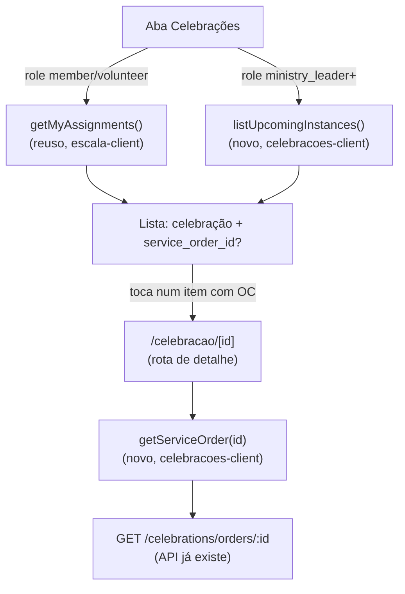

# Celebrações e OC no Mobile (MOB-08) Design

**Spec**: `.specs/features/celebracoes-oc-mobile/spec.md`
**Status**: Draft

---

## Architecture Overview

Nova aba "Celebrações" no `apps/mobile`, terceira tab ao lado de "Escala" e
"Conteúdo". A fonte de dados diverge por papel — decidido pela spec
(Assumptions), não por endpoint novo:

- `member`/`volunteer`: reaproveita `getMyAssignments()` (já existe,
  `escala-client.ts`) — a mesma lista que a aba Escala já busca.
- `ministry_leader`+: `GET /celebrations/instances?date_from=hoje` (endpoint
  já existe, papel já liberado).

Tocar num item leva à tela de detalhe (rota fora das tabs, como
`post/[id].tsx` e `indisponibilidade.tsx` já fazem), que busca
`GET /celebrations/orders/:id` e renderiza a OC + setlist em modo leitura.



---

## Code Reuse Analysis

### Existing Components to Leverage

| Component | Location | How to Use |
|---|---|---|
| `getMyAssignments()` | `apps/mobile/src/lib/escala/escala-client.ts` | Fonte de dados da aba Celebrações para `member`/`volunteer` — zero mudança de contrato |
| `authenticatedRequest` | `apps/mobile/src/lib/auth/auth-client.ts` | Base de todo client novo (`celebracoes-client.ts`), mesmo padrão de `content-client.ts`/`escala-client.ts` |
| `decodeJwtPayload` | `apps/mobile/src/lib/auth/jwt.ts` | Decide a fonte de dados por `roles` do token — já existe, usado hoje só pro OneSignal, ganha um segundo consumidor |
| `HttpError` | `apps/mobile/src/lib/api/errors.ts` | Diferenciar 404 de erro genérico na tela de detalhe, mesmo padrão de `post/[id].tsx:29-36` |
| Estado loading/error/detail | `apps/mobile/src/app/post/[id].tsx` | Template quase 1:1 para `app/celebracao/[id].tsx` (mesmo formato de 3 estados com `testID`) |
| `GET /celebrations/orders/:id` | `apps/api/src/celebrations/service-orders.controller.ts:30-34` | Já libera `volunteer`/`member`/`ministry_leader`; já inclui `items` → `setlist.songs.song` aninhado — endpoint único cobre AC2 inteiro, sem endpoint novo |
| `GET /celebrations/instances` | `apps/api/src/celebrations/celebration-instances.controller.ts:29-33` | Já libera `ministry_leader`+; já inclui `serviceOrder: {id,title,published_at}` — sem endpoint novo pro P2 |

### Integration Points

| System | Integration Method |
|---|---|
| `apps/api` — `CelebrationAssignmentService.getMyAssignments` | Passa a incluir `serviceOrder: { select: { id: true } }` no include de `celebrationInstance` e `service_order_id` no shape de retorno (campo aditivo — `apps/web` não usa esse shape hoje, `git grep -n "my-celebration-assignments" apps/web` confirma único consumidor é a tela `voluntarios/page.tsx`, que não lê campo desconhecido) |
| `apps/mobile` — nova aba | `Tabs.Screen name="celebracoes"` em `(tabs)/_layout.tsx`, mesmo padrão de `conteudo.tsx` |
| `apps/mobile` — rota de detalhe | `app/celebracao/[id].tsx`, Stack raiz (`_layout.tsx`), mesmo padrão de `post/[id].tsx` |

---

## Components

### Backend: `CelebrationAssignmentService.getMyAssignments` (alteração)

- **Purpose**: passa a devolver o id da Ordem de Culto de cada assignment,
  para o mobile navegar até ela sem endpoint novo.
- **Location**: `apps/api/src/celebrations/celebration-assignment.service.ts:353-410`
- **Mudança**: `include.celebrationMinistry.schedule.celebrationInstance`
  ganha `serviceOrder: { select: { id: true } }`; o `result.map` ganha
  `service_order_id: a.celebrationMinistry.schedule.celebrationInstance.serviceOrder?.id ?? null`.
- **Dependências**: nenhuma nova — mesma query, um `include` a mais.
- **Reuses**: a query e o batch de setlist (`attachSetlists`) já existentes,
  intocados.

### Mobile: `lib/celebracoes/types.ts`

- **Purpose**: tipos puros do domínio (OC + itens + setlist), espelhando o
  shape de `ServiceOrdersService.findOne` sem importar Nest/Prisma.
- **Location**: `apps/mobile/src/lib/celebracoes/types.ts`
- **Interfaces**: `ServiceOrder`, `ServiceOrderItem`, `CelebrationInstanceSummary`
  (ver Data Models).
- **Dependências**: nenhuma.
- **Reuses**: `SetlistSong` já existe em `lib/escala/types.ts` — reexportado
  daqui em vez de duplicado (mesmo shape: `id, sequence, title, key, bpm, link`,
  mas a OC também traz `key_alt`/`youtube_link`/`spotify_link`/`cifra_club_link`
  quando a música está vinculada ao catálogo — ver `SONG_REFERENCE_SELECT`;
  por isso `celebracoes/types.ts` define seu próprio `SetlistSongRef` mais
  completo em vez de forçar o tipo mais estreito de `escala/types.ts`).

### Mobile: `lib/celebracoes/celebracoes-client.ts`

- **Purpose**: wrapper tipado sobre `authenticatedRequest` para as duas
  chamadas novas do módulo.
- **Location**: `apps/mobile/src/lib/celebracoes/celebracoes-client.ts`
- **Interfaces**:
  - `listUpcomingInstances(): Promise<CelebrationInstanceSummary[]>` — `GET /celebrations/instances?date_from=<hoje ISO>`
  - `getServiceOrder(id: string): Promise<ServiceOrder>` — `GET /celebrations/orders/:id`
- **Dependências**: `authenticatedRequest`.
- **Reuses**: mesmo princípio de `content-client.ts`/`escala-client.ts` —
  não duplica validação, só chama a rota.

### Mobile: Tela `(tabs)/celebracoes.tsx`

- **Purpose**: lista as celebrações do usuário (AC1) ou da congregação
  (AC6), decidindo a fonte por `roles` do token.
- **Location**: `apps/mobile/src/app/(tabs)/celebracoes.tsx`
- **Dependências**: `useAuth()` (pegar `session.accessToken`),
  `decodeJwtPayload`, `getMyAssignments` (reuso), `listUpcomingInstances`.
- **Reuses**: layout de lista/estado de erro de `(tabs)/index.tsx`.

### Mobile: Tela `celebracao/[id].tsx`

- **Purpose**: detalhe da OC + setlist em modo leitura (AC2-AC5).
- **Location**: `apps/mobile/src/app/celebracao/[id].tsx`
- **Dependências**: `useLocalSearchParams` (`id`, `ministryId?`),
  `getServiceOrder`.
- **Reuses**: estrutura de 3 estados (loading/error/detail) de `post/[id].tsx`.

---

## Data Models

### `CelebrationInstanceSummary` (lista do `ministry_leader`+)

```typescript
export interface CelebrationInstanceSummary {
  id: string;
  scheduled_date: string;
  celebration: { id: string; name: string; type: string };
  serviceOrder: { id: string; title: string; published_at: string | null } | null;
}
```

**Relationships**: espelha `CelebrationInstancesService.findAll` — mesmo
`select` do `serviceOrder`, sem o `schedule` (não usado por esta tela).

### `ServiceOrder` (detalhe)

```typescript
export interface SetlistSongRef {
  id: string;
  sequence: number;
  title: string;
  key: string | null;
  key_alt: string | null;
  bpm: number | null;
  link: string | null;
  youtube_link: string | null;
  spotify_link: string | null;
  cifra_club_link: string | null;
}

export interface ServiceOrderItem {
  id: string;
  sequence: number;
  name: string;
  type: string;
  start_offset_minutes: number;
  duration_minutes: number;
  responsible_type: "person" | "ministry" | "free_text";
  person: { id: string; full_name: string } | null;
  ministry: { id: string; name: string } | null;
  responsible_label: string | null;
  notes: string | null;
  setlist: { songs: SetlistSongRef[] } | null;
}

export interface ServiceOrder {
  id: string;
  title: string;
  published_at: string | null;
  celebrationInstance: {
    id: string;
    scheduled_date: string;
    celebration: { id: string; name: string; type: string };
  };
  items: ServiceOrderItem[];
}
```

**Relationships**: espelha `ServiceOrdersService.findOne`
(`apps/api/src/celebrations/service-orders.service.ts:47-78`) campo a campo.

---

## Error Handling Strategy

| Error Scenario | Handling | User Impact |
|---|---|---|
| `getServiceOrder` devolve 404 (OC apagada entre listar e abrir) | `HttpError.status === 404` → mensagem dedicada | "Ordem de culto não encontrada." (mesmo padrão de `post/[id].tsx`) |
| `getServiceOrder`/`listUpcomingInstances` falha de rede | erro genérico com opção de retry | AC5 da spec — nunca tela vazia interpretável como "sem OC" |
| `order.published_at === null` | tela mostra a OC (itens) normalmente, com aviso "Ordem de culto ainda não publicada — pode mudar" no topo | Não bloqueia a leitura (a role já é liberada pela API); só avisa que é rascunho — decisão desta rodada, ver Tech Decisions |
| `item.setlist === null` | mensagem "Repertório ainda não publicado" no lugar da lista de músicas | AC4 da spec |
| Lista vazia (sem escala futura / sem celebração futura) | estado vazio explícito, texto por papel | Edge Case da spec — nunca indistinguível de erro |

---

## Risks & Concerns

| Concern | Location (file:line) | Impact | Mitigation |
|---|---|---|---|
| `getMyAssignments` não devolve `checked_in_at` no `result.map`, embora o campo exista no model e a tela hoje leia `item.checked_in_at` | `apps/api/src/celebrations/celebration-assignment.service.ts:388-400` | Bug pré-existente, fora do escopo original do MOB-08: o botão de check-in da aba Escala reaparece após reload mesmo já tendo dado check-in (só fica correto na sessão em memória, via `updateAssignment` local) | **Corrigido nesta feature, por decisão do usuário** (achado de revisão apresentado, não corrigido por conta própria) — adicionado ao `result.map` no mesmo commit que adiciona `service_order_id`, já que é a mesma função. Vira requisito `MOB-08-08` |
| `ServiceOrdersService.findOne` não filtra por `published_at` | `apps/api/src/celebrations/service-orders.service.ts:47-78` | Volunteer/member acessando a rota (hoje sem UI que chegue lá) veria rascunho gerenciado pelo líder, inclusive itens que podem ainda mudar | Mitigado no cliente: a tela de detalhe do mobile mostra aviso "ainda não publicada" quando `published_at` é `null`, sem esconder o conteúdo (a API já libera a role; esconder no mobile só, sem mudar a API, criaria inconsistência entre telas que a spec não pediu) |
| Destaque "sua função/horário" (AC3) só pode casar por `ministry.id`, não por pessoa | `apps/api/.../service-order-items.controller.ts` não devolve o `volunteer_profile_id`/assignment do item, só `person`/`ministry` do item em si | Se dois voluntários da mesma função estiverem na mesma etapa, ambos veem a etapa destacada (granularidade de ministério, não de pessoa) | Aceito nesta rodada — é a granularidade que os dois dados (assignment × item da OC) têm em comum hoje; documentado como Tech Decision abaixo |

> Concern adicional considerado e descartado: N+1 em `attachSetlists` — não
> é tocado por esta feature (função já existe e não muda).

---

## Tech Decisions (only non-obvious ones)

| Decision | Choice | Rationale |
|---|---|---|
| Casamento do destaque "minha função" (AC3) | Por `ministry.id` do item da OC == `ministry.id` do assignment usado pra navegar (passado como query param `ministryId` na rota de detalhe) | É o único campo em comum entre `Assignment` (ministério) e `ServiceOrderItem` (responsável por pessoa OU ministério OU rótulo livre) sem endpoint novo — ver Risks |
| Fonte de "próximas" para `ministry_leader`+ | `GET /celebrations/instances?date_from=<hoje em ISO local>` | Reusa o filtro que já existe no DTO (`date_from`), sem inventar flag "upcoming" nova |
| Decisão de papel (qual fonte de dados usar) | Decodifica `roles` do `accessToken` da sessão (`decodeJwtPayload`), checa se intersecciona com `["ministry_leader","admin_congregation","pastor","tenant_admin","secretary"]` | Mesmo mecanismo que o app já usa pra montar tags do OneSignal — sem chamada extra à API só pra saber o papel |
| OC não publicada | Mostrar com aviso, não esconder | Ver Risks — a API já libera a role; esconder no client criaria uma regra de negócio que não existe no servidor |

> **Project-level**: nenhuma decisão aqui estabelece convenção nova além do
> que `AD-002` já cobre (nenhum literal de identidade hardcoded — não se
> aplica a este módulo, que não toca branding). Nada para adicionar a
> `.specs/STATE.md`.
