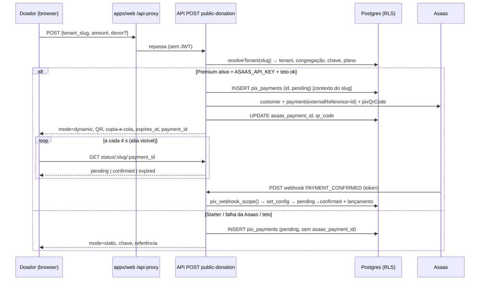

# Doação pública Premium com QR dinâmico — Design

**Spec**: `.specs/features/doacao-publica-premium-qr-dinamico/spec.md`
**Status**: Approved e implementado (2026-10-03) — respostas em `tasks.md` §Respostas

> `.specs/STATE.md` (`## Decisions`, AD-001…AD-005) foi lido. Conformidade:
> AD-001 (congregação em tabela nova) **não se aplica** — não há tabela nova;
> `pix_payments` é de `001` e já tem a policy de congregação. AD-004
> (`audit_insert` resolve o autor uma vez) é o precedente para a função SQL de
> DPUB-06. Nenhuma decisão ativa é superada; as escolhas abaixo que viram
> convenção devem virar `AD-006` **depois** da aprovação (não gravei agora para não
> registrar decisão não confirmada).
>
> Lições confirmadas (`lessons.py list --status confirmed`): nenhuma.

---

## Achado crítico (pré-requisito): o webhook não enxerga `pix_payments` sob RLS

Por regra do `CLAUDE.md`, é **achado → pergunta**, não correção por conta
própria (Q1). Evidência:

1. `pix_payments` tem `ENABLE` + `FORCE ROW LEVEL SECURITY` e **uma** policy:
   `tenant_congregation_isolation ... TO app_user USING (tenant_id =
   app_current_tenant() AND app_congregation_allowed(congregation_id))` com
   `WITH CHECK` idêntico (consultado em `pg_policies` no banco local).
2. `app_current_tenant()` = `NULLIF(current_setting('app.tenant_id', TRUE), '')`.
   Sem `set_config`, é `NULL` e a policy nega tudo.
3. `PixService.handleWebhook` (`pix.service.ts:614`) é rota pública, sem
   `TenantContextInterceptor`, e chama `this.prisma.client.pixPayment.findFirst({
   where: { asaas_payment_id } })` **sem** `set_config` — conexão `orbien_app`.
4. **Sonda reproduzida** (transação com `ROLLBACK`, banco local de
   desenvolvimento, linhas sintéticas, nenhum tenant real):

   ```
   sem contexto, orbien_app lê pix_payments: 0
   com contexto (tenant/congregação certos):  1
   outro tenant:                              0
   ```

5. Mesmo que a leitura passasse, `financialTransaction.create` dentro do `runInTx`
   do webhook falharia no `WITH CHECK` (42501), e `DonationReceiptService` lê
   `financial_transactions`/`persons` sem contexto.
6. Nenhum teste cobre isso: `grep` por `handleWebhook|pix_webhook|asaas_payment_id`
   em `apps/api/test/` retorna vazio; `pix.service.spec.ts` mocka o Prisma.
   Mesmo padrão do `8a623ac fix(api): auditoria ... nunca gravou no banco`.

**Consequência:** em produção, toda confirmação (Cenário 2, inscrição paga
PROD-24, recorrente PROD-27) cairia em `warn "PixPayment não encontrado"` e
responderia 200 — dinheiro pago sem lançamento e sem sinal de erro. **Não
verifiquei produção** (só o banco local); a verificação segura é rodar o teste de
integração do T-03 em `teste2-church` e conferir o log do Render por
`PixPayment não encontrado` no Cenário 2 já em uso. Sem esta correção, o
Premium público confirmaria exatamente nada, então ela é a tarefa zero.

### Opções para o webhook (Q1)

| Opção | Como | Prós | Contras |
| --- | --- | --- | --- |
| **W1 (recomendada)** — função SQL `SECURITY DEFINER` | `pix_webhook_scope(p_asaas_payment_id, p_asaas_subscription_id)` devolve `(tenant_id, congregation_id)`; o service chama, depois `runInTx` + `set_config` e o resto roda sob RLS normal | Fronteira no banco, precedente (`audit_insert`, `resolve_actor_name`); cobre os 3 caminhos (pagamento, recorrente via `pix_subscriptions`, inscrição) | Script de RLS novo (`024_…`) + verificação no passo 7 |
| W2 — `prisma.system` (BYPASSRLS) só para achar tenant | Lookup com o client privilegiado, resto sob contexto | Sem SQL novo | `prisma.service.ts` diz "Never use in request handlers"; abre precedente |
| W3 — `externalReference = tenantId:paymentId` | Lê o tenant do payload | Sem SQL | Confia em campo do payload (só o token o protege); não serve para recorrente nem para cobranças já criadas |

W1 é o desenho usado no resto deste documento. Se a resposta for W2/W3, só a
tarefa T-02 muda.

---

## Architecture Overview



**Ordem das escritas (importante):** a linha `pix_payments` é gravada **antes**
da chamada à Asaas, com o `id` pré-gerado (`randomUUID()`, como já faz o Cenário 3)
e usado como `externalReference`. Assim, se o processo cair após a Asaas criar a
cobrança, ainda existe a linha e o webhook a acha por `asaas_payment_id` (que é
atualizado logo depois — janela mínima, edge case documentado na spec). Se a Asaas
falhar, a linha vira intenção estática (A4) — sem `DELETE`, o que preserva o rastro
da tentativa. Diferente de `createDynamic`, que grava a linha só depois do QR.

### Abordagens para a rota (Large/Complex)

| | A — mesma rota, ramo por plano **(recomendada)** | B — rota nova `…/public-donation/dynamic` | C — redirecionar para `invoiceUrl` da Asaas |
| --- | --- | --- | --- |
| Quem decide Premium | Servidor (banco) | Servidor, mas o cliente "pede" dynamic → 403 se Starter | Servidor |
| Contrato | 1 endpoint, `mode` na resposta | 2 endpoints, cliente precisa saber o plano antes | 1 endpoint |
| Mobile (`WebBrowser.openBrowserAsync(/doar/slug)`) | Sem mudança | Sem mudança | Sem mudança |
| UX | QR na própria página, polling | igual A | Sai do domínio da igreja para a fatura Asaas; sem controle do estado "pago" |
| Risco | Resposta cresce (`qr_code_image` base64 ~3–6 KB) | Duplica DTO/throttle | Perde marca e controle |

Escolha: **A**. B só acrescenta uma decisão para o cliente errar; C descarta o
Premium como diferencial de experiência (ADR-007 pede QR "identificado").

---

## Code Reuse Analysis

### Existing Components to Leverage

| Component | Location | How to Use |
| --- | --- | --- |
| `PixService.resolveTenant` | `pix.service.ts:92` | Estender: devolve também `plan`/`status` (leitura de `tenantPlan` no mesmo `Promise.all`) e unifica as 3 falhas num 404 |
| `PixService.runInPublicContext` | `:164` | Contexto de RLS da escrita sem JWT (já fixa `app.tenant_id` + `app.congregation_id`; a policy exige os dois) |
| `resolveAsaasCustomer`, `asaasPost/Get/Delete`, `shortRef` | `:237`, `:44-80` | Extrair o trio customer→payment→pixQrCode de `createDynamic`/`createForEventRegistration` para um helper privado `createAsaasPixCharge(...)` (hoje duplicado 2×; a 3ª cópia seria dívida) |
| `resolveCategory` | `:171` | Idem Cenário 3 atual |
| Idempotência `updateMany WHERE status = pending` | `:701` | Reaproveitar sem mudança; só ganha `status IN (pending, failed)` (DPUB-09) |
| `writeAuditLog` | `common/audit/write-audit-log.ts` | `pix.confirmed` já é gravado; acrescentar `pix.public_intent_settled` na baixa manual (DPUB-26) |
| `@Throttle` + `ThrottlerGuard` | `pix.controller.ts:88` | Base do limite; tracker customizado (R1) |
| `RecurringRuleScheduler` + `prisma.system` | `recurring-rules/recurring-rule.scheduler.ts` | Molde do job de expiração/anonimização (cross-tenant legítimo: scheduler) |
| `DynamicPixPanel` (QR, copiar, `expires_at`) | `apps/web/src/components/financial/DynamicPixPanel.tsx` | Referência de UI do QR; **não** reutilizar o componente (é do painel autenticado, ver CLAUDE.md do web) — extrair o bloco "QR + copia-e-cola" para componente neutro se ficar idêntico |
| `public-routes.spec.ts` | `apps/api/test/integration/` | Molde dos testes HTTP; novos casos usam `teste1-church`/`teste2-church` |
| `test/helpers/rls` (`runAsTenantWithRole`) | `apps/api/test/rls/pix-subscriptions.spec.ts` | Molde dos testes de RLS |

### Integration Points

| System | Integration Method |
| --- | --- |
| Asaas | `POST /payments` com `externalReference = pix_payments.id`; `GET /payments/:id/pixQrCode`; `DELETE /payments/:id` (cancelar órfã). Detalhes do **expirationDate** vêm da resposta (já usado por `createDynamic`). Mínimo de valor, `dueDate` com hora e `notificationDisabled` **não verificados** na doc oficial — T-01 |
| Webhook Asaas | `PAYMENT_CONFIRMED`/`PAYMENT_RECEIVED` já tratados; **não** se trata `PAYMENT_OVERDUE`/`PAYMENT_DELETED` (a expiração é nossa) |
| `apps/web` `/api-proxy` | Encaminha tudo, inclusive `x-forwarded-for` (ver R1) |
| `proxy.ts` (domínio próprio) | Sem mudança |
| Mobile | Abre `/doar/[slug]` no navegador; o contrato antigo da resposta é preservado |

---

## RLS — qual policy cobre a escrita sem JWT

**Nenhuma policy nova é necessária para a escrita.** A rota pública roda como
`orbien_app`, que é **membro** de `app_user` (`pg_has_role('orbien_app',
'app_user','member') = t` no banco local); policies `TO app_user` valem para quem
herda o papel. `runInPublicContext` fixa `app.tenant_id` e `app.congregation_id`
do slug resolvido no servidor, e `tenant_congregation_isolation` (`USING` ≡ `WITH
CHECK`) passa só para essa dupla. Já coberto por `public-routes.spec.ts`
(`POST public-donation` grava a linha).

- A leitura de `tenants`, `branding_configs`, `congregations` e `tenant_plans`
  em `resolveTenant` passa por `orbien_app_auth ... USING (true)` (`017`) — é por
  isso que o plano é legível sem contexto (A1). **Não** apertar essas policies
  sem rever esta rota.
- **Rota de status** (`GET …/:tenant_slug/:payment_id`): resolve tenant pelo slug,
  `runInPublicContext`, `findFirst({ id, tenant_id, scenario: public })`. O RLS
  garante que um `payment_id` de outro tenant devolve 0 linhas = 404 (DPUB-15).
- **Se Q1 = W1:** novo `024_rls_pix_webhook_scope.sql` (função, não policy):
  `CREATE OR REPLACE FUNCTION pix_webhook_scope(...) SECURITY DEFINER SET
  search_path = public`, `REVOKE ALL ... FROM PUBLIC`, `GRANT EXECUTE ... TO
  orbien_app`. Entra no `bootstrap-db.sh` **depois** de `003` e do passo 4 (como
  `017`/`023`, fora do histórico do Prisma), e o **passo 7** ganha a verificação:
  `prosecdef`, dono, `search_path` fixo, `EXECUTE` só para `orbien_app` (modelo:
  a checagem de `audit_insert`, `bootstrap-db.sh:~675`). A função **só devolve
  ids**; não devolve linha de `pix_payments`.
- **Implementado:** `024_rls_pix_webhook_scope.sql` + passo 7 do bootstrap + `test/rls/pix-webhook-scope.spec.ts` e `pix-payments.spec.ts`. Nenhuma policy tocada.
- **Se nenhuma policy for alterada** (cenário sem W1 e sem tabela nova): o passo 7
  não muda, mas `test:rls` ganha casos novos para `pix_payments` (hoje só
  `isolation.spec.ts` toca nela) cobrindo congregação distinta do mesmo tenant.
- `USING` e `WITH CHECK` continuam idênticos: nada aqui os edita.

---

## Components

### `PixService.createPublicDonation` (estendido)

- **Purpose**: decidir `static`/`dynamic`, gravar intenção, cobrar na Asaas.
- **Location**: `apps/api/src/financial/pix.service.ts:520`
- **Interfaces**:
  - `createPublicDonation(dto: CreatePublicDonationDto): Promise<PublicDonationResponse>`
  - privados: `resolveTenant` (estendido), `createAsaasPixCharge(ctx, id, amount, description)`, `countRecentPublicDynamic(ctx)`.
- **Dependencies**: `TenantPlan` (plano), `HttpService`, `PrismaService.runInTx`.
- **Reuses**: `runInPublicContext`, `resolveCategory`, `asaas*`.

### `PixService.getPublicDonationStatus` (novo)

- **Purpose**: estado da cobrança para o polling, sem PII.
- **Location**: `pix.service.ts`; rota `GET /financial/pix/public-donation/:tenant_slug/:payment_id` em `pix.controller.ts`.
- **Interfaces**: `getPublicDonationStatus(slug, paymentId): Promise<{ status: 'pending'|'confirmed'|'expired'; expires_at: string|null }>`.
- **Regras**: `payment_id` validado por `ParseUUIDPipe`; só `scenario = public`; `expired` quando `pending` e `created_at + 24h < now` (expiração preguiçosa, A11); resposta com `Cache-Control: no-store`; **nunca** devolve valor, nome, e-mail, chave ou id de tenant.

### `PixService.handleWebhook` (corrigido — P0)

- **Purpose**: achar o escopo da linha, abrir transação sob contexto, confirmar.
- **Interfaces**: novo passo inicial `resolveWebhookScope(asaasPaymentId, asaasSubscriptionId?)` (W1); `updateMany ... status IN (pending, failed)`; `description` por cenário (`public` → "Doação pública via PIX").
- **Reuses**: o corpo atual (idempotência, auditoria, recibo).
- **Atenção**: `createPixPaymentFromSubscriptionWebhook` lê `pixSubscription.findUnique` — também sob RLS; precisa do mesmo escopo.

### `PublicDonationExpiryScheduler` (novo)

- **Purpose**: cancelar na Asaas e marcar `failed` as cobranças dinâmicas públicas `pending` > 48 h; anonimizar `donor_*` de intenções não confirmadas > 30 d (A10).
- **Location**: `apps/api/src/financial/public-donation-expiry.scheduler.ts`
- **Interfaces**: `@Cron('0 4 * * *') run(): Promise<void>`
- **Dependencies**: `prisma.system` (cross-tenant legítimo, mesmo padrão do `RecurringRuleScheduler`), `HttpService`.
- **Ordem obrigatória por linha**: `DELETE /payments/:id` na Asaas → só se 2xx/404, `UPDATE status = failed` (DPUB-09). Falha da Asaas ⇒ mantém `pending`, tenta no dia seguinte.
- **Ressalva**: `@Cron` não dispara com a API dormindo (PEND-13); a expiração preguiçosa do status cobre a UX, o job é higiene.

### `GET/POST financial/pix/intents…` (novo — P3)

- **Purpose**: listar intenções públicas e dar baixa manual das estáticas.
- **Location**: `PixController`; `GET /financial/pix/public-intents` (paginado) e `POST /financial/pix/public-intents/:id/settle`, ambos `JwtAuthGuard, RolesGuard` + `TenantContextInterceptor` + `@Roles(...FINANCIAL_ROLES)`. **Sem** `@RequiresPlan` (Starter também usa).
- **Reuses**: `FINANCIAL_ROLES`, `runInTx`, `writeAuditLog`.

### `apps/web` — `/doar/[tenant_slug]/page.tsx` (estendida)

- **Purpose**: formulário → QR/estado/polling.
- **Interfaces**: estados `form | static | dynamic | confirmed | expired`; hook local `usePaymentStatus(slug, paymentId, enabled)` com `setTimeout` encadeado, `document.visibilityState`, backoff 4→8→16 s em erro/429, teto de 24 h.
- **Reuses**: `api` (`src/lib/api.ts`), `apiErrorMessage`, `CurrencyInput`, `Button`/`Input`/`Label`.
- **Regras do web** (`apps/web/AGENTS.md`, `CLAUDE.md`): ler `node_modules/next/dist/docs/` antes de editar; tokens do design system; `<button>` puro para ícone/link; busca de dados é `useEffect` + axios (não react-query); **skill `frontend-design` carregada antes da primeira edição** (hook `require-frontend-design.mjs`).

---

## Data Models

### Contrato novo da resposta (compatível com o atual)

```typescript
// POST /financial/pix/public-donation
interface PublicDonationResponse {
  mode: 'static' | 'dynamic';            // NOVO
  pix_key: string;                        // existente (sempre presente)
  amount: number;                         // existente
  church_name: string;                    // existente
  transaction_ref: string;                // existente: PIX-XXXXXXXX
  fallback_reason?: 'provider_unavailable' | 'cap_reached'; // NOVO
  // só em mode = 'dynamic':
  payment_id?: string;                    // uuid v4 — capacidade de consulta de status
  qr_code?: string;                       // copia-e-cola
  qr_code_image?: string;                 // base64
  expires_at?: string;                    // ISO, vindo da Asaas
}
```

`payment_id` é um UUID v4 (122 bits) devolvido só a quem criou a cobrança; combinado
com o slug na rota de status ele atua como capacidade — adivinhar é inviável. O
`transaction_ref` (`PIX-` + 8 hex) **não** serve de chave (32 bits) e nunca é aceito
na rota de status.

### Migration (`pix_payments`) — PR 4

```prisma
model PixPayment {
  // …campos atuais…
  donor_name            String?   @db.VarChar(120)
  donor_email           String?   @db.VarChar(254)
  donor_consent_version String?   @db.VarChar(40)   // 'donor_consent_v1'
  donor_consented_at    DateTime?
}
```

Sem índice em `donor_email` (nada consulta por ele). Colunas nullable ⇒ migration
aditiva sem `DEFAULT`, sem lock longo. **Sem policy nova**: coluna em tabela com RLS
herda a policy. Nenhum campo de IP/user-agent (A9/Q6).

### DTO

`CreatePublicDonationDto` (novo, separado de `CreatePixDto` que serve também a
`POST /financial/pix`): `tenant_slug` (`@MaxLength(64)`), `amount` (`@IsNumber({
maxDecimalPlaces: 2 })`, `@Min`, `@Max` — A5), `donor_name` (`@MaxLength(120)`),
`donor_email` (`@IsEmail`, `@MaxLength(254)`), `donor_consent` (`@IsBoolean`,
obrigatório `true` se `donor_email`), `category_slug` (`@MaxLength(40)`), `website`
(honeypot). Mantém `forbidNonWhitelisted` — `plan`/`mode`/`scenario` dão 400.

---

## Error Handling Strategy

| Error Scenario | Handling | User Impact |
| --- | --- | --- |
| Slug inexistente / sem chave PIX / sem congregação | 404 único "Igreja não encontrada" (DPUB-14) | "Igreja não encontrada. Confira o link" |
| `amount` inválido | 400 por `class-validator` | Mensagem de valor mín./máx. |
| Rate limit | 429 | "Muitas tentativas. Aguarde um minuto" |
| Asaas falha / sem `ASAAS_API_KEY` / teto por tenant | Log `error`/`warn`, resposta `static` com `fallback_reason`, tenta `DELETE` da cobrança órfã | Chave estática + aviso |
| Webhook sem token | 401 (inalterado) | — |
| Webhook sem linha | 200 `{received:true}` + `warn` | — |
| Webhook duplicado/concorrente | 200, 1 lançamento | — |
| Polling com 404/429/rede | Backoff, sem erro visível enquanto o QR vale | QR segue na tela |
| `expired` | Para o polling | "Gerar novo QR" |
| Recibo falha | Engolido com `warn` (inalterado) | — |

---

## Risks & Concerns

| Concern | Location (file:line) | Impact | Mitigation |
| --- | --- | --- | --- |
| **R0** Webhook roda sem contexto de RLS (sonda: 0 linhas) | `pix.service.ts:614-703` | Toda confirmação PIX silenciosamente perdida; premissa de todo o Premium público | P0: W1 (`024_…` + `resolveWebhookScope`) + teste de integração contra o banco; Q1 |
| **R1** Throttle por IP atrás do proxy do web: `/api-proxy` repassa `x-forwarded-for` e a Render, com `trust proxy 1`, usa o **último** salto — o IP de egresso da Vercel, compartilhado por todos os doadores | `main.ts:19`, `api-proxy/[...path]/route.ts:29-41`, `pix.controller.ts:88` | 10 req/min **globais** para todas as igrejas pelo web ⇒ doação legítima vira 429 sob pico (domingo); ou, se o limite for subido, perde-se a proteção. **Hipótese a validar** (não testei em ambiente com Vercel→Render): ler `req.ip` num log em staging | T-05: (a) tracker `ThrottlerGuard` por `tenant_slug` + faixa de IP; (b) teto por tenant em banco (DPUB-13); (c) decidir como a API aprende o IP real (cabeçalho assinado do proxy do web). Q8 em `tasks.md` |
| **R2** Cada doação Premium faz 3 chamadas à Asaas (GET customer, POST payment, GET pixQrCode) | `pix.service.ts:237,299-312` | Esgotar cota/rate limit da conta Asaas e custo; anônimo sem login | DPUB-13 (teto por tenant/hora, em banco, sobrevive a restart); cache do `customerId` por tenant em memória (T-06) |
| **R3** `amount` sem teto/precisão; `Decimal(12,2)` estoura em 500 | `dto/create-pix.dto.ts:16-18` | 500 com valor ≥ 10^10; `10.123` arredondado em silêncio; cobrança de R$ 0,01 em massa | DPUB-11 (DTO próprio) |
| **R4** 400 "Igreja não configurou chave PIX" distingue slug válido-sem-chave de inexistente | `pix.service.ts:105-107` | Enumeração de tenants por slug | DPUB-14 (404 único). Observação: `GET /public/domains/resolve` e `/celulas/[slug]` também confirmam slug — enumeração é **inerente** ao produto (o slug é público no link); o objetivo aqui é não vazar *estado de configuração* |
| **R5** `resolveCategory` usa `contains` insensível com texto livre do cliente | `pix.service.ts:171-190` | Doador direciona a doação para qualquer categoria de receita (ex.: "Dízimo", "Inscrição") | Baixo (mesma congregação; o tesoureiro vê). Mitigação opcional: aceitar só um conjunto pequeno (`oferta`, `dizimo`, `missoes`) ou ignorar `category_slug` no Premium público. Q9 |
| **R6** Vincular doador por e-mail digitado a `Person` | — | Spam/recibo a terceiro; carnê de IR do membro errado (PROD-08) | A7: nunca vincular automaticamente; baixa/ vínculo é ação do tesoureiro |
| **R7** Cobrança paga após `failed` | `pix.service.ts:701` | Dinheiro recebido sem lançamento | DPUB-09 (`status IN (pending, failed)`) + ordem "cancelar na Asaas antes de `failed`" |
| **R8** Cobrança órfã na Asaas (aba fechada, dois QRs) | — | Linhas `pending` eternas; cobrança aberta | Expiração preguiçosa + job (DPUB-27); `DELETE /payments/:id` |
| **R9** CORS | `main.ts:41-47` | `allowedOrigins` só da web; o browser do doador **não** chama a API direto — chama `/api-proxy` (mesma origem) | Nada a fazer: CORS **não é vetor** desta rota; não adicionar `*`. Chamada direta do mobile à API não existe hoje (abre o navegador). Se existir no futuro, nova origem = decisão explícita |
| **R10** PII de doador em log | `pix.service.ts:630` (`this.logger.warn('Webhook sem payment.id', payload)`) | Payload da Asaas pode trazer nome/CPF do pagador em log | Não logar o payload inteiro (só ids); T-04 ajusta |
| **R11** `ASAAS_WEBHOOK_TOKEN` comparado com `!==` | `pix.service.ts:616` | Timing attack teórico | Trocar por `timingSafeEqual` (T-02, 3 linhas) |
| **R12** O teste de integração existente cria tenant `pub-<ts>` | `public-routes.spec.ts:36` | Foge da regra `teste1-church`/`teste2-church` (CLAUDE.md, `AMBIENTES.md`) em banco efêmero local | Os testes **novos** deste trabalho usam os slugs de teste (seed `--seed`); migrar o antigo é decisão à parte (Q10) |
| **R13** Cron dorme com o serviço (PEND-13) | `celebration-scheduler.service.ts:41` | Job de expiração/anonimização atrasa | A UX não depende do job (expiração preguiçosa); LGPD: anonimização atrasada é dívida visível — documentar |
| **R14** Sem split de 1% | ADR-007 | Receita transacional da plataforma ausente no Premium público | Fora de escopo, mas mesmo estado do Cenário 2 |

---

## Tech Decisions (só as não óbvias)

| Decision | Choice | Rationale |
| --- | --- | --- |
| Estado "pago" para o doador | Polling na rota de status | Não há push do servidor na base; 4 s × aba visível é barato (índice `[tenant_id, id]` já existe) |
| Capacidade de leitura do status | `payment_id` UUID + slug | Sem token novo; o `transaction_ref` curto nunca é aceito |
| Gravar a linha antes da Asaas | Sim, `id` pré-gerado → `externalReference` | Webhook sempre acha a linha; tentativa fica registrada |
| Donor ≠ Person | Snapshot na linha de `pix_payments` | Evita criar `Person`/consentimento sensível por rota pública |
| Baixa manual do estático | `source = manual` | Honesto sobre quem confirmou; sem migration de enum |
| Quem gateia plano | `TenantPlan` do banco **na criação** | A confirmação não depende do plano (o dinheiro já entrou) |
| Cliente Asaas | Customer = a igreja (como hoje) | Dados do doador **não** vão à Asaas (minimização) |
