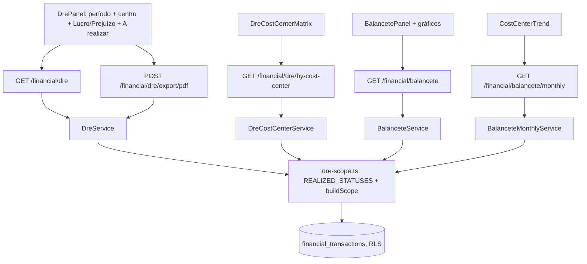

# DRE: lucro/prejuízo, PDF e centros de custo — Design

**Spec**: `.specs/features/financeiro-dre-resultado-centros-custo/spec.md`
**Status**: Approved (spec confirmada pelo usuário; abordagem A recomendada, sem objeção)

---

## Architecture Overview

Três serviços de leitura na API compartilham **um** construtor de filtro
(`dre-scope.ts`), que é o que garante o critério de sucesso "DRE = soma da
matriz = Balancete": mesmo status, mesmo recorte, mesma regra de `none`.

Abordagens avaliadas:

| | Abordagem | Veredito |
| --- | --- | --- |
| **A** | Estender `DreService` e criar serviços finos para matriz e série mensal, sobre helper de filtro comum | **Escolhida**: reaproveita o que existe, cada endpoint testável isolado |
| B | Um endpoint "analytics" devolvendo DRE+matriz+série | Rejeitada: resposta pesada para quem só quer o DRE; acopla telas |
| C | Calcular matriz e série no cliente a partir de `/financial/transactions` | Rejeitada: paginado, duplicaria regra de status/arredondamento no front |

## Code Reuse Analysis

| Component | Location | How to Use |
| --- | --- | --- |
| `DreService.previousPeriod/spansWholeMonths` | `apps/api/src/financial/dre.service.ts` | Mantidos; só o `where` passa a vir do helper |
| `DrePdfService.buildDocDef` | `dre-pdf.service.ts` | Editado: rótulo, linha "A realizar", cabeçalho de recorte; sem `updateMany` |
| `BalanceteService.groupByCostCenter` | `balancete.service.ts` | Reaproveitado; `where` do helper |
| `BalancetePanel` | `apps/web/src/components/financial/BalancetePanel.tsx` | Recebe os gráficos e a evolução; padrão `requestSeq`, `NoAccessState`, `isForbidden` |
| `CostCentersModal` / `GET /financial/cost-centers` | web + `cost-centers.controller.ts` | Fonte da lista do seletor |
| `ForecastCard` | `components/financial/ForecastCard.tsx` | Referência de uso de `recharts` no repo |
| Tab DRE inline | `financeiro/page.tsx:985-1117` | Extraída para `DrePanel.tsx` (testes de `page.test.tsx` seguem valendo) |

## Components

### `dre-scope.ts` (API)
- **Location**: `apps/api/src/financial/dre-scope.ts`
- **Interfaces**:
  - `REALIZED_STATUSES = ['paid','confirmed'] as const`
  - `buildScope({ tenantId, start, end, congregationId?, costCenterId?, costCenterName?, statuses }): Prisma.FinancialTransactionWhereInput` — `costCenterId==='none'` → `cost_center_id: null`; `costCenterId` vence `costCenterName`
  - `round2(n: number): number`
  - `resultLabel(net: number): 'Lucro' | 'Prejuízo' | 'Resultado zerado'` (usado pelo PDF)
- **Reuses**: nada; é a única definição de "o que entra no resultado"

### `DreQueryDto` / `PeriodRangeDto` (API)
- `cost_center_id?: string` validado por `@Matches(UUID | 'none')`; validador `period_end >= period_start` (400) compartilhado com `BalanceteQueryDto`.

### `DreService.buildDre` (API)
- Resultado: `revenue`, `expenses`, `net_result` (`round2`) só de `REALIZED_STATUSES`; novo campo `pending: { revenue_total, expenses_total }` do mesmo período/recorte; `previous_period` com a mesma regra.

### `DreCostCenterService` + rota `GET /financial/dre/by-cost-center`
- Retorno: `{ period, columns: [{ cost_center_id|null, name, revenue_total, expenses_total, net_result }], revenue: [{ category_name, cells: Record<key, number>, total }], expenses: [...], totals }`; chave `__none__` para sem centro.

### `BalanceteMonthlyService` + rota `GET /financial/balancete/monthly`
- Retorno: `{ period, months: ['AAAA-MM'...], series: [{ cost_center_id|null, name, points: [{ month, revenue_total, expenses_total, net_result }] }] }`; 400 acima de 36 meses; zeros preenchidos.

### `DrePanel` (web)
- **Location**: `apps/web/src/components/financial/DrePanel.tsx`
- Período, `CostCenterSelect` (Todos / Sem centro de custo / centros), tabela atual com linha de resultado "Lucro/Prejuízo do período", linha "A realizar", `DrePdfButton`, e `DreCostCenterMatrix` abaixo.

### `DrePdfButton`, `DreCostCenterMatrix`, `CostCenterCharts`, `CostCenterTrend` (web)
- Mesma pasta. `DrePdfButton` copia `downloadBlob` do `ExportButton` (POST blob). Gráficos via `recharts`; barras com `aria-label`; participação nas despesas como lista ordenada + barra horizontal (sem pizza — leitura de % por comprimento).

## Data Models

Nenhum modelo novo, nenhuma migration, nenhum script de RLS. Leitura de `financial_transactions` (`status`, `cost_center_id`, `amount`, `category.type`) já sob RLS de congregação/tenant.

## Error Handling Strategy

| Error Scenario | Handling | User Impact |
| --- | --- | --- |
| Período invertido ou `cost_center_id` inválido | 400 por `class-validator` | Tela não deixa disparar com período vazio; erro genérico se vier 400 |
| Período > 36 meses na série | 400 | "Escolha um período de até 36 meses" no card de evolução |
| 403 (papel/plano) | `isForbidden` | `NoAccessState` |
| Falha ao gerar PDF | catch no botão | "Erro ao exportar o DRE." |
| Resposta antiga chega depois | `requestSeq` | Ignorada |

## Risks & Concerns

| Concern | Location | Impact | Mitigation |
| --- | --- | --- | --- |
| PDF muta dados (`updateMany` → `confirmed`) | `dre-pdf.service.ts:62-76` | Cada clique alteraria status de lançamentos | Removido (DRE-05), teste afirma zero chamadas de escrita |
| `net_result` sem arredondamento | `dre.service.ts` (`revenueTotal - expensesTotal`) | `0.1+0.2-0.3` ≠ 0 | `round2` no resultado (DRE-04) |
| `pending` somado ao resultado hoje | `dre.service.ts:61`, `balancete.service.ts:42` | Números mudam; Balancete e DRE precisam mudar juntos | Helper único + teste de fechamento entre as 3 visões |
| Filtro por nome de centro | `dre.service.ts:55` | Nome duplicado entre congregações mistura recortes | `cost_center_id` passa a vencer; nome fica só por compatibilidade |
| `findMany` sem limite em período longo | `balancete.service.ts:36` | Consulta pesada na série mensal | Limite de 36 meses; `select` mínimo na série |
| Aba DRE inline em arquivo de 1248 linhas | `financeiro/page.tsx` | Difícil de testar e de crescer | Extração para `DrePanel` sem mudar comportamento |
| `isPastor` ignorado na API (`void isPastor`) | `dre.service.ts:96` | Pastor vê totais por chamada direta | Fora do escopo; mantido como está e preso por teste existente |

## Tech Decisions

| Decision | Choice | Rationale |
| --- | --- | --- |
| Sem centro no filtro | literal `none` | UUID inválido já é 400; `none` é inequívoco e igual ao rótulo |
| Pizza vs. barra | Barras (receita×despesa) e barra horizontal para participação | Comparação por comprimento; pizza com muitos centros não se lê |
| Lucro/prejuízo além da cor | Rótulo textual + sinal | Acessibilidade (não depender só de cor) |

> Decisão de projeto: "lucro/prejuízo é resultado realizado (`paid`+`confirmed`)" afeta
> qualquer relatório financeiro futuro. Registrar como `AD-011` em `.specs/STATE.md` na T12.
