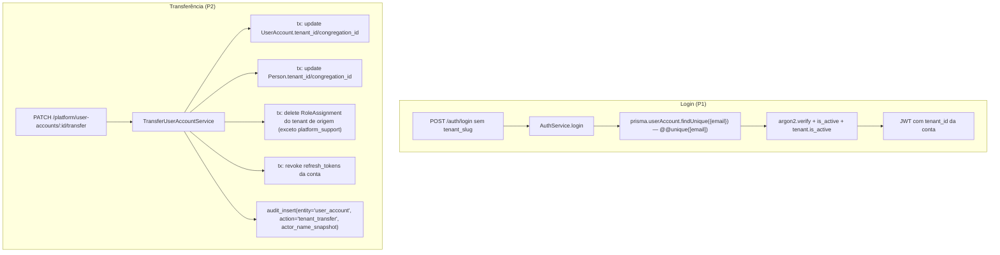

# Login por e-mail único (global) Design

**Spec**: `.specs/features/login-email-global/spec.md`
**Context**: `.specs/features/login-email-global/context.md`
**Status**: Approved

---

## Leitura prévia (Knowledge Verification Chain)

- `.specs/STATE.md` → AD-001/002/003 não colidem com esta feature (nenhuma
  trata de auth, email ou RLS de `user_accounts`/`audit_logs`).
- Lições confirmadas: nenhuma registrada ainda (`lessons.py list --status
  confirmed` vazio).
- Código lido: `AuthService.login/platformLogin/refresh`, `JwtStrategy.validate`,
  `TenantContextInterceptor`, `AuditInterceptor`, `audit_insert()` (em
  `001_rls_setup.sql`), `PlatformController` + `SetTenantActiveService` +
  `UpdateTenantService` (padrão de rota/serviço de plataforma),
  `LoginRateLimitService`, schema de `UserAccount`/`Person`/`RoleAssignment`/
  `AuditLog`/`Tenant`, `DEPLOY.md` (pipeline de RLS fora do Prisma).

---

## Architecture Overview

Duas mudanças relativamente independentes, uma pré-condição da outra:

1. **Login sem slug** — `AuthService.login` passa a fazer o que
   `platformLogin` já faz (busca por e-mail, sem tenant informado), só que
   sem a exceção de "múltiplos tenants": com `@@unique([email])` no schema,
   nunca há ambiguidade a tratar em runtime.
2. **Transferência de tenant** — nova rota de plataforma
   (`PlatformController`), mesmo padrão de `SetTenantActiveService`, que move
   `UserAccount` + `Person` para outro tenant/congregação, revoga
   sessões e papéis, e grava um `audit_logs` com snapshot do nome do autor.



---

## Approach Exploration (P1 — como resolver a busca sem slug)

### Opção A — `@@unique([email])` no schema (recomendada, é a que o usuário escolheu)

Constraint no banco garante zero-ou-uma conta por e-mail. `login` fica uma
função simples: `findUnique({ where: { email } })`. Ambiguidade é impossível
por construção — não existe branch de erro `ACCOUNT_AMBIGUOUS` como em
`platformLogin`, porque a situação que gera aquele erro não pode ocorrer.

- **Trade-off**: exige a migration de unicidade (com o guard de duplicata do
  AUTH-05/06) e a feature de transferência como pré-condição operacional.

### Opção B — manter `@@unique([tenant_id, email])`, replicar a busca ambígua de `platformLogin`

`login` faria `findMany({ email })` e trataria 0/1/N como `platformLogin` já
trata (N vira 409 `ACCOUNT_AMBIGUOUS`). Não precisa de migration nem de
transferência — mas devolveria esse erro pra usuário final sempre que duas
contas (de tenants diferentes) coincidissem no e-mail, o que o produto trata
como situação a **evitar**, não a **expor** para quem só quer logar.

- **Descartada**: o usuário já decidiu por "email único de verdade no
  schema" na fase Specify — registrado aqui só para não perder o porquê.

### Opção C — resolver tenant por sub-domínio/app (sem tocar em schema)

Cada app (web) já sabe seu tenant por config/DNS (ex.: `igreja.orbien.app`).
Não se aplica: hoje não existe esse roteamento por domínio para tenants de
igreja (é o desenho do `apps/mobile` white-label futuro, ADR-002, não deste
produto). Descartada por não existir a infraestrutura que a sustentaria.

**Decisão**: Opção A. Já confirmada pelo usuário no Specify.

---

## Code Reuse Analysis

### Existing Components to Leverage

| Component | Location | How to Use |
| --- | --- | --- |
| `platformLogin` (busca por e-mail, mensagem 401 genérica) | `apps/api/src/auth/auth.service.ts:179-252` | Modelo direto para o novo `login`: mesma forma de tratar "não achou" e "senha errada" como o mesmo erro. |
| `LoginRateLimitService` + `LOGIN_POLICY` | `apps/api/src/auth/login-rate-limit.service.ts` | Reusado sem mudança de policy — só a chave deixa de incluir `tenant_slug` (`LoginRateLimitService.key('login', dto.email)`). |
| `SetTenantActiveService` (padrão de serviço de plataforma simples) | `apps/api/src/platform/set-tenant-active.service.ts` | Modelo de forma/estrutura pro `TransferUserAccountService` novo — `NotFoundException` em `P2025`, retorno tipado. |
| `PlatformController` (`@PlatformRoute()` + `@Roles('platform_support')` + `TenantContextInterceptor`) | `apps/api/src/platform/platform.controller.ts` | Nova rota entra neste controller, mesmas 3 marcas. |
| `audit_insert()` (SQL, `SECURITY DEFINER`) | `apps/api/prisma/migrations/001_rls_setup.sql:454` | Chamado diretamente pelo novo serviço (primeiro caller fora do `AuditInterceptor`) — assinatura ganha 1 parâmetro novo (`actor_name_snapshot`), `CREATE OR REPLACE` já é o padrão do arquivo. |
| `refreshToken.updateMany` para revogar família | `apps/api/src/auth/auth.service.ts:296-304` (`refresh`) | Mesmo `updateMany({ where: { user_account_id, revoked_at: null }, data: { revoked_at: new Date() } })`, chamado pelo novo serviço. |
| `bootstrap-db.sh` / `npm run db:deploy` | `apps/api/scripts/bootstrap-db.sh`, `DEPLOY.md` | Já aplica `001_rls_setup.sql` com `CREATE OR REPLACE FUNCTION` em produção sem passo manual extra — a mudança de assinatura do `audit_insert()` viaja pelo pipeline existente. |

### Integration Points

| System | Integration Method |
| --- | --- |
| Prisma schema | `@@unique([tenant_id, email])` → `@@unique([email])` em `UserAccount`; migration normal (`prisma migrate dev`), dentro do histórico do Prisma — não é RLS. |
| RLS (`001_rls_setup.sql`) | Só o `audit_insert()` muda de assinatura; nenhuma policy de `user_accounts`/`persons`/`role_assignments` precisa mudar — a transferência escreve dentro da mesma transação `SET LOCAL ROLE app_user` já usada por qualquer request de plataforma. |
| `apps/web` / `apps/mobile` | Removem o campo/estado de `tenant_slug` das telas e do payload de `POST /auth/login`. |
| `apps/admin` | Nova tela/ação de transferência, no mesmo lugar de `EditTenantModal` (ficha da pessoa, não do tenant — ver Componentes). |

---

## Components

### `AuthService.login` (modificado)

- **Purpose**: Autentica por e-mail+senha sem tenant informado.
- **Location**: `apps/api/src/auth/auth.service.ts`
- **Interfaces**: `login(dto: LoginDto): Promise<{ access_token, refresh_token, expires_in }>` — assinatura do DTO perde `tenant_slug` (AUTH-01/02/03).
- **Dependencies**: `PrismaService`, `LoginRateLimitService`, `argon2`.
- **Reuses**: a forma de erro único (`INVALID_CREDENTIALS`) e o `rateLimit.clear/register` já usados em `platformLogin`.

### `TransferUserAccountService` (novo)

- **Purpose**: Move `UserAccount` + `Person` para outro tenant/congregação,
  revoga sessão e papéis do tenant de origem, grava auditoria.
- **Location**: `apps/api/src/platform/transfer-user-account.service.ts`
- **Interfaces**:
  - `transfer(userAccountId: string, dto: TransferUserAccountDto, actor: JwtPayload): Promise<TransferredAccount>`
- **Dependencies**: `PrismaService` (transação), mesma forma de `$executeRaw`
  para `audit_insert()` usada no `AuditInterceptor`.
- **Reuses**: `SetTenantActiveService` como modelo de forma; `refresh()`'s
  padrão de revogação de família.

### `PlatformController` (rota nova)

- **Purpose**: Expor a transferência como ação de plataforma.
- **Location**: `apps/api/src/platform/platform.controller.ts`
- **Interfaces**: `PATCH /platform/user-accounts/:id/transfer`
- **Dependencies**: `TransferUserAccountService`.
- **Reuses**: mesmas 3 marcas (`@Roles`, `@PlatformRoute`, `TenantContextInterceptor`) de toda rota do controller.

### `apps/admin` — ação de transferência

- **Purpose**: UI para `platform_support` disparar a transferência.
- **Location**: nova ação na tela de pessoa/conta do console (a decidir em
  Tasks — hoje o admin só tem telas de **tenant**, não de pessoa; pode nascer
  como campo no modal de edição de tenant filtrado por e-mail, ou tela
  própria "Transferir conta").
- **Reuses**: padrão de modal com confirmação de `EditTenantModal`.

---

## Data Models

### `UserAccount` (schema alterado)

```prisma
model UserAccount {
  // ...
  @@unique([email])              // era @@unique([tenant_id, email])
  @@index([tenant_id, id])
  @@index([tenant_id, congregation_id])
}
```

### `AuditLog` (schema alterado)

```prisma
model AuditLog {
  // ...
  actor_name_snapshot String?    // novo — nome da pessoa autora, congelado no momento do INSERT
}
```

`audit_insert()` ganha o parâmetro `p_actor_name_snapshot TEXT` (11º
argumento) e passa a gravá-lo. Chamadas existentes (só o `AuditInterceptor`)
resolvem o nome via join `actor_user_id → user_accounts → persons` antes de
chamar a função — hoje esse join não é feito ali, então isso também é
trabalho novo do `AuditInterceptor`, não só do serviço de transferência
(ver Riscos).

### `TransferUserAccountDto` (novo)

```typescript
interface TransferUserAccountDto {
  destination_tenant_id: string;
  destination_congregation_id: string;
}
```

---

## Error Handling Strategy

| Error Scenario | Handling | User Impact |
| --- | --- | --- |
| E-mail não encontrado / senha errada / conta ou tenant inativo (`login`) | Mesmo 401 `INVALID_CREDENTIALS` genérico já usado hoje | Mensagem idêntica à atual — nenhuma mudança visível de UX de erro |
| Migration encontra e-mail duplicado entre tenants | Migration falha, lista as duplicatas em log | Deploy não avança; alguém resolve manualmente antes de rodar de novo (AUTH-05) |
| Transferência para o mesmo tenant em que a conta já está | 400 `NOOP_TRANSFER` | Admin vê mensagem de erro específica, não um "sucesso" vazio |
| `destination_tenant_id`/`destination_congregation_id` inexistente ou tenant inativo | 404 / 400 (mesmo padrão de `SetTenantActiveService`/`UpdateTenantService` com `P2025`) | Admin vê erro claro antes de mover qualquer dado |
| `audit_insert()` falha na transferência | Loga erro (best-effort, mesmo princípio do `AuditInterceptor`) mas **não** desfaz a transferência — a auditoria nunca bloqueia a operação de negócio, mesmo padrão já adotado | Transferência completa mesmo sem rastro; erro fica só no log do servidor |

---

## Risks & Concerns

| Concern | Location | Impact | Mitigation |
| --- | --- | --- | --- |
| `audit_insert()` hoje não resolve nome de autor — quem chama (`AuditInterceptor`) só tem `actor_user_id` do JWT, nunca fez join pra nome | `apps/api/src/common/interceptors/audit.interceptor.ts:60-113` | Sem mudança no interceptor, `actor_name_snapshot` fica `NULL` em **toda** auditoria existente (`support_access`, `platform_access`), não só na de transferência — o snapshot só existiria pra transferência se só ela passar o nome | O `AuditInterceptor` precisa passar a resolver `person.full_name` via `user.sub` antes de chamar `audit_insert` (1 query extra por request auditada) — inclui isso como task explícita, não é grátis |
| Migration de `@@unique([email])` é destrutiva se houver duplicata real hoje em produção — ninguém aqui consultou o banco de produção | Schema de `user_accounts` | Deploy trava (ou, pior, alguém tenta forçar e escolhe uma conta arbitrariamente) | AUTH-05/06 exigem que a migration falhe alto e liste as duplicatas; antes de rodar em produção, alguém com acesso precisa rodar a query de verificação (`SELECT email, count(*) FROM user_accounts GROUP BY email HAVING count(*) > 1`) e resolver manualmente — **isto é um passo manual pré-deploy, não algo que o código resolve por si** |
| `RoleAssignment.congregation_id` é obrigatório (`String`, não nulável) — a transferência weeds papéis do tenant de origem, mas não atribui nenhum no destino | `apps/api/prisma/schema.prisma:239-254` | Pessoa transferida chega ao tenant novo autenticável (login funciona) mas sem nenhum papel — todas as rotas com `@Roles` vão 403 até alguém do tenant novo atribuir um papel | Comportamento é o que a spec pede (AUTH-10: "chega sem papel, tenant novo atribui de novo") — só documentar que isso é intencional, não bug, e garantir que a UI do admin avise disso no fluxo de transferência |
| `Person.email` (campo solto, sem unique) não está sincronizado com `UserAccount.email` — a transferência move `Person.tenant_id`, mas se o `Person.email` divergir da conta, nada nesta feature detecta isso | `apps/api/prisma/schema.prisma:310-330` | Inconsistência pré-existente, não introduzida por esta feature | Fora de escopo — não é a unicidade de login que estamos desenhando; anotar em `docs/PLANO.md` só se aparecer caso real |
| Nenhum teste hoje cobre `login` sem `tenant_slug` nem a ausência de ambiguidade — toda a suite atual de `auth.service.spec.ts` assume o parâmetro | `apps/api/src/auth/auth.service.spec.ts` | Testes existentes quebram na mudança de assinatura do DTO | Esperado — a Task de implementação reescreve os testes de `login` (não é gap, é o próprio trabalho da task) |

---

## Tech Decisions (only non-obvious ones)

| Decision | Choice | Rationale |
| --- | --- | --- |
| Onde a transferência vive no código | `apps/api/src/platform/` (não `apps/api/src/auth/`) | É uma ação de plataforma sobre uma conta, mesma família de `SetTenantActiveService`/`UpdateTenantService` — não é fluxo de autenticação. |
| `TENANT_NOT_FOUND` code no erro de `login` | Removido da resposta (era só informativo, nunca mudava o texto mostrado) | Simplificação de escopo; ninguém no front distinguia por esse code (`apps/web` mostra a mesma mensagem genérica hoje). |
| `actor_name_snapshot` populado também pelo `AuditInterceptor`, não só pela transferência | Resolver o nome no interceptor, uma vez, reaproveitado por todo `audit_insert()` | Snapshot inconsistente (só em alguns registros) seria pior que não ter — ou toda auditoria congela o nome, ou nenhuma. |
| Chave do rate limit de `login` | `LoginRateLimitService.key('login', dto.email)` (sem tenant) | Decisão explícita do usuário no Specify; mesmo padrão de `platformLogin`. |

> **Project-level**: a mudança em `audit_insert()` (parâmetro novo,
> resolvido uma vez no `AuditInterceptor` e reusado por qualquer chamador
> direto) é um padrão que vale para qualquer feature futura que precise
> registrar auditoria de ação entre tenants — vou registrar como `AD-004`
> em `.specs/STATE.md` ao aprovar este design.

---
