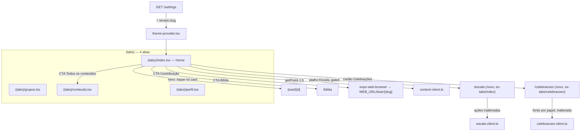

# Redesenho da Home e do menu inferior (mobile) — Design

**Spec**: `.specs/features/mobile-home-redesign/spec.md`
**Status**: Approved (abordagem confirmada com o usuário)

---

## Architecture Overview

Duas telas hoje registradas como abas (`(tabs)/index.tsx`,
`(tabs)/celebracoes.tsx`) migram, **sem reescrever a lógica interna**, para
rotas empilhadas fora do grupo `(tabs)` — mesmo padrão já usado por
`biblia/`, `indisponibilidade.tsx`, `notificacoes.tsx`: arquivo novo em
`src/app/`, registrado no `Stack.Protected` de `src/app/_layout.tsx`, com
`title` próprio (o Stack já dá header/voltar de graça, coisa que a aba não
tinha).

O `(tabs)/index.tsx` fica livre para virar a Home nova: um orquestrador
magro que compõe componentes novos (hero, grid de CTAs) com o que já existia
ali (saudação, "Meus grupos", "Avisos recentes" — HOME-01/02/03, mantidos
como estão).



---

## Approach Confirmed

**Escolhida**: mover `index.tsx`/`celebracoes.tsx` para rotas empilhadas
novas (`src/app/escala.tsx`, `src/app/celebracoes.tsx`), reconstruindo
`(tabs)/index.tsx` do zero como Home.

**Rejeitada**: esconder as abas com `href: null` sem mover arquivo — mantém
Home e Escala fisicamente no mesmo componente, o que contradiz o pedido
central (separar os dois papéis) e complicaria inserir o hero/CTAs no meio
de uma tela que já tem fetch + FlatList + ações de escala.

---

## Code Reuse Analysis

### Existing Components to Leverage

| Component | Location | How to Use |
| --- | --- | --- |
| `Screen` | `src/components/Screen.tsx` | Container da nova Home (`scroll`), igual a hoje. |
| `BrandHeader` | `src/components/BrandHeader.tsx` | Topo da Home, sem mudança. |
| `Card` | `src/components/Card.tsx` | Base visual dos cards de "Meus grupos"/"Avisos recentes" (mantidos) e do novo cartão de Celebrações. |
| `AppButton` | `src/components/AppButton.tsx` | CTA "Ver todos os conteúdos" (secundário) se um dos CTAs pedir botão cheio em vez de ícone. |
| `AppLink` | `src/components/AppLink.tsx` | Base de toque 48px para os ícones de atalho (Bíblia/Contribuição/Escala/Celebrações), sem reinventar hitSlop. |
| `SectionLabel` | `src/components/SectionLabel.tsx` | Rótulos de seção da Home ("Últimos conteúdos", "Meus grupos", "Avisos recentes"). |
| `Badge` | `src/components/Badge.tsx` | Opcional, para marcar item do hero (ex. tipo "Evento") se o post for do tipo `event`. |
| `getPosts` | `src/lib/content/content-client.ts` | Fonte do hero (`getPosts(1, 5)`) e do CTA "Ver todos" (mesma tela `conteudo.tsx`, sem client novo). |
| `listMyGroups` | `src/lib/groups/*-client.ts` (o mesmo já usado em `index.tsx` hoje) | HOME-02, sem mudança. |
| `getMyAssignments`, `respondToAssignment`, `checkIn` | `src/lib/escala/escala-client.ts` | Movem junto com o JSX para `escala.tsx`, sem mudança de assinatura. |
| `listUpcomingInstances`, fonte por papel | `src/lib/celebracoes/celebracoes-client.ts` | Move junto com o JSX para `celebracoes.tsx`, sem mudança. |
| `useAuth()` (`areas`) | `src/lib/auth/auth-provider.tsx` | Gate do atalho de Escala na Home (`areas === null \|\| areas.includes("volunteers")`), mesma regra que hoje vive em `(tabs)/_layout.tsx`. |
| `useTheme()` | `src/lib/theme/theme-provider.tsx` | Cores/CTA da Home; ganha `tenantSlug` novo (ver Data Models). |
| ícones (`lucide-react-native` via `src/lib/theme/icons.ts`) | idem | Ícones novos do CTA grid entram no barril por subpath, nunca do pacote inteiro (STYLE-GUIDE §5). |

### Integration Points

| System | Integration Method |
| --- | --- |
| `GET /settings` (API) | Ganha `tenant.slug` na resposta (`ResolvedSettings.tenant`), sem migration — `Tenant.slug` já existe no schema (`prisma/schema.prisma:25`), só não estava exposto. |
| `apps/web` `/doar/[tenant_slug]` | Consumida via link externo (`expo-web-browser`), sem chamada de API direta do mobile — o mobile só monta a URL. |
| `expo-web-browser` (novo) | `npx expo install expo-web-browser` a partir da raiz (mono-repo, workspace `orbien-mobile`) — resolve a versão compatível com Expo SDK 57 sozinho; nunca fixar versão à mão. |

---

## Components

### `HeroSlider`

- **Purpose**: carrossel horizontal dos últimos conteúdos publicados, com paginação por toque/swipe.
- **Location**: `src/components/HeroSlider.tsx`
- **Interfaces**:
  - `HeroSlider({ posts, onPressPost }: { posts: Post[]; onPressPost: (id: string) => void }): JSX.Element`
- **Dependencies**: `FlatList` (`react-native`) com `horizontal pagingEnabled snapToAlignment="start" decelerationRate="fast"` — **sem lib nova**, mesma decisão já registrada na exploração inicial (nenhuma lib de carousel no projeto, e o padrão do resto do app é não introduzir dependência de UI sem necessidade). Indicadores de página como pontinhos simples (`View` + `bgSubtle`/`primaryColor`), sem biblioteca.
- **Reuses**: `Card` (moldura de cada slide), tokens de `spacing`/`radius`.

### `HomeQuickActions`

- **Purpose**: grade de CTAs/ícones (Bíblia, Contribuição, Ver todos os conteúdos, Escala [gated], Celebrações).
- **Location**: `src/components/HomeQuickActions.tsx`
- **Interfaces**:
  - `HomeQuickActions({ items }: { items: QuickAction[] }): JSX.Element`
  - `interface QuickAction { key: string; label: string; icon: LucideIcon; onPress: () => void; disabled?: boolean }`
- **Dependencies**: nenhuma externa nova.
- **Reuses**: `AppLink`/`Card` para o touch target de 48px, `iconSize.action` (24px) para os ícones, `useTheme().primaryColor`/`accentReadable` para o destaque visual (STYLE-GUIDE §6).

### `(tabs)/index.tsx` (reescrita — Home)

- **Purpose**: orquestra hero + quick actions + os destaques já existentes (saudação, Meus grupos, Avisos recentes).
- **Location**: `src/app/(tabs)/index.tsx`
- **Dependencies**: `getPosts` (hero), `listMyGroups`/`getPosts` (destaques, já existentes), `useAuth()` (`areas`), `useTheme()` (`tenantSlug`, `appName`), `expo-web-browser` (CTA Contribuição), `expo-router` `useRouter()` (navegação dos CTAs).
- **Reuses**: toda a lógica de HOME-01/02/03 de hoje, copiada sem alteração de comportamento (só de posição no arquivo).

### `src/app/escala.tsx` (novo — ex-`(tabs)/index.tsx`)

- **Purpose**: lista de "Próximas escalas" com ações de confirmar/recusar/check-in — **cópia 1:1** do que `(tabs)/index.tsx` faz hoje para essa parte, sem o `BrandHeader`/saudação/destaques (que ficam na Home).
- **Location**: `src/app/escala.tsx`
- **Dependencies**: `escala-client.ts` (inalterado).
- **Reuses**: 100% da lógica de fetch/estado/ações do `index.tsx` atual; só o container muda de `(tabs)/index.tsx` para uma rota de `Stack` com `title: "Escala"`.

### `src/app/celebracoes.tsx` (novo — ex-`(tabs)/celebracoes.tsx`)

- **Purpose**: lista de celebrações, mesma lógica de fonte por papel (`getMyAssignments` vs `listUpcomingInstances`) de hoje.
- **Location**: `src/app/celebracoes.tsx`
- **Dependencies**: `celebracoes-client.ts` (inalterado).
- **Reuses**: 100% da lógica atual de `(tabs)/celebracoes.tsx`; header próprio (`title: "Celebrações"`) no lugar do header de aba.

### `(tabs)/_layout.tsx` (editado)

- Remove `Tabs.Screen name="celebracoes"`.
- Renomeia a entrada `index`: `title: "Home"`, ícone `Home` (lucide) no lugar de `CalendarCheck`/`Church`.
- Remove a lógica `showEscala`/`href` condicional (o gate de permissão passa a viver dentro da Home, no `HomeQuickActions`, não na tab bar).
- Ordem final: `index` (Home) → `grupos` → `conteudo` → `perfil`.

### `src/app/_layout.tsx` (editado)

- Adiciona `<Stack.Screen name="escala" options={{ title: "Escala" }} />` e `<Stack.Screen name="celebracoes" options={{ title: "Celebrações" }} />` dentro do `Stack.Protected guard={isAuthenticated}` — mesma lista onde já estão `biblia/index`, `indisponibilidade`, etc.

### `login.tsx` (editado, item independente)

- **Purpose**: corrigir o corte lateral do `appName`.
- **Mudança**: `styles.appName` ganha `flexShrink: 1` explícito e a `Text` ganha `numberOfLines={2}` (nunca corta caractere — na pior hipótese quebra linha) em vez de depender do comportamento default; adicionado um `paddingHorizontal: spacing.xs` no `styles.brand` para garantir folga entre o texto e qualquer borda que hoje meça o box exatamente do tamanho do texto.
- **Reuses**: mesmos tokens (`spacing`), nenhum componente novo.

---

## Data Models

### `ResolvedSettings.tenant` (API, `apps/api/src/settings/settings.service.ts`)

```typescript
export interface ResolvedSettings {
  tenant: { name: string; email: string | null; phone: string | null; slug: string }; // + slug
  // branding, congregation inalterados
}
```

**Relationships**: `slug` vem direto de `Tenant.slug` (já `@unique`, já selecionado — `getSettings` já busca o `tenant` inteiro via `findUnique`, então é campo a mais no mesmo objeto, sem query nova).

### `BrandTheme` (mobile, `src/lib/theme/brand-theme.ts`)

```typescript
export interface BrandTheme {
  primaryColor: string;
  accentColor: string;
  logoUrl: string | null;
  appName: string;
  tenantSlug: string | null; // novo
}
```

`tenantSlug` entra na cadeia de camadas só na camada 4 (runtime, `GET /settings`) — não existe em build-time nem em plataforma, porque só faz sentido depois do login (mesmo raciocínio de `logoUrl`/`appName` hoje). Cache (camada 3) também preenche, para o CTA já funcionar mesmo se `/settings` ainda não respondeu de novo nesta sessão.

### `Constants.expoConfig.extra` (mobile, `app.config.js`)

Novo campo `webUrl`, resolvido de `process.env.ORBIEN_WEB_URL` (mesmo padrão de `apiUrl`/`ORBIEN_API_URL`), com default apontando para o ambiente local/staging já usado pelos outros defaults do arquivo.

---

## Error Handling Strategy

| Error Scenario | Handling | User Impact |
| --- | --- | --- |
| `getPosts(1, 5)` falha ou retorna vazio (hero) | Hero omitido, resto da Home renderiza normalmente (mesma regra de HOME-02/03) | Home sem hero, sem erro visível. |
| `tenantSlug` nulo/indisponível ao tocar CTA Contribuição | CTA renderiza com `disabled: true` (sem `onPress` funcional) | Botão visivelmente inativo, sem crash nem navegação para URL inválida. |
| `expo-web-browser` falha ao abrir (ex. sem navegador disponível) | `catch` silencioso, nenhuma tela de erro bloqueante — mesmo padrão de `Linking.openURL` em `grupo/encontro/[id].tsx` | Nada acontece visivelmente; não é cenário esperado em iOS/Android modernos. |
| `areas` ainda `null` ao montar a Home (permissão não resolvida) | Atalho de Escala aparece (fail-open, mesma regra de hoje) | Sem diferença de comportamento em relação à tab bar atual. |

---

## Risks & Concerns

| Concern | Location | Impact | Mitigation |
| --- | --- | --- | --- |
| Mover `index.tsx`/`celebracoes.tsx` sem copiar certinho os testIDs quebra a suíte existente (12 casos em `index.test.tsx` + suíte de `celebracoes.test.tsx`) | `src/app/(tabs)/index.tsx`, `src/app/(tabs)/celebracoes.tsx` | Regressão silenciosa em fluxo já verificado (MOB-04, HOME-04) | Tasks de Execute fazem a migração como `git mv` conceitual (copiar o corpo do componente 1:1, só trocar o container) e rodam a suíte movida sem editar asserção — qualquer diff de comportamento aparece como teste quebrando. |
| `expo-web-browser` é dependência nova | `apps/mobile/package.json` | Adiciona ~poucas dezenas de KB ao bundle; risco baixo, mas é a primeira vez que o app abre browser in-app (hoje só usa `Linking.openURL`, que sai do app) | `npx expo install` garante compat de versão; se o time preferir não trazer dependência nova, `Linking.openURL` (já usado) é fallback direto — trade-off registrado, não bloqueia. |
| Corte de texto no login sem repro local confirmada | `src/app/login.tsx` | Fix pode não cobrir a causa raiz real se for algo device-specific não capturado pela leitura de código | AC de LOGIN (MHR-12) pede validação visual explícita (larguras 320–430px, fonte 130%) antes de fechar a tarefa — não fecha só por "o código mudou". |

---

## Tech Decisions

| Decision | Choice | Rationale |
| --- | --- | --- |
| Slider do hero | `FlatList horizontal pagingEnabled`, sem lib de carousel | Nenhuma lib de slider existe hoje no app; `FlatList` cobre o requisito (paginação por swipe) sem dependência nova — consistente com o resto do app, que não usa libs de UI além de `react-native-svg`/`lucide-react-native`. |
| Abrir link de doação | `expo-web-browser` (`openBrowserAsync`), não `Linking.openURL` | `Linking.openURL` sai do app pro navegador do sistema; `expo-web-browser` mantém o usuário "dentro" do app (browser in-app), melhor para um fluxo que ele deve voltar depois (doação). Custo: dependência nova, mas mínima. |
| `tenant.slug` em `GET /settings` em vez de endpoint novo | Campo a mais na resposta existente | `getSettings` já busca o `Tenant` inteiro; expor `slug` é zero custo de query e não pede rota nova, guard novo ou RLS novo — é dado que a authenticated request já tem direito de ver (é o dono do próprio tenant). |

> Nenhuma decisão acima estabelece um padrão de projeto novo o bastante para
> virar `AD-NNN` em `.specs/STATE.md` — são escolhas locais desta feature
> (a escolha de `FlatList` sobre carousel, por exemplo, é "não introduzir
> dependência sem necessidade", que já é o padrão implícito do resto do
> código, não uma regra nova).
