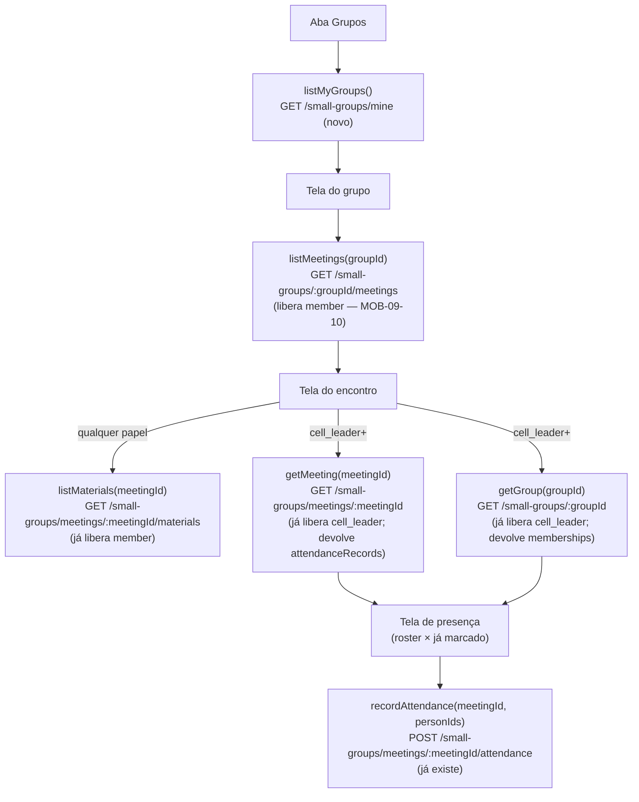

# Pequenos Grupos no Mobile (MOB-09) Design

**Spec**: `.specs/features/pequenos-grupos-mobile/spec.md`
**Status**: Draft

---

## Architecture Overview

Quarta aba "Grupos" no `apps/mobile`, ao lado de "Escala", "Celebrações" e
"Conteúdo" (nomeada de acordo com a ordem em que os módulos foram entregues —
ver Tech Decisions sobre a ordem das abas). Um único endpoint novo
(`GET /small-groups/mine`) resolve o ponto de entrada pra qualquer papel;
tudo daí pra frente reusa rotas que já existem — só a lista de encontros do
grupo (`findByGroup`) precisa liberar `member`, que hoje só devolve pra
cargos de liderança.



---

## Code Reuse Analysis

### Existing Components to Leverage

| Component | Location | How to Use |
|---|---|---|
| `resolvePersonId(userId)` (padrão, não a função em si) | `apps/api/src/celebrations/celebration-assignment.service.ts:32-39` | Mesmo padrão (`userAccount.findUnique` → `person_id`) replicado em `SmallGroupsService`, já que os dois módulos não compartilham service base |
| `authenticatedRequest` | `apps/mobile/src/lib/auth/auth-client.ts` | Base do novo `pequenos-grupos-client.ts`, mesmo padrão de `celebracoes-client.ts`/`escala-client.ts` |
| `decodeJwtPayload` | `apps/mobile/src/lib/auth/jwt.ts` | Decide se a tela do encontro mostra a ação de presença (`cell_leader`+) — mesmo mecanismo já documentado como uso legítimo pro MOB-08 |
| `HttpError` | `apps/mobile/src/lib/api/errors.ts` | Diferenciar erro de rede de 404, mesmo padrão de todas as telas de detalhe |
| Estrutura de 3 estados (loading/error/detail) | `apps/mobile/src/app/celebracao/[id].tsx` (MOB-08) | Template pras 3 telas novas (grupo, encontro, presença) |
| Guard de duplo toque (`pendingIdsRef`) | `apps/mobile/src/app/(tabs)/index.tsx:24-31` (MOB-04) | Reusado na tela de presença pra evitar duplo POST enquanto o primeiro ainda não voltou |
| `GET /small-groups/meetings/:meetingId/materials` | `apps/api/src/small-groups/meetings.controller.ts:93-100` | Já libera `member`, já filtra `visibility` — zero mudança de backend |
| `POST /small-groups/meetings/:meetingId/attendance` | idem `:64-72` | Já libera `cell_leader`, contrato `{person_ids: string[]}` já aditivo (skipDuplicates) — zero mudança de backend |
| `GET /small-groups/:id` (roster) | `apps/api/src/small-groups/small-groups.controller.ts:61-65` | Já libera `cell_leader`, já devolve `memberships.person` — zero mudança de backend |
| `GET /small-groups/meetings/:meetingId` (attendance atual) | `apps/api/src/small-groups/meetings.controller.ts:43-47` | Já libera `cell_leader`, já devolve `attendanceRecords.person` — zero mudança de backend |

### Integration Points

| System | Integration Method |
|---|---|
| `apps/api` — `SmallGroupsController` | Novo `@Get('mine')` + `SmallGroupsService.findMine(userId, tenantId, congregationId)` |
| `apps/api` — `MeetingsController` | `findByGroup` (`GET /small-groups/:groupId/meetings`) ganha `'member'` em `MEETING_READ_ROLES` |
| `apps/mobile` — nova aba | `Tabs.Screen name="grupos"` em `(tabs)/_layout.tsx` |
| `apps/mobile` — rotas de detalhe | `app/grupo/[id].tsx` (lista de encontros), `app/grupo/encontro/[id].tsx` (material + ação de presença) |

---

## Components

### Backend: `SmallGroupsController.findMine` + `SmallGroupsService.findMine` (novo)

- **Purpose**: lista os grupos do usuário autenticado, por `GroupMembership`.
- **Location**: `apps/api/src/small-groups/small-groups.controller.ts`,
  `small-groups.service.ts`
- **Interface**: `GET /small-groups/mine` → `SmallGroupMine[]` (ver Data
  Models)
- **Roles**: `MINE_ROLES = ['member', 'cell_leader', 'treasurer',
  'secretary', 'pastor', 'admin_congregation', 'tenant_admin']` (mesmo
  princípio de `VOLUNTEER_ROLES` do MOB-08: lista explícita, nunca omitir
  `@Roles`)
- **Dependências**: resolve `person_id` do `userAccount` (padrão replicado
  de `CelebrationAssignmentService.resolvePersonId`); lança
  `NotFoundException` se a conta não tem pessoa vinculada — mesmo
  comportamento do módulo de celebrações.
- **Reuses**: shape de `SmallGroup`/`GroupMembership` já existentes; nenhuma
  tabela nova.

### Backend: `MeetingsController.findByGroup` (alteração de roles)

- **Purpose**: libera `member` pra listar os encontros do próprio grupo,
  necessário pra achar o `meetingId` e chegar no material.
- **Location**: `apps/api/src/small-groups/meetings.controller.ts:25-26,58-62`
- **Mudança**: `MEETING_READ_ROLES` ganha `'member'`.
- **Risco aceito** (ver Risks & Concerns): `findByGroup` não confere se o
  chamador participa do grupo — mesma malha (ausência de checagem) que
  `listMaterials` já tem hoje pra `member`. Não é regressão desta feature,
  é o padrão de segurança já existente no módulo.

### Mobile: `lib/pequenos-grupos/types.ts`

- **Purpose**: tipos puros do domínio, espelhando os shapes das rotas
  consumidas.
- **Location**: `apps/mobile/src/lib/pequenos-grupos/types.ts`
- **Interfaces**: `SmallGroupMine`, `GroupMeetingSummary`, `GroupMeetingDetail`,
  `MeetingMaterial`, `GroupRosterMember` (ver Data Models).

### Mobile: `lib/pequenos-grupos/pequenos-grupos-client.ts`

- **Purpose**: wrapper tipado sobre `authenticatedRequest`.
- **Location**: `apps/mobile/src/lib/pequenos-grupos/pequenos-grupos-client.ts`
- **Interfaces**:
  - `listMyGroups(): Promise<SmallGroupMine[]>` — `GET /small-groups/mine`
  - `listMeetings(groupId: string): Promise<GroupMeetingSummary[]>` —
    `GET /small-groups/:groupId/meetings`
  - `getMeeting(meetingId: string): Promise<GroupMeetingDetail>` —
    `GET /small-groups/meetings/:meetingId`
  - `listMaterials(meetingId: string): Promise<MeetingMaterial[]>` —
    `GET /small-groups/meetings/:meetingId/materials`
  - `getGroupRoster(groupId: string): Promise<GroupRosterMember[]>` —
    `GET /small-groups/:groupId` (só o campo `memberships`)
  - `recordAttendance(meetingId: string, personIds: string[]): Promise<{added: number}>` —
    `POST /small-groups/meetings/:meetingId/attendance`

### Mobile: Tela `(tabs)/grupos.tsx`

- **Purpose**: lista "meus grupos" (MOB-09-01/02).
- **Location**: `apps/mobile/src/app/(tabs)/grupos.tsx`
- **Reuses**: layout de lista/erro de `(tabs)/celebracoes.tsx` (MOB-08).

### Mobile: Tela `grupo/[id].tsx`

- **Purpose**: lista os encontros do grupo (MOB-09-03).
- **Location**: `apps/mobile/src/app/grupo/[id].tsx`

### Mobile: Tela `grupo/encontro/[id].tsx`

- **Purpose**: material do encontro (MOB-09-04/05) e, se `cell_leader`+,
  ação "Registrar presença" que leva à tela de presença.
- **Location**: `apps/mobile/src/app/grupo/encontro/[id].tsx`
- **Dependências**: `decodeJwtPayload` pra decidir se mostra o botão de
  presença (mesma decisão não-autoritativa do MOB-08 — a API reforça via
  `@Roles`).

### Mobile: Tela `grupo/encontro/[id]/presenca.tsx`

- **Purpose**: roster do grupo × já marcado, seleção e envio (MOB-09-06/07/08).
- **Location**: `apps/mobile/src/app/grupo/encontro/[id]/presenca.tsx`
- **Reuses**: guard de duplo toque de `(tabs)/index.tsx` (MOB-04), adaptado
  pra um envio em lote em vez de por-item.

---

## Data Models

### `SmallGroupMine`

```typescript
export interface SmallGroupMine {
  id: string;
  name: string;
  meeting_time: string | null;
  recurrence: string | null;
  role: "leader" | "trainee" | "member"; // GroupMemberRole do usuário neste grupo
}
```

**Relationships**: um registro por `GroupMembership` do usuário, com o
`SmallGroup` associado — espelha o novo `SmallGroupsService.findMine`.

### `GroupMeetingSummary`

```typescript
export interface GroupMeetingSummary {
  id: string;
  occurred_at: string;
  topic: string | null;
}
```

**Relationships**: espelha `MeetingsService.findByGroup` (que hoje devolve
`GroupMeeting[]` cru — o mobile só usa estes três campos).

### `GroupMeetingDetail` / `MeetingMaterial` / `GroupRosterMember`

```typescript
export interface MeetingMaterial {
  id: string; // id do vínculo GroupMeetingMaterial
  visibility: "all" | "leaders_only";
  material: {
    id: string;
    title: string;
    source_type: "pdf" | "doc" | "rich_text";
    file_url: string | null;
    rich_content: string | null;
  };
}

export interface GroupMeetingDetail {
  id: string;
  occurred_at: string;
  topic: string | null;
  attendanceRecords: Array<{ person_id: string }>;
}

export interface GroupRosterMember {
  person_id: string;
  full_name: string;
  role: "leader" | "trainee" | "member";
}
```

**Relationships**: `MeetingMaterial` espelha `listMaterials` (`meetings.service.ts:195-202`,
`include: {material: true}`); `GroupMeetingDetail` é o subconjunto de
`findOne` (`:76-90`) que a tela de presença usa (não traz `materials` de
novo, já coberto por `listMaterials`); `GroupRosterMember` é o subconjunto
de `memberships.person` que `SmallGroupsService.findOne` já devolve
(`:148-158`).

---

## Error Handling Strategy

| Error Scenario | Handling | User Impact |
|---|---|---|
| `listMyGroups` sem grupos | lista vazia, sem erro | Estado vazio explícito (MOB-09-02) |
| Falha de rede em qualquer tela | erro genérico com retry | Nunca tela vazia interpretável como "sem dado" (mesmo padrão do MOB-08) |
| Material com `file_url` nulo | ação de abrir desabilitada | Edge case da spec — nunca `Linking.openURL(null)` |
| `recordAttendance` falha | erro + seleção preservada em memória (state React, não refeita a partir da API) | AC3/MOB-09-08 |
| Encontro sem material visível pro papel | estado vazio distinto de "sem encontro" | AC5 da segunda história |

---

## Risks & Concerns

| Concern | Location (file:line) | Impact | Mitigation |
|---|---|---|---|
| `findByGroup` e `listMaterials` não conferem se o chamador realmente participa do grupo/encontro — só a role JWT | `apps/api/src/small-groups/meetings.controller.ts:58-62,93-100` | Um `member` de QUALQUER grupo pode listar encontros e materiais `visibility: all` de QUALQUER OUTRO grupo do tenant, não só o seu | **Não corrigido nesta feature, por decisão do usuário** — registrado em `docs/PENDENCIAS.md` ("rota de encontros e de materiais não conferem participação real"). `listMaterials` já liberava `member` sem checar participação antes desta feature; `findByGroup` estende a mesma política já aceita, não cria uma nova |
| `findMine` (novo) depende de `userAccount.person_id` — usuário sem pessoa vinculada | `apps/api/src/small-groups/small-groups.service.ts` (novo método) | Conta de sistema/de teste sem `person_id` quebraria com erro genérico se não tratado | Mitigado: mesmo padrão de `resolvePersonId`, lança `NotFoundException` explícito — mobile trata como lista vazia ou erro dedicado (decisão de Tasks) |

---

## Tech Decisions (only non-obvious ones)

| Decision | Choice | Rationale |
|---|---|---|
| Ordem das abas | Escala, Celebrações, Grupos, Conteúdo (Grupos entra entre Celebrações e Conteúdo) | Segue a ordem cronológica de entrega dos módulos de domínio (MOB-04/08/09), mesmo princípio já usado quando Celebrações entrou entre Escala e Conteúdo |
| `findMine` como rota dedicada, não `?mine=true` em `GET /small-groups` | Rota nova `GET /small-groups/mine` | `GET /small-groups` tem `READ_ROLES` sem `member`; misturar um filtro que muda o conjunto de roles válidas na mesma rota exigiria lógica condicional de autorização fora do `@Roles` padrão. Mesmo padrão de `GET /volunteers/my-celebration-assignments` (MOB-08), que também é rota própria |
| Presença é só adicionar, nunca remover, no mobile | Sem UI de "desmarcar" | `DELETE .../attendance/:personId` é `MEETING_ADMIN_ROLES` (sem `cell_leader`) — desmarcar continua exclusivo do web/admin, registrado em Out of Scope |
| Não criar encontro pelo mobile | Fora de escopo, assumido na spec | Reduz a primeira entrega ao que a spec original (AC2) realmente pede: "registrar presença de um encontro", não "criar" |

> **Project-level**: nenhuma decisão aqui estabelece convenção nova além
> do que `AD-001`/`AD-002` já cobrem — sem tabela nova, sem branding. Nada
> para adicionar a `.specs/STATE.md`.
