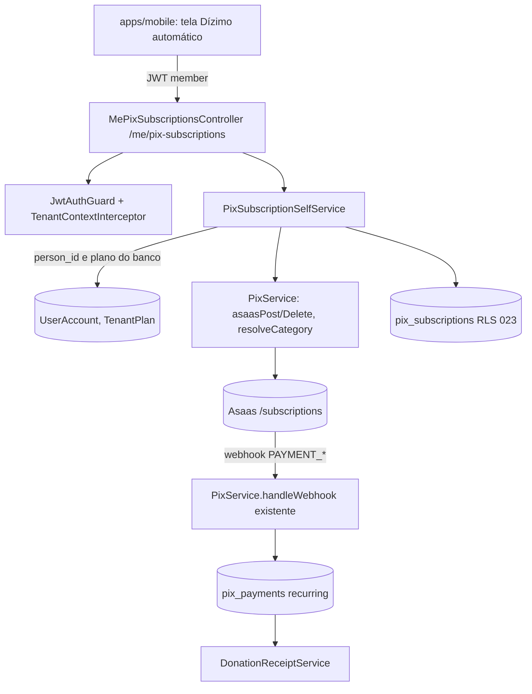

# PIX recorrente do doador (mobile) — Design

**Spec**: `.specs/features/pix-recorrente-doador-mobile/spec.md`
**Status**: Draft (avaliação — nada implementado)

Constraints ativas de `.specs/STATE.md` lidas: AD-001 (RLS de congregação com
USING = WITH CHECK) se aplica e é **conformada**; **AD-006 (tarifa do tenant,
1% de split, montador único)** se aplica e é **conformada**; AD-002..AD-005 não
tocam esta feature. Nenhuma decisão é superada. Lições confirmadas: nenhuma.

---

## Architecture Overview

Abordagens avaliadas (a decisão de produto Q1 escolhe entre elas só na Fase 0):

| | A. Recomendada | B. Doador vira cliente Asaas | C. Só mobile, sem backend novo |
|---|---|---|---|
| Ideia | Controller `/me/pix-subscriptions` reusa `PixService`; cobrança do ciclo buscada na Asaas sob demanda | A + cria `customer` Asaas por doador (CPF/e-mail) | App chama rotas do tesoureiro |
| Prós | Mínimo de mudança; mantém 1 cliente-igreja | Asaas notifica o doador; mais próximo de PIX Automático | Nada |
| Contras | Aviso do ciclo depende de push nosso | Exige CPF do doador (dado novo, LGPD), mais superfície | **Inviável**: `member` toma 403 e o corpo carregaria `donor_person_id` |
| Quando | Se Q1 = cobrança mensal | Se Q1 = débito automático | Descartada |



## Code Reuse Analysis

| Component | Location | How to Use |
|---|---|---|
| `PixService.createSubscription/cancelSubscription` | `apps/api/src/financial/pix.service.ts:350-443` | Extrair o miolo (chamada Asaas, `resolveCategory`, gravação) para método que recebe `donorPersonId` já resolvido; o do tesoureiro passa `dto.donor_person_id`, o do doador passa o do banco. Sem duplicar a regra. |
| `PixSubscription` + RLS 023 | `schema.prisma:1207`, `023_rls_pix_subscriptions.sql` | Reuso integral; ver Data Models para o índice parcial e `pending`. |
| `handleWebhook` + fallback por `payment.subscription` | `pix.service.ts:560-680` | Inalterado; recibo/carnê saem sozinhos. |
| `MeController` | `apps/api/src/auth/me.controller.ts` | Precedente de rota autenticada sem `@Roles`. Fica na allowlist de `roles-invariant.spec.ts` (justificativa: opera só na pessoa do token). |
| `TenantPlan` lookup | `auth.service.ts:116`, `MemberCapService` | Padrão "plano do banco" — reusar a consulta, nunca `PlanGuard`/`@RequiresPlan` (leem a claim). |
| `EventRegistrationPanel` | `apps/mobile/src/components/EventRegistrationPanel.tsx` | Padrão de QR + copia-e-cola + estado de erro; extrair `PixQrBlock` se for reusar. |
| `HomeQuickActions`/`QuickAction` | `apps/mobile/src/components/HomeQuickActions.tsx` | Ponto de entrada; `disabled` não recebe `onPress`. |

### Integration Points

| System | Integration Method |
|---|---|
| Asaas | `AsaasChargeService.buildCharge('subscription', …)` (split de 1% e conta do tenant, AD-006) no lugar de `asaasPost('/subscriptions')` direto; `asaasDelete`, **novo** `asaasGet('/subscriptions/:id/payments')` + `/payments/:id/pixQrCode` (P0 — endpoints a confirmar na doc Asaas; não verificado aqui) |
| JWT mobile | `plan` só para esconder/mostrar a entrada; a autoridade é o servidor |
| Notificações | Categoria de push só no P3 |

---

## Components

### MePixSubscriptionsController (API)
- **Purpose**: rotas do doador sobre a própria assinatura.
- **Location**: `apps/api/src/financial/me-pix-subscriptions.controller.ts` (módulo `pix.module.ts`).
- **Interfaces**: `POST /me/pix-subscriptions` (`{amount, consent_version}` + header `Idempotency-Key`), `GET /me/pix-subscriptions`, `GET /me/pix-subscriptions/:id/charge` (QR do ciclo em aberto), `PATCH /me/pix-subscriptions/:id/cancel`.
- **Guards**: `JwtAuthGuard`, `ThrottlerGuard` (`@Throttle` 10/min como o controller atual), `TenantContextInterceptor`. **Sem** `@Roles` e **sem** `@RequiresPlan`.
- **Reuses**: `CurrentUser`, padrão do `MeController`.

### PixSubscriptionSelfService (API)
- **Purpose**: resolve pessoa e plano **no banco**, aplica regras de auto-serviço e delega à Asaas.
- **Interfaces**: `resolveDonor(user): Promise<string>` (409 sem `person_id`; 403 se `support_session`), `assertPremium(tenantId)` (consulta `TenantPlan`; só em criar), `create`, `list`, `cancel`, `chargeFor`.
- **Regra de ouro**: toda query leva `donor_person_id = <resolvido>` **além** do RLS; `:id` alheio → `NotFoundException` (404).

### Tela mobile — Dízimo automático
- **Location**: `apps/mobile/src/app/dizimo-automatico.tsx` (rota Expo Router, padrão de `escala.tsx`/`notificacoes.tsx`) + `src/lib/pix-recorrente/` (client e tipos, padrão de `src/lib/notifications`).
- **Estados**: carregando · sem assinatura (formulário valor + aceite) · criando · ativa (valor, próximo ciclo, QR do ciclo, histórico) · cancelando · erro Asaas (recuperável) · conta sem cadastro de pessoa · tenant não Premium (entrada nem aparece).
- **Entrada**: ação "Dízimo automático" em `HomeQuickActions` condicionada a `plan === "premium"` (dica de UI) e atalho no Perfil; "Contribua" avulso permanece.
- **Front**: carregar a skill `frontend-design` antes de editar (regra do monorepo); tokens/Card do app, `touchTarget`, sem cor fora do tema.

---

## Data Models

```prisma
// pix_subscriptions — mudanças propostas (migration Prisma + índice parcial em SQL)
enum PixSubscriptionStatus { pending active cancelled }   // + pending

model PixSubscription {
  // ...campos atuais...
  asaas_subscription_id String? @unique   // null enquanto pending
  idempotency_key       String?           // por (tenant_id, created_by_user_id)
  consent_version       String?
  consent_at            DateTime?
  @@unique([tenant_id, created_by_user_id, idempotency_key])
}
```

- Índice único **parcial** (não expressável no Prisma; vai em SQL de migration):
  `CREATE UNIQUE INDEX uq_pix_sub_active_donor ON pix_subscriptions (tenant_id, donor_person_id) WHERE status IN ('pending','active');`
- **Tornar `asaas_subscription_id` opcional** muda `findUnique` do webhook (`:577`): `pending` sem id não casa com webhook — comportamento correto.
- **RLS**: **nenhuma policy nova**. `023` já cobre colunas novas (policy é por linha) e segue simétrica; o passo 7 do `bootstrap-db.sh` (linhas ~579-590) continua passando sem alteração. Se Q5 optar por policy por pessoa: policy `RESTRICTIVE` com `app_current_person()` (GUC novo no `TenantContextInterceptor`) — USING = WITH CHECK, script `024_*` no `bootstrap-db.sh` antes do passo 4, verificação nova no passo 7.
- Reconciliação: job/cron (ou checagem em `list`) que fecha `pending` > N min: consulta Asaas por `externalReference` (`ORB-SUB-…` já enviado, `pix.service.ts:372`); achou → `active`, não achou → apaga.

---

## Fluxo de criação (saga idempotente)

1. `resolveDonor` + `assertPremium(banco)` + validação de valor/consent.
2. `INSERT` linha `pending` (índice parcial barra a 2ª; `Idempotency-Key` repetido devolve a mesma).
3. `POST /subscriptions` na Asaas com `externalReference` = id local (permite reconciliar).
4. `UPDATE ... SET status='active', asaas_subscription_id=? WHERE id=? AND status='pending'`.
5. Falha em 3 → `DELETE` da linha `pending` e 503. Falha em 4 → fica `pending`; reconciliação resolve.

## Error Handling Strategy

| Error Scenario | Handling | User Impact |
|---|---|---|
| Asaas indisponível/timeout (criar) | 503, linha `pending` removida | "Não foi possível agora, tente de novo" |
| Asaas erro (cancelar) | 503, linha continua `active` | "Não foi possível cancelar agora" — nunca "cancelado" |
| Asaas 404 ao cancelar | marca `cancelled` | "Assinatura cancelada" |
| Já existe ativa | 409 + assinatura existente | App mostra a ativa |
| Conta sem pessoa | 409 | "Peça à secretaria para completar seu cadastro" |
| Tenant não Premium (criar) | 403 | Entrada oculta; se chegar, mensagem neutra |
| `:id` alheio | 404 | "Assinatura não encontrada" |
| Sessão de suporte | 403 | — |

---

## Risks & Concerns

| Concern | Location | Impact | Mitigation |
|---|---|---|---|
| R1 Cobrança do ciclo não chega ao doador (cliente Asaas = igreja) | `pix.service.ts:237-251,380` | Feature entrega assinatura que não cobra | Fase 0 (P0) antes de qualquer tela; Q1/Q2 |
| R2 Plano lido da claim em `PlanGuard` | `plan.guard.ts` | Tenant rebaixado cria assinatura por até 15 min | Rotas `/me` consultam `TenantPlan`; (follow-up fora de escopo: avaliar o mesmo no fluxo do tesoureiro) |
| R3 RLS 023 não isola por pessoa | `003:30-36`, `023` | IDOR entre membros da congregação se o filtro de serviço faltar | Filtro por pessoa em toda query + teste de integração IDOR; decisão Q5 |
| R4 Criar chama Asaas antes de gravar; sem idempotência | `pix.service.ts:378-410` | Cobrança duplicada/órfã | Saga `pending` + índice parcial + `Idempotency-Key` |
| R5 Cancelar com 404 da Asaas vira 503 eterno | `pix.service.ts:432-437` | Doador não consegue cancelar | Tratar 404 como removida |
| R6 Assinatura fica na congregação de origem; `listSubscriptions` do tesoureiro filtra por congregação da sessão | `pix.service.ts:413-420`, `app_congregation_allowed` | Doador que muda de congregação não acha/cancela a própria | `/me` não filtra congregação além do RLS; se a congregação mudou, RLS esconde → decisão: cancelar via serviço com contexto da congregação da linha, ou travar transferência com assinatura ativa (abrir pendência) |
| R7 Sem `split` e conta Asaas única | `pix.service.ts:297,382,479` | Contra AD-006: 1% da Orbien não é cobrado e a tarifa não é do tenant | Criar a assinatura **só** pelo `AsaasChargeService` (feature `asaas-taxa-e-split-padrao`, A3/A4); esta feature depende dela |
| R8 Webhook confia no `payment.subscription` | `:652-660` | Já tem token/validação do webhook; assinatura `pending` não casa | Manter; teste de regressão |
| R9 Sem teste de integração para rotas PIX hoje | `apps/api/test/integration` (não há `pix`) | Regressão silenciosa | Testes das fases 1-3 incluem integração |
| R10 `member` sem `person_id` (importação) | `schema.prisma` ~254 | 409 em parte da base | Mensagem acionável; métrica de quantos membros sem pessoa em `teste*` é tarefa de dados |

## Tech Decisions

| Decision | Choice | Rationale |
|---|---|---|
| Rota `/me/...` em vez de abrir `@Roles('member')` nas rotas do tesoureiro | `/me/pix-subscriptions` | Rota de gestão aceita `donor_person_id` no corpo; doador nunca pode escolhê-lo. Separar elimina a classe de bug. |
| Plano do banco | Consulta direta a `TenantPlan` | Pedido do dono + precedente `MemberCapService` |
| Isolamento por pessoa | Serviço + testes; RLS por pessoa só se Q5 pedir | Evita mudar `TenantContextInterceptor` para uma rota |
| Cancelar nunca bloqueado por plano | Sim | Direito do doador; Q3 |

> **Project-level**: se a feature for construída, registrar em `STATE.md` como AD-008 (AD-006/AD-007 já são taxa/split e subconta): "rota de dinheiro self-service de `member` deriva pessoa e plano do banco, nunca do corpo ou da claim". Não registrado agora (feature não aprovada).
