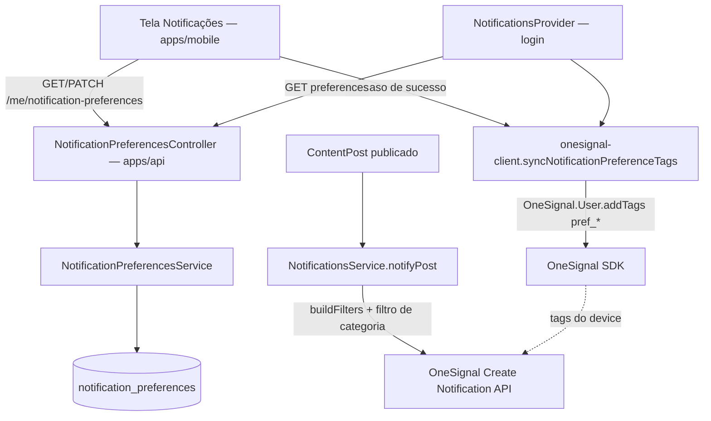

# Preferências de notificação (mobile) — Design

**Spec**: `.specs/features/preferencias-notificacao-mobile/spec.md`
**Status**: Draft

---

## Architecture Overview



O servidor é a fonte de verdade para a **tela** (o que aparece marcado,
sincronizado entre aparelhos). O disparo em si nunca consulta a tabela nova —
ele confia na tag OneSignal que o app manteve sincronizada, exatamente como
`tenant_id`/`congregation_id`/`role` já funcionam hoje (MOB-07). Duas fontes
de verdade existem de propósito, não por descuido: uma para leitura humana
(banco), uma para o filtro de envio (tag) — ver Tech Decisions.

---

## Code Reuse Analysis

### Existing Components to Leverage

| Component | Location | How to Use |
|---|---|---|
| `UnavailabilityService.resolveProfile`/rota "própria conta" | `apps/api/src/volunteers/unavailability.controller.ts`, `.service.ts:15-28` | Padrão a replicar: `@CurrentUser() user: JwtPayload`, sem `@Roles` (rota de dado do próprio usuário), `user.sub` = `UserAccount.id` |
| `TenantContextInterceptor` | `apps/api/src/common/interceptors/tenant-context.interceptor.ts` | Já aplicado via `@UseInterceptors`; `SET LOCAL ROLE app_user` + `set_config` acontecem antes do controller — nenhuma query precisa passar tenant/congregation manualmente, RLS resolve |
| `003_rls_admin_write.sql` → `app_congregation_allowed()` | `apps/api/prisma/migrations/003_rls_admin_write.sql` | Usado direto no `USING`/`WITH CHECK` da tabela nova (AD-001) |
| `007_rls_songs.sql` | `apps/api/prisma/migrations/007_rls_songs.sql` | Template exato do script `008_rls_notification_preferences.sql` — mesma estrutura, troca só o nome da tabela |
| `OneSignalFilter`/`buildFilters`/`dispatch` | `apps/api/src/content/notifications.service.ts:14-227` | Estendido, não reescrito — um filtro a mais é empilhado ao final do array que `buildFilters` já produz |
| `onesignal-client.registerDevice` | `apps/mobile/src/lib/notifications/onesignal-client.ts:34-44` | Novo `syncNotificationPreferenceTags` segue o mesmo estilo (`OneSignal.User.addTags`, no-op silencioso em erro) |
| `content-client.ts` (padrão `*-client.ts`) | `apps/mobile/src/lib/content/content-client.ts` | Novo `notification-preferences-client.ts` no mesmo formato (`authenticatedRequest` tipado) |
| Tela `indisponibilidade.tsx` (rota solta, fora das tabs) | `apps/mobile/src/app/indisponibilidade.tsx` | Template de tela solta acessada a partir de Perfil |
| `Card`/`SectionLabel`/toggle já usados em `perfil.tsx` | `apps/mobile/src/app/(tabs)/perfil.tsx` | Reaproveitados na tela nova; Perfil ganha uma linha de navegação "Notificações" |

### Integration Points

| System | Integration Method |
|---|---|
| `apps/api` Prisma schema | Modelo novo `NotificationPreference`, relacionado a `Tenant`/`Congregation`/`UserAccount` (mesmo padrão de `Song`) |
| RLS (fora do histórico do Prisma) | `008_rls_notification_preferences.sql`, adicionado ao `bootstrap-db.sh` no mesmo passo dos scripts `002`-`007` |
| OneSignal (envio) | `NotificationsService.notifyPost` acrescenta um filtro de tag por categoria do post — nenhuma chamada nova à API do OneSignal, é o mesmo `dispatch()` |
| OneSignal (device) | `onesignal-client.ts` ganha `syncNotificationPreferenceTags`, chamado pela tela de preferências e por `NotificationsProvider` |

---

## Components

### `NotificationPreferencesController` (novo)

- **Purpose**: expõe a preferência da própria conta autenticada.
- **Location**: `apps/api/src/content/notification-preferences.controller.ts`
- **Interfaces**:
  - `GET /me/notification-preferences` → `get(@CurrentUser() user: JwtPayload)`
  - `PATCH /me/notification-preferences` → `update(@Body() dto: UpdateNotificationPreferencesDto, @CurrentUser() user: JwtPayload)`
- **Dependencies**: `JwtAuthGuard`, `RolesGuard` (sem `@Roles` — dado da própria conta, ver Assumptions da spec), `TenantContextInterceptor`.
- **Reuses**: mesmo esqueleto de `UnavailabilityController`/`UsersController`.

### `NotificationPreferencesService` (novo)

- **Purpose**: ler/gravar `notification_preferences`, com default "tudo ligado" quando a linha ainda não existe.
- **Location**: `apps/api/src/content/notification-preferences.service.ts`
- **Interfaces**:
  - `get(userId: string): Promise<NotificationPreferenceValues>` — `findUnique` por `user_account_id`; sem linha, devolve os 4 booleans `true` (Edge Case da spec) sem criar nada.
  - `update(userId: string, tenantId: string, congregationId: string, patch: Partial<NotificationPreferenceValues>): Promise<NotificationPreferenceValues>` — `upsert` (cria na primeira escrita, com os defaults + o patch; atualiza nas seguintes).
- **Dependencies**: `PrismaService` (`this.prisma.client`, roda sob o contexto RLS já setado pelo interceptor).
- **Reuses**: nenhuma tabela/serviço além do Prisma direto — é a tabela mais simples do domínio (sem relação além das FKs obrigatórias).

### `notification-categories.ts` (novo, compartilhado dentro de `content/`)

- **Purpose**: única fonte da lista de categorias e do mapeamento `ContentPostType → categoria`, para `NotificationPreferencesService` (validação) e `NotificationsService` (filtro de disparo) nunca divergirem.
- **Location**: `apps/api/src/content/notification-categories.ts`
- **Interfaces**:
  - `export const NOTIFICATION_CATEGORIES = ['avisos', 'oracao', 'eventos', 'devocional'] as const`
  - `export type NotificationCategory = (typeof NOTIFICATION_CATEGORIES)[number]`
  - `export const CATEGORY_BY_POST_TYPE: Record<ContentPostType, NotificationCategory>`
- **Dependencies**: nenhuma (constante pura).
- **Reuses**: n/a — é o componente que evita duplicar o mapeamento em dois arquivos.

> Um teste (`notification-categories.spec.ts`) trava que `CATEGORY_BY_POST_TYPE`
> cobre **todos** os valores de `ContentPostType` — o mesmo espírito do teste
> que já existe para `permissions.ts`/`roles-invariant.spec.ts` no resto do
> repositório: enum que cresce sem entrar em algum grupo quebra o teste, não
> falha em silêncio no disparo (Assumption da spec).

### `NotificationsService.notifyPost` (alterado)

- **Purpose**: mesmo de hoje, mais o filtro de categoria.
- **Location**: `apps/api/src/content/notifications.service.ts:34-50`
- **Mudança**: depois de `const filters = this.buildFilters(...)`, acrescenta
  `filters.push({ field: 'tag', key: `pref_${CATEGORY_BY_POST_TYPE[post.type]}`, relation: '!=', value: 'false' })`
  antes de chamar `dispatch`. `sendManualNotification` (broadcast administrativo,
  sem `ContentPostType`) **não** ganha esse filtro — está fora do escopo desta
  spec (ver Out of Scope: preferência atua sobre o que já foi endereçado ao
  usuário por um post, não sobre broadcast livre do admin).

### `onesignal-client.syncNotificationPreferenceTags` (novo)

- **Purpose**: espelhar a preferência salva no servidor como tags do device.
- **Location**: `apps/mobile/src/lib/notifications/onesignal-client.ts`
- **Interfaces**: `syncNotificationPreferenceTags(prefs: Record<NotificationCategory, boolean>): void`
  — `OneSignal.User.addTags({ pref_avisos: String(prefs.avisos), pref_oracao: ..., pref_eventos: ..., pref_devocional: ... })`.
- **Dependencies**: SDK OneSignal já inicializado (mesma premissa de `registerDevice`).
- **Reuses**: mesmo arquivo, mesmo estilo de função pura sem estado.

### `notification-preferences-client.ts` (novo)

- **Purpose**: wrapper tipado sobre `authenticatedRequest` para o endpoint novo.
- **Location**: `apps/mobile/src/lib/notifications/notification-preferences-client.ts`
- **Interfaces**:
  - `getNotificationPreferences(): Promise<NotificationPreferenceValues>`
  - `updateNotificationPreferences(patch: Partial<NotificationPreferenceValues>): Promise<NotificationPreferenceValues>` (usa `authenticatedRequest("patch", ...)`)
- **Reuses**: mesmo padrão de `content-client.ts`.

### Tela `apps/mobile/src/app/notificacoes.tsx` (nova)

- **Purpose**: 4 toggles (Avisos, Pedidos de oração, Eventos, Conteúdo devocional).
- **Location**: `apps/mobile/src/app/notificacoes.tsx` (rota solta, como `indisponibilidade.tsx`), com entrada em `perfil.tsx` (nova linha "Notificações" na seção "Conta", com ícone e navegação `router.push("/notificacoes")`).
- **Interfaces**: componente de tela, sem props (usa `useAuth()`/roteamento).
- **Dependencies**: `notification-preferences-client.ts`, `onesignal-client.syncNotificationPreferenceTags`, `Card`/`SectionLabel`/tokens de tema.
- **Comportamento**: `GET` no mount → estado local dos 4 toggles; ao tocar um
  toggle, atualização otimista + `PATCH` da categoria isolada (`{ [categoria]: novoValor }`);
  falha reverte o toggle e mostra erro (AC3 da P1); sucesso chama
  `syncNotificationPreferenceTags` com o estado completo resultante. Chamadas
  em sequência rápida são serializadas por categoria (uma fila simples de
  "última escrita pendente" por chave, mesmo princípio da fila de refresh —
  Edge Case da spec), não uma fila global: desligar duas categorias em
  sequência não deve fazer uma esperar a outra.

### `NotificationsProvider` (alterado)

- **Location**: `apps/mobile/src/lib/notifications/notifications-provider.tsx:35-39`
- **Mudança**: no mesmo `useEffect([session])`, depois de `registerDevice`,
  dispara (fire-and-forget, sem bloquear o efeito) `getNotificationPreferences()`
  seguido de `syncNotificationPreferenceTags`. Falha de rede aqui é no-op —
  mesma filosofia de `registerDevice` com token indecodificável: efeito
  colateral de push não pode derrubar o app nem atrasar a navegação.

---

## Data Models

### `NotificationPreference` (Prisma)

```prisma
model NotificationPreference {
  id              String   @id @default(uuid())
  tenant_id       String
  congregation_id String
  user_account_id String   @unique
  avisos          Boolean  @default(true)
  oracao          Boolean  @default(true)
  eventos         Boolean  @default(true)
  devocional      Boolean  @default(true)
  created_at      DateTime @default(now())
  updated_at      DateTime @updatedAt

  tenant       Tenant       @relation(fields: [tenant_id], references: [id], onDelete: Cascade)
  congregation Congregation @relation(fields: [congregation_id], references: [id], onDelete: Cascade)
  userAccount  UserAccount  @relation(fields: [user_account_id], references: [id], onDelete: Cascade)

  @@index([tenant_id, congregation_id])
  @@map("notification_preferences")
}
```

`user_account_id` é `@unique` (1:1 com `UserAccount`, não com `Person` —
mesmo id que o token carrega em `sub`, sem precisar resolver `person_id`
como `UnavailabilityService` faz). `Tenant`/`Congregation`/`UserAccount`
ganham a relação inversa (`notificationPreference` singular em
`UserAccount`, `notificationPreferences NotificationPreference[]` em
`Tenant`/`Congregation`, mesmo padrão de `Song`).

**Relationships**: pertence a exatamente uma `UserAccount`; `tenant_id`/
`congregation_id` são redundantes com o que `UserAccount` já carrega, mas
necessários porque é assim que toda tabela isolada por RLS neste projeto
funciona (AD-001) — a policy lê essas colunas da própria linha, não faz
join até `user_accounts` para descobrir o tenant.

### `NotificationPreferenceValues` (TypeScript, API e mobile)

```typescript
interface NotificationPreferenceValues {
  avisos: boolean;
  oracao: boolean;
  eventos: boolean;
  devocional: boolean;
}
```

---

## Error Handling Strategy

| Error Scenario | Handling | User Impact |
|---|---|---|
| `PATCH` falha (rede/servidor) | Mobile reverte o toggle otimista para o valor anterior | Toast/mensagem de erro; toggle volta visualmente ao estado real |
| Conta sem `notification_preferences` ainda (primeiro `GET`) | Service devolve os 4 `true` sem criar linha | Tela mostra tudo ligado, igual ao comportamento atual do produto |
| `ContentPostType` sem entrada em `CATEGORY_BY_POST_TYPE` (não deve acontecer) | Teste unitário do mapeamento falha no CI antes de chegar a produção | N/A — é um portão de build, não um caso de runtime |
| `OneSignal.User.addTags` falha (SDK/rede) no mobile | Erro engolido (no-op), mesmo padrão de `registerDevice` | Tag fica desatualizada até a próxima sincronização (próximo login ou próxima troca de preferência) — pior caso é receber uma categoria que devia estar desligada, nunca perder uma que devia estar ligada (default seguro) |
| RLS nega escrita (contexto sem tenant/congregação — não deveria ocorrer numa rota autenticada normal) | `42501` sobe como 500 | Não é tratado com mensagem própria — mesmo comportamento de qualquer outra rota autenticada do produto hoje |

---

## Risks & Concerns

| Concern | Location | Impact | Mitigation |
|---|---|---|---|
| Relação `!=`/`not_exists` em filtro OneSignal é documentada como mais cara computacionalmente que `=`/`exists` (a base de tags é indexada por presença, não por ausência) | `apps/api/src/content/notifications.service.ts` (filtro novo em `notifyPost`) | Em volume alto de push, o filtro por categoria pode ficar mais lento que o filtro atual por tenant/role | Aceitável no volume atual (um disparo por post publicado, não em massa); registrado aqui para reavaliar se o volume de posts crescer uma ordem de grandeza — não é gate para esta feature |
| Duas fontes de verdade (tabela para leitura, tag OneSignal para o filtro de envio) podem divergir se a sincronização de tag falhar silenciosamente | `onesignal-client.ts` (novo `syncNotificationPreferenceTags`), `notifications-provider.tsx` | Usuário vê "desligado" na tela mas ainda recebe push daquela categoria até a próxima sincronização bem-sucedida | Sincronização acontece em dois pontos independentes (a cada login, e a cada troca de preferência) — a janela de divergência fecha no próximo desses dois eventos; não é diferente do risco que já existe hoje para `tenant_id`/`congregation_id`/`role` (MOB-07), que tem o mesmo padrão de sincronização best-effort |
| `sendManualNotification` (broadcast administrativo) ignora a preferência do usuário de propósito | `apps/api/src/content/notifications.service.ts:52-76` | Admin pode notificar alguém que desligou a categoria correspondente, num broadcast manual | Decisão de escopo explícita (ver Out of Scope da spec) — broadcast manual é uma ferramenta de admin distinta de post categorizado; se isso incomodar na prática, é discussão de produto própria, não bug desta feature |

---

## Tech Decisions

| Decision | Choice | Rationale |
|---|---|---|
| Filtro de categoria usa uma única condição `!=` em vez de duas condições `not_exists OR '='` | `{field:'tag', key:'pref_<categoria>', relation:'!=', value:'false'}` | Confirmado (OneSignal docs + comportamento documentado de "!=" tratar tag ausente como "não igual") que `!=` já cobre "tag ausente OU tag diferente de 'false'" numa única condição — evita introduzir OR dentro de um array que já tem ORs de segmento, o que quebraria a semântica pretendida dado que filtros OneSignal não suportam parênteses/agrupamento (a ordem de avaliação é sequencial: cada operador aplica sobre o resultado acumulado até ali, então um `AND` implícito ao final do array já amarra corretamente com **todo** o resultado anterior, sem precisar distribuir a condição em cada termo OR) |
| Filtro de categoria só existe em `notifyPost`, não em `buildFilters` | `filters.push(...)` fora de `buildFilters`, direto em `notifyPost` | `buildFilters` monta a segmentação de audiência (dado do post/segmento); a categoria de preferência é um eixo ortogonal e só existe quando há um `ContentPostType` conhecido — `sendManualNotification` não tem post, então não faz sentido esse filtro morar dentro de `buildFilters` |
| Tabela nasce sem relação com `Person` | FK só para `UserAccount` | Preferência é da conta que loga, não da pessoa (contas de suporte/admin sem `Person` vinculado também abrem o app e recebem push) — evita o `NotFoundException('Usuário sem vínculo de pessoa')` que `UnavailabilityService` precisa tratar |

> **Decisão de projeto**: o padrão "tag OneSignal por categoria, sincronizada
> pelo cliente, checada com `!=` no disparo" é reutilizável para qualquer
> push futuro que precise de opt-out por categoria (ex., se nascer push de
> escala). Registrada como AD-003 em `.specs/STATE.md`.
