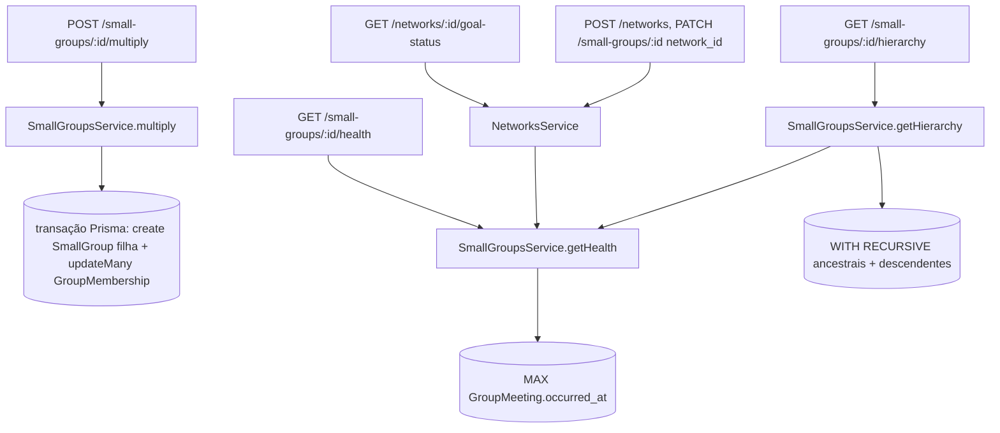

# PROD-20 — Multiplicação de célula, árvore genealógica, semáforo de saúde, metas por rede — Design

**Spec**: `.specs/features/prod-20-multiplicacao-celula/spec.md`
**Status**: Approved (approach confirmado com o usuário)

---

## Decisões de abordagem (confirmadas com o usuário)

1. **`GET /small-groups/:id/hierarchy` é estendido, não duplicado.** Já existe
   em `small-groups.service.ts:317` (`WITH RECURSIVE`, descendentes até
   profundidade 4) e não tem nenhum consumidor em `apps/web` hoje — gatear
   por Premium e adicionar ancestrais + `health_status` não quebra nada em
   produção. Vira o endpoint da história "Árvore genealógica" (P2).
2. **`Network` vive dentro de `SmallGroupsModule`**, não em módulo próprio —
   é conceitualmente parte do domínio de células e o cálculo de
   `goal-status` precisa do mesmo cálculo de saúde usado por
   `getHierarchy`/`getHealth`. Um módulo `NetworksModule` importando
   `SmallGroupsModule` só para reusar uma função pura seria indireção sem
   ganho.

---

## Architecture Overview

Tudo entra em `apps/api/src/small-groups/`: um `NetworksController` +
`NetworksService` novos, registrados no `SmallGroupsModule` existente; a
`SmallGroupsService`/`SmallGroupsController` ganham os métodos de
multiplicar, saúde e a hierarquia estendida.



`NetworksService.computeHealthSummary` e `SmallGroupsService.getHealth`
compartilham a mesma função pura de classificação (ver Componentes) para que
o critério de cor nunca divirja entre a tela de célula e a de rede.

---

## Code Reuse Analysis

### Existing Components to Leverage

| Component | Location | How to Use |
|---|---|---|
| `getHierarchy` + `buildTree` + `HierarchyRow`/`HierarchyNode` | `small-groups.service.ts:54-99,317-344` | Estender a CTE para incluir ancestrais (segunda branch recursiva subindo por `parent_group_id`) e juntar `health_status` por nó após buscar as linhas |
| `PlanGuard` + `@RequiresPlan('premium')` | `auth/guards/plan.guard.ts`, `auth/decorators/requires-plan.decorator.ts` | Aplicado por método (precedente: `dashboard.controller.ts:41-43`, `pix.controller.ts:40-43`) — adicionar `PlanGuard` ao `@UseGuards` de classe de `SmallGroupsController` (no-op nas rotas sem `@RequiresPlan`) e criar `NetworksController` já com os quatro guards |
| `ALERT_ROLES` (padrão de auto-serviço do `cell_leader`) | `small-groups.controller.ts:32` | Base para o papel de multiplicar — ver seção Permissões |
| `PRODUCT_AREA_READ_ROLES.small_groups` | `auth/product-areas.ts` | Reusado sem mudança para leitura de saúde/genealogia (mesma área de produto) |
| Padrão RLS "tabela nova nasce com `app_congregation_allowed()`" (AD-001) | `prisma/migrations/014_rls_small_group_visit_requests.sql` | Template exato para `networks` — uma única policy `tenant_congregation_isolation`, sem ramo público |
| Padrão de transação Prisma | `platform/transfer-user-account.service.ts` | Mesmo uso de `prisma.client.$transaction` para mover `GroupMembership` + criar `SmallGroup` filha atomicamente |
| Padrão front `useEffect` + axios + `isForbidden`/`NoAccessState` | `apps/web/src/app/(admin)/grupos/page.tsx:81-107` | Reusado tal qual nas novas telas (árvore, semáforo, redes) |
| `<Button>` do design system | `apps/web/src/components/ui/button` | Usado no botão "Multiplicar célula" e nos formulários de rede (regra do `CLAUDE.md`: nunca `<button>` cru pra ação primária) |

### Integration Points

| System | Integration Method |
|---|---|
| Prisma schema | Novo modelo `Network`; `SmallGroup` ganha `network_id String?` + relação `network Network? @relation(...)`, `onDelete: SetNull` |
| RLS | Novo script `016_rls_networks.sql`, registrado em `bootstrap-db.sh` no passo 3 (junto de 002-006, 012-015) e coberto pela checagem do passo 7 |
| Plan gating | `@RequiresPlan('premium')` nos métodos de saúde, genealogia e em todo `NetworksController` |
| Auditoria | Nenhuma — nenhuma destas rotas é `@PlatformRoute()` nem envolve impersonação; segue o padrão comum de rota de tenant, sem `AuditInterceptor` explícito além do que já roda globalmente (se houver) |

---

## Components

### `SmallGroupsService.multiply`

- **Purpose**: cria a célula filha e move os membros escolhidos, numa transação.
- **Location**: `apps/api/src/small-groups/small-groups.service.ts`
- **Interfaces**:
  - `multiply(motherId: string, dto: MultiplySmallGroupDto, user: JwtPayload): Promise<SmallGroup>`
- **Dependências**: `PrismaService`; valida `leader_person_id` (Person do mesmo tenant) e `member_ids` (memberships ativas da mãe) antes de abrir a transação, e novamente dentro dela (re-leitura) para o caso de corrida (Edge Case da spec).
- **Reuses**: mesmo padrão de validação de FK usado em `create()` (`small-groups.service.ts:86-93`, "Grupo pai não encontrado").

**Corpo da transação** (`prisma.client.$transaction`):
1. Recarrega as `member_ids` com `WHERE small_group_id = motherId AND person_id IN (...)`; se o count não bate com `member_ids.length`, `BadRequestException` (cobre concorrência e IDs inválidos na mesma checagem).
2. `smallGroup.create` com `parent_group_id: motherId`, `tenant_id`/`congregation_id` da mãe, `leader_person_id: dto.leader_person_id`, demais campos do DTO.
3. `groupMembership.updateMany({ where: { small_group_id: motherId, person_id: { in: dto.member_ids } }, data: { small_group_id: novaCelula.id } })`.
4. `groupMembership.upsert` do líder na filha com `role: 'leader'` (`where: small_group_id_person_id`, `create` se não existir — cobre o caso do líder não estar em `member_ids`).

### `MultiplySmallGroupDto`

- **Location**: `apps/api/src/small-groups/dto/multiply-small-group.dto.ts`
- **Fields**: `name: string` (reusa validação de `CreateSmallGroupDto.name`), `leader_person_id: string` (`@IsUUID()`), `member_ids: string[]` (`@IsUUID(4, { each: true })`, default `[]`), `meeting_time?`, `recurrence?`, `address?` (mesmos validators opcionais de `CreateSmallGroupDto`) — **não** repete `group_type_id`: a filha herda o `group_type_id` da mãe (não perguntado ao usuário no fluxo de multiplicar; ausência de decisão sobre isso na spec é resolvida aqui como herança direta, mais simples que perguntar de novo o tipo de uma célula que é fisicamente a mesma reunião dividida).

### `SmallGroupsService.getHealth` / `classifyHealth` (função pura)

- **Purpose**: calcula o status verde/amarelo/vermelho de uma célula.
- **Location**: `small-groups.service.ts` — `classifyHealth(lastMeetingAt: Date | null, now = new Date())` como função exportada (não-método), para ser reusada por `NetworksService` sem acoplar os dois services um ao outro.
- **Interfaces**:
  - `classifyHealth(lastMeetingAt: Date | null, now?: Date): 'green' | 'yellow' | 'red'`
  - `getHealth(groupId: string): Promise<{ status; last_meeting_at; days_since_last_meeting }>`
- **Regra**: `daysSince = lastMeetingAt ? diffInDays(now, lastMeetingAt) : Infinity`; `< 14` → green; `14–27` → yellow; `>= 28` ou `null` → red (CEL20-04/05 da spec).
- **Dependências**: `prisma.client.groupMeeting.aggregate({ where: { small_group_id }, _max: { occurred_at: true } })`.

### `SmallGroupsService.getHierarchy` (estendido)

- **Purpose**: agora retorna ancestrais + descendentes + saúde por nó.
- **Location**: `small-groups.service.ts:317` (método existente, editado)
- **Mudança na CTE**: adicionar uma segunda `WITH RECURSIVE` (ou um segundo `UNION ALL` na mesma CTE, subindo por `parent_group_id` a partir da própria célula, profundidade simétrica ao teto de 4 já usado para descendentes) para trazer ancestrais; **ou**, mais simples e sem reescrever a CTE existente, uma função `getAncestors(groupId)` separada, iterativa (loop de até 4 `findUnique` seguindo `parent_group_id`), já que ancestral é uma cadeia linear (não uma árvore) — não precisa de SQL recursivo. **Escolha**: iterativo em `apps/api`, mais legível que uma segunda CTE, e o teto de profundidade é o mesmo `depth < 4` usado hoje.
- Depois de montar `{ ancestors, tree }`, calcular `health_status` de cada nó com `classifyHealth`, buscando o `MAX(occurred_at)` de todas as células envolvidas numa única query (`groupBy small_group_id` em vez de N chamadas a `getHealth`).
- **Response shape** (`GenealogyResponse`): `{ ancestors: GenealogyNode[], tree: GenealogyNode | null }`, onde `GenealogyNode = { id, name, leader_person_name, generation, health_status }` (mantém `children` no `tree`, achatado com `generation` no `ancestors`).

### `NetworksController` / `NetworksService`

- **Purpose**: CRUD de `Network`, vínculo de célula à rede, status da meta.
- **Location**: `apps/api/src/small-groups/networks.controller.ts`, `networks.service.ts` (mesma pasta/módulo — decisão confirmada)
- **Rotas**: `POST /networks`, `GET /networks`, `GET /networks/:id`, `PATCH /networks/:id`, `DELETE /networks/:id`, `GET /networks/:id/goal-status`. Vínculo de célula é `PATCH /small-groups/:id` existente, ganhando `network_id?: string | null` no `UpdateSmallGroupDto` (não uma rota nova em `NetworksController` — é a célula que aponta pra rede, mesma direção do FK).
- **Interfaces**:
  - `create(dto: CreateNetworkDto, user): Promise<Network>`
  - `findAll(user): Promise<Network[]>`
  - `update(id, dto: UpdateNetworkDto): Promise<Network>`
  - `remove(id): Promise<void>`
  - `getGoalStatus(id): Promise<{ goal_pct, current_pct, met, green, yellow, red, total }>`
- **`getGoalStatus`**: busca todas `SmallGroup` com `network_id = id`, `groupBy` de `GroupMeeting` por `small_group_id` pra achar o último encontro de cada uma numa query só, aplica `classifyHealth` por célula, agrega contagens. `current_pct = total === 0 ? null : round((green+yellow)/total*100, 2)`; `met = goal_pct === null || total === 0 ? null : current_pct >= goal_pct`.
- **Dependências**: `PrismaService`, `classifyHealth` de `small-groups.service.ts`.
- **Guards**: classe inteira com `@UseGuards(JwtAuthGuard, RolesGuard, PlanGuard) @UseInterceptors(TenantContextInterceptor) @RequiresPlan('premium')` (igual a `AuditController`/`DreController` — controller 100% Premium, decorator na classe). `@Roles(...MANAGE_ROLES)` em create/update/delete (papéis decididos com o usuário); leitura (`findAll`, `findOne`, `getGoalStatus`) usa `READ_ROLES` (mesma área `small_groups`).

### Permissões de `multiply`

`MANAGE_ROLES` (`tenant_admin`, `admin_congregation`, `pastor`) cobre o caso
geral. Para o `cell_leader` da própria célula multiplicar sem depender de um
admin, é necessário resolver "é líder **desta** célula" — o `RoleAssignment`
tem escopo por `small_group_id` (`SmallGroup.roleAssignments`,
`schema.prisma:549`), então o guard não pode ser só `@Roles('cell_leader')`
(isso liberaria qualquer líder de célula a multiplicar qualquer célula do
tenant). **Decisão de design**: em vez de um guard novo, o próprio
`SmallGroupsService.multiply` faz a checagem de escopo depois do
`RolesGuard` já ter liberado por `ALERT_ROLES`
(`tenant_admin, admin_congregation, pastor, cell_leader`) — se o usuário só
tem `cell_leader` (nenhum papel de `MANAGE_ROLES`), o service confirma
`smallGroup.leader_person_id === user.person_id` (ou um `RoleAssignment`
ativo dele nesta célula) antes de prosseguir, senão `ForbiddenException`.
Mesmo padrão de "role abre a porta, service confirma o escopo" já documentado
para `platform_support`/`app_platform_access()` no `CLAUDE.md`, aplicado aqui
no nível de aplicação em vez de RLS (RLS já isola por tenant/congregação;
"é o líder desta célula específica" é regra de negócio, não de tenant).

---

## Data Models

### `Network` (novo modelo Prisma)

```prisma
model Network {
  id                String   @id @default(uuid())
  tenant_id         String
  congregation_id   String
  name              String
  leader_person_id  String?
  health_goal_pct   Int?
  created_at        DateTime @default(now())
  updated_at        DateTime @updatedAt

  tenant       Tenant       @relation(fields: [tenant_id], references: [id], onDelete: Cascade)
  congregation Congregation @relation(fields: [congregation_id], references: [id], onDelete: Cascade)
  leader       Person?      @relation("NetworkLeader", fields: [leader_person_id], references: [id], onDelete: SetNull)
  smallGroups  SmallGroup[]

  @@index([tenant_id, id])
  @@index([tenant_id, congregation_id])
  @@map("networks")
}
```

`SmallGroup` ganha:

```prisma
network_id String?
network    Network? @relation(fields: [network_id], references: [id], onDelete: SetNull)
```

**Relationships**: `Network` 1:N `SmallGroup` (opcional); `Network` N:1
`Congregation`/`Tenant` (obrigatório, mesma isolação de sempre);
`Network.leader_person_id` opcional aponta pra `Person`.

**Migração Prisma**: `npx prisma migrate dev --name add_network` a partir de
`apps/api`, gerando a tabela `networks` + coluna `small_groups.network_id`.
RLS entra à parte, em `016_rls_networks.sql` (fora do histórico do Prisma,
por regra do monorepo).

### `016_rls_networks.sql` (novo, mesmo template de `014`)

Uma única policy, sem ramo público (nada aqui é consultado sem sessão):

```sql
ALTER TABLE networks ENABLE ROW LEVEL SECURITY;
ALTER TABLE networks FORCE ROW LEVEL SECURITY;

DROP POLICY IF EXISTS tenant_congregation_isolation ON networks;
CREATE POLICY tenant_congregation_isolation ON networks
  AS PERMISSIVE FOR ALL TO app_user
  USING (
    app_current_user() IS NOT NULL
    AND tenant_id = app_current_tenant()
    AND app_congregation_allowed(congregation_id)
  )
  WITH CHECK (
    app_current_user() IS NOT NULL
    AND tenant_id = app_current_tenant()
    AND app_congregation_allowed(congregation_id)
  );
```

Registrado em `apps/api/scripts/bootstrap-db.sh` no passo 3, junto de
`012`–`015` (depois de `003`, por AD-001), e a checagem do passo 7 passa a
exigir a policy de `networks` — tabela nova sem RLS derruba o bootstrap de
propósito.

`small_groups.network_id` não muda a RLS de `small_groups` — é só mais uma
coluna na mesma tabela já isolada por `tenant_congregation_isolation`.

---

## Error Handling Strategy

| Error Scenario | Handling | User Impact |
|---|---|---|
| `member_ids` com pessoa que não é membro ativo da mãe | `BadRequestException` dentro da transação (recontagem) | `400` com mensagem "Um ou mais membros informados não pertencem a este grupo" |
| `leader_person_id` de outro tenant | `NotFoundException` na validação pré-transação | `404` "Pessoa não encontrada" |
| `cell_leader` tentando multiplicar célula que não lidera | `ForbiddenException` no service, depois do `RolesGuard` liberar por `ALERT_ROLES` | `403` |
| Tenant sem Premium chamando `hierarchy`/`health`/qualquer rota de `Network` | `PlanGuard` | `403` "Recurso disponível apenas no plano Premium" (mensagem já padronizada no guard) |
| `network_id` de rede de outra congregação no `PATCH /small-groups/:id` | `BadRequestException` no `SmallGroupsService.update` | `400` |
| Rede sem células (`goal-status`) | `current_pct: null`, sem exceção | Tela mostra "sem células nesta rede" em vez de erro |
| Front sem Premium acessando telas novas | Reaproveita `isForbidden(error)` → `<NoAccessState>` | Mesma UX de qualquer outra tela Premium hoje |

---

## Risks & Concerns

| Concern | Location (file:line) | Impact | Mitigation |
|---|---|---|---|
| `getHierarchy` hoje não tem teste de integração que caia na `WITH RECURSIVE` além do que já existe (`small-groups.service.spec.ts`) | `small-groups.service.spec.ts` | Estender a query sem cobertura prévia da branch existente aumenta risco de regressão silenciosa na parte de descendentes que já funciona | Task de Execute inclui reexecutar a suíte existente antes de estender, e adicionar teste novo cobrindo ancestrais + descendentes juntos, não só o campo novo |
| `GroupMemberRole` não distingue membro ativo/inativo (achado no scan) | `schema.prisma` (`GroupMembership`) | "Membro ativo" no wizard de multiplicar é, na prática, "toda `GroupMembership` da célula" — não há como filtrar inativos porque o conceito não existe | Nenhuma — está fora de escopo (spec já assume isso implicitamente); documentado aqui para não ser redescoberto como bug depois |
| Nenhum índice hoje em `SmallGroup.network_id` além do índice implícito de FK do Postgres | novo campo | `goal-status` faz `WHERE network_id = :id` — sem índice explícito, tabela grande de células degradaria | Adicionar `@@index([tenant_id, network_id])` ao modelo `SmallGroup` (ver Data Models) |

*(atualizar `Network` acima com o índice também, e adicionar ao `SmallGroup` no `schema.prisma` durante o Execute — anotado aqui, aplicado na task de schema)*

---

## Tech Decisions (only non-obvious ones)

| Decision | Choice | Rationale |
|---|---|---|
| Ancestrais via loop iterativo, não segunda CTE recursiva | Loop de `findUnique` seguindo `parent_group_id`, teto 4 | Ancestral é uma cadeia linear — SQL recursivo é overkill e mexe numa query já correta em produção (ainda que sem consumidor); menor superfície de regressão |
| `classifyHealth` como função pura exportada, não método de instância | Função livre em `small-groups.service.ts` | Reusada por `NetworksService.getGoalStatus` sem acoplar os dois services; evita um `SmallGroupsService` injetado em `NetworksService` só para uma conta de dias |
| Célula filha herda `group_type_id` da mãe | Sem campo novo no DTO de multiplicar | Não perguntado ao usuário; assumido como o comportamento menos surpreendente (mesma "categoria" de célula) — registrado como assunção, não pedido de mudança de escopo |
| `PATCH /small-groups/:id` (não uma rota em `NetworksController`) associa célula à rede | Reusa endpoint de update existente | Menos uma rota nova; `network_id` é só mais um campo editável da célula, como `parent_group_id` já é |

Nenhuma decisão acima estabelece uma convenção de projeto nova além do que
já é `AD-001` (RLS de tabela nova) — não há `AD-NNN` a acrescentar em
`.specs/STATE.md`.
