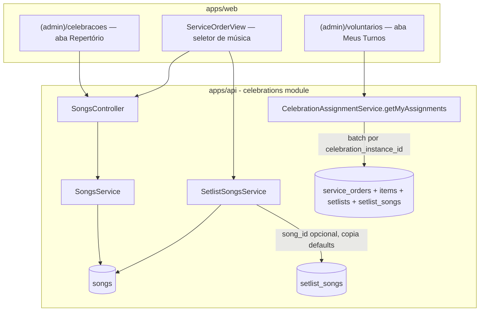

# Repertório do Time de Louvor — Design

**Spec**: `.specs/features/repertorio-louvor/spec.md`
**Status**: Approved

---

## Arquitetura — abordagens consideradas

### Opção A — Estender o módulo `celebrations` existente (recomendada)

`Song` entra como mais uma entidade do domínio de Celebrações (junto de
`Setlist`/`SetlistSong`, que já moram lá). Endpoints novos ficam em
`apps/api/src/celebrations/songs.{controller,service}.ts`, registrados em
`celebrations.module.ts`. No front, o catálogo ganha uma aba dentro da
página que já existe em `(admin)/celebracoes`, e a visão do músico se
pendura na aba **"Meus Turnos"** que já existe em `(admin)/voluntarios`
(`apps/web/src/app/(admin)/voluntarios/page.tsx:292`), que já busca
`GET /volunteers/my-celebration-assignments` e já é acessível a
`volunteer`/`member`.

**Custo:** zero módulo novo, zero tela nova — só extensão de superfícies que
já existem e já têm a gate de papel certa.

### Opção B — Módulo `repertoire` isolado

`Song` vira um bounded module próprio (`apps/api/src/repertoire/`), com
seu próprio controller/service, importado tanto por `celebrations` quanto
(hipoteticamente) por outro domínio no futuro.

**Custo:** um módulo a mais para uma entidade que só faz sentido dentro do
fluxo de Setlist — não há hoje nenhum outro consumidor do catálogo fora de
Celebrações. Adiciona fronteira sem um segundo caso de uso que a justifique.

### Opção C — Tela nova dedicada ao músico (`(admin)/repertorio`)

Uma página nova, fora de `voluntarios`, juntando escala + repertório num
lugar só, pensada já com a cara de "o que o app mobile mostraria".

**Custo:** fragmenta onde o voluntário olha a própria escala — parte fica
em "Meus Turnos" (status, confirmar/recusar) e parte numa tela nova
(repertório), para o mesmo dado. Duplica a busca de `my-celebration-assignments`
em dois lugares do front.

### Recomendação

**Opção A.** Reaproveita módulo, telas e gates de permissão que já existem
e já resolvem exatamente esse recorte de acesso (RolesGuard com
`volunteer`/`member` no endpoint de escala pessoal). A "prontidão para
mobile" citada no problema é uma propriedade do **endpoint** (JSON estável,
sem acoplamento a HTML), não da tela — o endpoint já nasce pronto para isso
na opção A, sem precisar de uma tela nova hoje.



---

## Code Reuse Analysis

### Existing Components to Leverage

| Component | Location | How to Use |
|---|---|---|
| `SetlistSongsService`/`CreateSetlistSongDto` | `apps/api/src/celebrations/setlist-songs.{service,controller}.ts`, `dto/create-setlist-song.dto.ts` | Estender: `song_id` opcional no DTO, service copia `key`/`bpm`/`link` do `Song` quando presente e o campo correspondente não veio no body |
| `CelebrationAssignmentService.getMyAssignments` | `apps/api/src/celebrations/celebration-assignment.service.ts:319` | Estender a query e o shape de retorno para incluir `setlist` por assignment, batched (ver Componentes) |
| Gate de papéis de edição da Setlist | `apps/web/src/app/(admin)/celebracoes/page.tsx:61-66` (`canEdit`, `canAddSongs`) | Reaproveitar a mesma lista de papéis para a aba de catálogo — é a decisão já tomada (mesma gate de hoje) |
| `VOLUNTEER_ROLES` + `RolesGuard` no endpoint de escala pessoal | `apps/api/src/celebrations/celebration-volunteer.controller.ts:12-19` | Nenhuma mudança de gate — a resposta do mesmo endpoint só ganha um campo a mais |
| Padrão RLS `tenant_congregation_isolation` + `app_congregation_allowed()` | `apps/api/prisma/migrations/002_rls_celebration_schedules.sql`, `003_rls_admin_write.sql` | Novo script `007_rls_songs.sql` já nasce usando `app_congregation_allowed()` nos dois lados — não precisa do ciclo "criar errado → 003 conserta", porque 003 já existe e roda antes |
| Tabela/cartão de "Meus Turnos" | `apps/web/src/app/(admin)/voluntarios/page.tsx:310-352` | Cada cartão de assignment ganha uma seção condicional de repertório quando `a.setlist` vier preenchido |
| `ServiceOrderView` (componente de montagem da OC) | `apps/web/src/components/celebrations/ServiceOrderView.tsx` | Form de adicionar `SetlistSong` ganha um combobox "escolher do catálogo" antes dos campos livres |

### Integration Points

| Sistema | Método de integração |
|---|---|
| Prisma / Postgres | Novo model `Song`, campo `song_id` em `SetlistSong` (FK `onDelete: SetNull`), migration comum do Prisma |
| RLS (fora do Prisma) | Novo script `007_rls_songs.sql`, adicionado ao pipeline do `bootstrap-db.sh` (passo 3, depois de 003, seguindo o padrão de `if [ -f ... ]` de 004/005/006) |
| `apps/web` → `apps/api` | Mesma convenção de todo o resto do front: `useEffect` + `axios` via `src/lib/api.ts`, sem react-query |

---

## Components

### `SongsController` / `SongsService` (novo)

- **Purpose**: CRUD do catálogo de músicas por congregação.
- **Location**: `apps/api/src/celebrations/songs.controller.ts`, `songs.service.ts`, `dto/create-song.dto.ts`, `dto/update-song.dto.ts`
- **Interfaces**:
  - `POST /songs` — `@Roles('admin_congregation','pastor','tenant_admin','ministry_leader')` — cria `Song`
  - `GET /songs` — qualquer papel com acesso ao módulo de Celebrações — lista por congregação, ordenado por título, com `last_played_at` calculado (REPERT-04)
  - `PATCH /songs/:id` — mesma gate de criação — atualiza campos
  - `DELETE /songs/:id` — mesma gate de criação — remove (`SetlistSong.song_id` vira `NULL` via `onDelete: SetNull`, sem bloquear)
- **Dependencies**: `PrismaService`, `TenantContextInterceptor` (padrão já aplicado a toda rota autenticada)
- **Reuses**: mesmo padrão de DTO/validação de `create-setlist-song.dto.ts` (título obrigatório, bpm `@Min(1)`, link `@IsUrl()`)

### `SetlistSongsService` (estendido)

- **Purpose**: ao criar uma `SetlistSong`, se `song_id` vier no DTO, buscar o `Song` (validando tenant/congregação) e usar `key`/`bpm`/`link` dele como default para os campos que não vieram explícitos no body.
- **Location**: `apps/api/src/celebrations/setlist-songs.service.ts` (arquivo existente)
- **Interfaces**: assinatura de `create()` não muda — só o corpo aceito pelo DTO ganha `song_id?: string`
- **Reuses**: a validação de posse de `Setlist` já existente no service

### `CelebrationAssignmentService.getMyAssignments` (estendido)

- **Purpose**: anexar, a cada assignment, o repertório (`SetlistSong[]`) do `ServiceOrderItem` da mesma `celebration_instance_id` e mesmo `ministry_id` da `CelebrationMinistry` do assignment — ou `null` se não houver `ServiceOrder`/item/setlist correspondente.
- **Location**: `apps/api/src/celebrations/celebration-assignment.service.ts:319`
- **Interfaces**: `getMyAssignments(...)` passa a devolver, por item, um campo `setlist: { songs: { id, sequence, title, key, bpm, link }[] } | null`
- **Implementação (evita N+1)**: depois de buscar `assignments` (query já existente), coletar o conjunto de `celebration_instance_id` envolvidos, buscar `ServiceOrder.findMany({ where: { celebration_instance_id: { in: [...] } }, include: { items: { include: { setlist: { include: { songs: true } } } } } })` numa única query, e casar em memória por `(celebration_instance_id, ministry_id)`.
- **Reuses**: a query e o shape existentes de `getMyAssignments`; só adiciona uma segunda query batched + um `map` em memória.

---

## Data Models

### `Song` (novo)

```prisma
model Song {
  id              String   @id @default(uuid())
  tenant_id       String
  congregation_id String
  title           String
  key             String?
  bpm             Int?
  link            String?
  notes           String?
  created_at      DateTime @default(now())
  updated_at      DateTime @updatedAt

  tenant       Tenant        @relation(fields: [tenant_id], references: [id], onDelete: Cascade)
  congregation Congregation  @relation(fields: [congregation_id], references: [id], onDelete: Cascade)
  setlistSongs SetlistSong[]

  @@index([tenant_id, congregation_id])
  @@index([tenant_id, id])
  @@map("songs")
}
```

**Relationships**: 1 `Song` → N `SetlistSong` (histórico de uso). `Tenant`/`Congregation` ganham `songs Song[]` nas suas listas de relações (mesmo padrão de `setlists`/`setlistSongs` já presentes nas linhas 69-70 e 126-127 do schema).

### `SetlistSong` (alterado)

```prisma
model SetlistSong {
  // ...campos existentes inalterados (sequence, title, key, bpm, link, notes)
  song_id String?

  song Song? @relation(fields: [song_id], references: [id], onDelete: SetNull)
}
```

Nenhum campo existente muda de tipo ou obrigatoriedade — `song_id` é puramente aditivo.

---

## Error Handling Strategy

| Cenário | Tratamento | Impacto pro usuário |
|---|---|---|
| `song_id` de outra congregação/tenant no `CreateSetlistSongDto` | Service valida posse (`findFirst` com `tenant_id`+`congregation_id`) antes de usar; se não achar, `NotFoundException` | 404, mensagem "Música não encontrada" |
| Papel sem permissão tenta CRUD no catálogo | `RolesGuard` nega antes do controller | 403, igual ao padrão de toda rota com `@Roles` |
| Assignment sem `ServiceOrder`/item/setlist correspondente | `setlist: null` na resposta, sem exceção | Front mostra "repertório ainda não publicado" em vez de erro |
| Remoção de `Song` referenciada | `onDelete: SetNull` no schema — Postgres cuida, sem lógica extra no service | Setlists antigas mantêm os campos copiados; só perdem o vínculo |

---

## Risks & Concerns

| Concern | Location | Impact | Mitigation |
|---|---|---|---|
| RLS de tabela nova fora do histórico do Prisma é fácil de esquecer (é o padrão nº 1 de erro já documentado em `docs/PENDENCIAS.md` nº 1 e nº 7) | `prisma/migrations/007_rls_songs.sql` (novo) | Sem RLS, `songs` fica sem isolamento — outra congregação/tenant vazaria | Escrever a policy usando `app_congregation_allowed()` desde a criação (não o padrão antigo que 003 precisou corrigir depois) + reusar a asserção genérica já existente no passo 7 do `bootstrap-db.sh` (ela varre `pg_policies` por nome, não por tabela — cobre `songs` automaticamente sem editar o script de verificação) |
| `getMyAssignments` hoje é uma função só, já com bastante lógica; adicionar uma segunda query + merge em memória aumenta a complexidade ciclomática do método | `celebration-assignment.service.ts:319-370` | Legibilidade | Extrair a busca de repertório para um método privado `attachSetlists(assignments)` dentro do mesmo service, não misturar no corpo principal |
| Nenhum teste de RLS cobre hoje o padrão "tabela nova criada corretamente desde o início" (todas as existentes passaram pelo ciclo criar-errado→corrigir) | `test/rls/` | Não é regressão, mas é a primeira vez que o padrão correto nasce direto — vale um teste específico confirmando `USING = WITH CHECK` em `songs` desde a primeira aplicação | Task de RLS inclui teste em `test/rls/isolation.spec.ts` (ou spec próprio) exercitando `songs` nos dois sentidos (congregação irmã nega leitura para `admin_congregation`, `tenant_admin` lê e escreve) |

> Nenhum outro risco de segurança/perf identificado — volume de dados (catálogo de músicas por congregação) é pequeno, sem paginação necessária na V1.

---

## Tech Decisions

| Decisão | Escolha | Racional |
|---|---|---|
| Onde mora o módulo | Dentro de `celebrations`, não um módulo novo | Ver Opção A acima — único consumidor do catálogo é o fluxo de Setlist |
| Campo `song_id` obrigatório? | Opcional | Decisão do usuário (Specify) |
| Escopo do catálogo | Por congregação (`tenant_id`+`congregation_id`), sem `ministry_id` | Decisão do usuário (Specify) |
| Gate de edição do catálogo | Mesma de hoje (`admin_congregation`,`pastor`,`tenant_admin`,`ministry_leader`) | Decisão do usuário (Specify) — sem novo conceito de "pertencer ao ministério de louvor" |
| Onde a visão do músico aparece no `web` | Extensão da aba "Meus Turnos" existente em `(admin)/voluntarios`, não uma tela nova | Reaproveita tela e gate já corretas para esse papel (ver Opção A) |
| "Última vez tocada" | Calculado on-the-fly no `GET /songs` via join, sem coluna redundante | Evita campo que pode dessincronizar (violaria REPERT-04 se ficasse desatualizado); volume pequeno não justifica cache |
| `007_rls_songs.sql` usa `app_congregation_allowed()` desde o início | Sim, em vez de replicar o padrão antigo de `002` (que dependia de `003` corrigir depois) | `003` já existe e roda antes de qualquer script novo no pipeline — não há razão para nascer com o defeito já corrigido em outro lugar |

> **Decisão de projeto (novo `AD-001`)**: toda tabela nova de congregação, a partir de agora, escreve sua policy `tenant_congregation_isolation` usando `app_congregation_allowed()` diretamente nos dois lados (`USING`/`WITH CHECK`) desde a primeira versão do script — nunca replicando o padrão pré-`003` (`OR tenant_admin OR denomination_admin` inline). Registrado em `.specs/STATE.md`.

---
