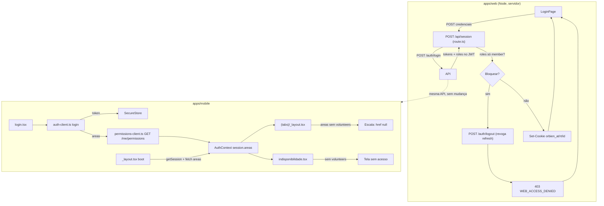

# Restrição de acesso do piso (`member`) — Design

**Spec**: `.specs/features/restricao-acesso-piso-member/spec.md`
**Status**: Draft

---

## Architecture Overview

Duas mudanças independentes, sem tabela nova nem migration — pura reutilização de duas
peças que já existem (`payload.roles` do JWT, e `GET /me/permissions` / `product-areas.ts`),
cada uma no seu front:

Nenhuma mudança na API (`apps/api`). O gate do web usa dado que a API já devolve no login
(`roles` no JWT); o gate do mobile usa um endpoint que a API já expõe
(`GET /me/permissions`) e que só o web consumia até aqui.

---

## Code Reuse Analysis

### Existing Components to Leverage

| Component | Location | How to Use |
|---|---|---|
| `decodeJwtPayload` | `apps/web/src/lib/auth.ts` | Já usado em `route.ts:83` — só ler `payload.roles` logo depois |
| Padrão try/catch silencioso do `DELETE` | `apps/web/src/app/api/session/route.ts:100-113` | Mesmo padrão pro `fetch(/auth/logout)` de revogação no bloqueio — falha de rede não pode travar o 403 |
| `PRODUCT_AREA_READ_ROLES` / `GET /me/permissions` | `apps/api/src/auth/product-areas.ts`, já servido | Nenhuma mudança — só um segundo consumidor (mobile) |
| `apiClient` + `authenticatedRequest` | `apps/mobile/src/lib/api/client.ts`, `lib/auth/auth-client.ts:186-201` | Novo client de permissões chama por aqui, igual `escala-client.ts` faz hoje |
| `decodeJwtPayload` (mobile) | `apps/mobile/src/lib/auth/jwt.ts` | **Não** usar pra decidir área — o payload não tem `areas`, só `roles`, e o comentário do arquivo já avisa que role do JWT não é quem decide acesso. Áreas vêm só de `/me/permissions` |
| `Stack.Protected` | `apps/mobile/src/app/_layout.tsx:108,126` | Padrão de guard já estabelecido (ver comentário de bug de boot nas linhas 33-43) — não usar early-return fora do navigator |
| Testes existentes | `_layout.test.tsx` (tabs), `login.test.tsx`, `navigation-boot.test.tsx`, `route.test.ts` (web) | Estender, não recriar |

### Integration Points

| System | Integration Method |
|---|---|
| `GET /me/permissions` (API) | Novo client mobile chama exatamente como `session.ts:fetchAreas` do web — mesmo contrato, mesmo fail-open (`try/catch` → `null`) |
| `POST /auth/logout` (API) | `route.ts` já a usa no `DELETE`; o bloqueio do `POST` passa a usá-la também, com o mesmo `try/catch` silencioso |

---

## Components

### `apps/web/src/app/api/session/route.ts` (POST) — alterado

- **Purpose**: Recusar sessão web pra conta cujo único papel é `member`, sem gravar cookie.
- **Location**: `apps/web/src/app/api/session/route.ts`
- **Mudança**: depois de `const payload = decodeJwtPayload(pair.access_token)` e da guarda
  existente (`if (!payload || !body.email)`), inserir:
  - `const hasNonMemberRole = payload.roles.some((r) => r !== 'member')`
  - `if (!hasNonMemberRole) { await revokeRefreshToken(pair.refresh_token); return NextResponse.json({ code: 'WEB_ACCESS_DENIED', message: 'Este acesso é apenas pelo aplicativo Orbien.' }, { status: 403 }); }`
- **Nova função auxiliar** `revokeRefreshToken(token: string)` em `lib/session.ts`, espelhando
  o `try { fetch(/auth/logout) } catch {}` que já existe no `DELETE` deste mesmo arquivo —
  extraída porque o `DELETE` também poderia passar a usá-la (não obrigatório nesta entrega,
  mas evita duplicar o `fetch` inline).
- **Dependencies**: nenhuma nova.
- **Reuses**: `decodeJwtPayload`, `BACKEND_URL`.

### `apps/web/src/app/(public)/login/page.tsx` — alterado

- **Purpose**: Mostrar mensagem específica quando o login é recusado por `WEB_ACCESS_DENIED`.
- **Mudança no `catch`**: adicionar um `else if` antes do `else if (err.response.status === 401)`
  (ou depois, ordem não importa — os status não colidem):
  `else if (err.response.status === 403 && (err.response.data as { code?: string })?.code === 'WEB_ACCESS_DENIED') setError(err.response.data.message ?? 'Este acesso é apenas pelo aplicativo Orbien.')`
- **Reuses**: `axios.isAxiosError`, o mesmo bloco de `if/else` existente.

### `apps/mobile/src/lib/permissions/permissions-client.ts` — novo

- **Purpose**: Buscar `GET /me/permissions`, mesmo contrato do web.
- **Location**: `apps/mobile/src/lib/permissions/permissions-client.ts` (pasta nova — não há
  `lib/permissions` hoje; `lib/escala` é o par mais próximo como referência de estilo).
- **Interfaces**: `fetchAreas(): Promise<string[] | null>` — chama
  `authenticatedRequest('get', '/me/permissions')` (mesma função de `auth-client.ts:186`, que
  já injeta token e já tem a lógica de renovar-e-repetir em 401), `try/catch` externo devolve
  `null` em qualquer falha (fail-open, AC P1-story-2 #4).
- **Dependencies**: `authenticatedRequest` de `lib/auth/auth-client.ts`.
- **Reuses**: o mesmo padrão de `escala-client.ts` pra chamar a API autenticada.

### `apps/mobile/src/lib/auth/auth-provider.tsx` — alterado

- **Purpose**: Guardar as áreas da sessão corrente, buscadas uma vez no login e uma vez na
  restauração de boot — nunca persistidas em SecureStore (sempre frescas, mesma filosofia do
  web: se a chamada falhar, `areas` fica `null` e quem decide de verdade continua sendo a
  API).
- **Mudança**: `Session`/estado do contexto ganha `areas: string[] | null`. Depois que
  `login()` resolve e depois que `getSession()` resolve no boot (ambos já setam
  `status: "authenticated"`), disparar `fetchAreas()` sem bloquear a UI (`status` já vira
  `authenticated` antes da resposta de áreas chegar — a tab bar nasce com `areas: null`,
  que é fail-open, e atualiza quando a resposta chegar).
- **Reuses**: `fetchAreas` novo, fluxo de `status` existente.

### `apps/mobile/src/app/(tabs)/_layout.tsx` — alterado

- **Purpose**: Esconder a aba "Escala" (`name="index"`) de quem não tem `volunteers`.
- **Mudança**: ler `const { session } = useAuth()`; calcular
  `const showEscala = session?.areas == null || session.areas.includes('volunteers')`
  (fail-open: `null` ainda mostra); no `<Tabs.Screen name="index" .../>`, adicionar
  `options={{ ..., href: showEscala ? undefined : null }}` — `href: null` é o padrão do Expo
  Router pra tirar uma tela da tab bar sem removê-la do navigator (mantém a regra "máximo 5
  abas" do STYLE-GUIDE como contagem de rotas declaradas, não de abas visíveis).
- **Reuses**: `useAuth`, componente existente — não vira lista de config, só ganha uma prop
  condicional.

### `apps/mobile/src/app/indisponibilidade.tsx` — alterado

- **Purpose**: Bloquear a tela para quem chegou nela sem `volunteers` (deep link, estado
  antigo).
- **Mudança**: no topo do componente, antes do `useEffect` que busca `getUnavailability`,
  `const { session } = useAuth(); if (session?.areas && !session.areas.includes('volunteers')) return <SemAcesso />;`
  — só bloqueia quando `areas` **existe e não inclui** `volunteers` (fail-open mantido: `null`
  passa). `<SemAcesso />` é um componente pequeno novo (texto + botão voltar), não precisa de
  nada além disso.
- **Reuses**: padrão de early-return condicional já comum em telas do mobile.

---

## Data Models

Nenhum. Sem migration, sem tabela nova — a feature inteira lê dado que já existe
(`role_assignments` via JWT, `PRODUCT_AREA_READ_ROLES` via `/me/permissions`).

---

## Error Handling Strategy

| Error Scenario | Handling | User Impact |
|---|---|---|
| Conta só-`member` loga no web | `route.ts` responde 403 antes de gravar cookie | Tela de login mostra "Este acesso é apenas pelo aplicativo Orbien." |
| Revogação do refresh token falha (API fora) | `try/catch` silencioso, resposta 403 segue normal | Nenhum — usuário só vê a mensagem de bloqueio, igual ao caso feliz |
| `GET /me/permissions` falha no mobile (rede, token vencido) | `fetchAreas()` devolve `null` | Aba Escala aparece (fail-open); tela de Indisponibilidade também abre normal — API decide de verdade nas rotas de voluntariado |
| Conta com `member` + outro papel loga no web | `hasNonMemberRole` é `true` | Login normal, nenhuma mudança |

---

## Risks & Concerns

| Concern | Location | Impact | Mitigation |
|---|---|---|---|
| `(tabs)/_layout.test.tsx` afirma um teto de 5 abas | `apps/mobile/src/__tests__/app/(tabs)/_layout.test.tsx` | Teste existente pode quebrar se passar a contar só abas *visíveis* em vez de rotas declaradas | Tasks inclui atualizar esse teste explicitamente: com `areas: ['volunteers']` continuam 5 visíveis; sem, 4 visíveis + 1 rota oculta (`href: null`) — não remove a tela, só a aba |
| `auth-provider.tsx` ganha uma chamada de rede a mais no boot | `apps/mobile/src/lib/auth/auth-provider.tsx` | Se `fetchAreas` demorar, não pode atrasar a splash/transição pra tabs | Design explícito: `status` vira `authenticated` **antes** da resposta de áreas chegar; `areas` começa `null` (fail-open) e atualiza depois, sem bloquear render |
| Mensagem de erro nova na tela de login depende de `err.response.data.code` | `apps/web/src/app/(public)/login/page.tsx` | Se a API/route.ts mudar o formato do corpo de erro no futuro sem avisar o front, a mensagem cai pro `else` genérico (não quebra, só perde a mensagem específica) | Aceitável — mesmo padrão de acoplamento fraco que os outros `if/else` de status já têm ali |

> Nenhum outro risco de segurança: o bloqueio do web é um gate de produto (UX), não uma
> fronteira de dado sensível — quem protege dado continua sendo `@Roles`/RLS na API, que não
> muda nesta feature.

---

## Tech Decisions

| Decision | Choice | Rationale |
|---|---|---|
| Onde guardar `areas` no mobile | Só em memória (Context), nunca em SecureStore | Mesma filosofia do web (`fetchAreas` sempre fresco); evita permissão desatualizada sobrevivendo a um restart do app |
| Como esconder a aba Escala | `options={{ href: null }}` no `Tabs.Screen` existente, não remover o `<Tabs.Screen>` da árvore | É o padrão do Expo Router pra isso; remover o elemento condicionalmente arriscaria a regra de 5 abas do STYLE-GUIDE virar `undefined` em runtime se `index` for a rota default |
| Guard da tela de Indisponibilidade | Early-return no topo do componente, antes do fetch de dados | Mais simples que um wrapper/HOC novo; escopo é uma tela só |

Nenhuma decisão aqui cria um padrão de projeto novo o bastante pra virar `AD-NNN` em
`.specs/STATE.md` — é reuso direto de mecanismos já documentados lá (nenhum conflito com
decisões ativas existentes).
