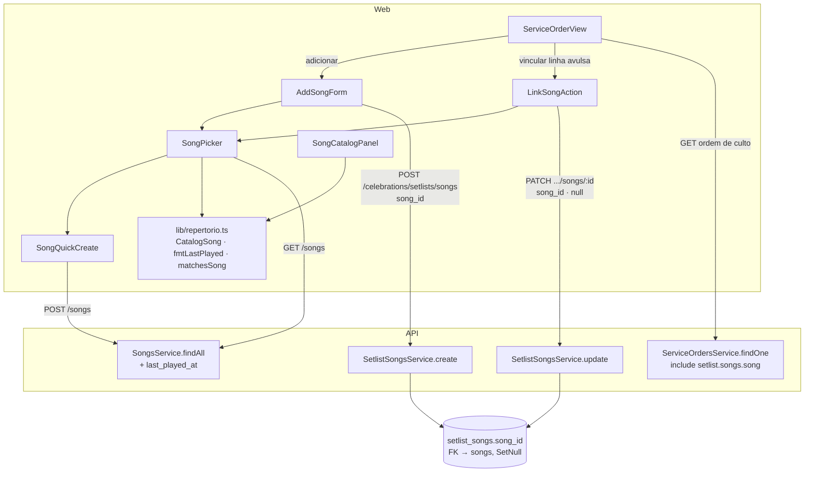

# Conexão Setlist ↔ Repertório — Design

**Spec**: `.specs/features/setlist-repertorio-conexao/spec.md`
**Status**: Approved (abordagem confirmada pelo usuário)

---

## Conformidade com `.specs/STATE.md` (`## Decisions`)

| Decisão | Status | Como este design se posiciona |
|---|---|---|
| **AD-001** — tabela nova de congregação nasce com `app_congregation_allowed()` nos dois lados | active | **Não se aplica**: esta feature não cria tabela nem coluna. `song_id` já existe em `setlist_songs`; `songs` já tem RLS forte em `007_rls_songs.sql`. Nenhum script `00N_rls_*.sql` novo, nenhuma mudança no `bootstrap-db.sh` |
| **AD-002** — `apps/mobile` com variantes por build profile | active | **Não se aplica**: nada em `apps/mobile` é tocado |

Nenhuma decisão ativa é contrariada; nada a superseder.

**Lições confirmadas**: `lessons.py list --status confirmed` → nenhuma no store.

---

## Architecture Overview

Duas frentes, uma dependente da outra só no contrato:

- **API** — corrige a persistência de `song_id` no PATCH e passa a devolver a
  referência do `Song` vinculado nas leituras de setlist. Nenhuma migration:
  a coluna e a FK já existem.
- **Web** — extrai um `SongPicker` compartilhado (busca + contexto + atalho de
  cadastro) e o consome em dois pontos do `ServiceOrderView`: o form de
  adicionar música e a nova ação de vincular uma avulsa.



---

## Code Reuse Analysis

### Existing Components to Leverage

| Component | Location | How to Use |
|---|---|---|
| `SearchInput` | `apps/web/src/components/ui/SearchInput.tsx` | Import direto no `SongPicker` — já traz ícone, debounce (300ms) e o estilo do repo. Nos testes, passar `debounce={0}` para não precisar de timer falso |
| `CatalogSong` + `fmtLastPlayed` | `apps/web/src/components/repertorio/SongCatalogPanel.tsx:15-36` | **Mover** para `apps/web/src/lib/repertorio.ts` (padrão de `lib/groupTypes.ts`, `lib/ministryTree.ts`, com teste irmão) e importar nos dois componentes. Hoje `ServiceOrderView.tsx:117-121` redeclara uma versão *mais estreita* de `CatalogSong` — essa duplicata é apagada |
| `apiErrorMessage` | `apps/web/src/lib/api-error.ts` | Mensagem de erro do `POST /songs` no cadastro inline (mesmo uso que `SongCatalogPanel`) |
| `Input`, `Label`, `Button` | `apps/web/src/components/ui/` | Campos do cadastro inline. Atenção à regra do `CLAUDE.md`: `<Button>` só para primário (com `bg-navy`); ícone/link usa `<button>` puro |
| `handleSelectSong` | `ServiceOrderView.tsx:151-163` | A lógica de pré-preencher título/tom/BPM/link (incluindo o fallback `key ?? key_alt`) migra para o callback do `SongPicker`; o comentário REPERT-02 vai com ela |
| `SetlistSongsService.resolveSetlist`/`findOne` | `apps/api/src/celebrations/setlist-songs.service.ts:13-18,55-61` | `update` já chama `findOne` para garantir posse da `SetlistSong`; a resolução de `song_id` reaproveita a consulta que `create` já faz (`:22-29`) — extrair para um `resolveCatalogSong` privado usado pelos dois |
| `SongsService.findAll` (com `last_played_at`) | `apps/api/src/songs/songs.service.ts:38+` | Consumido como está — já devolve todos os links e `last_played_at`. Nenhuma mudança no módulo `songs` |

### Integration Points

| System | Integration Method |
|---|---|
| `GET /songs` | Fonte única do catálogo no `SongPicker`; sem `?q=` — filtro é client-side (spec, Assumptions) |
| `POST /songs` | Cadastro inline; mesma gate de papéis que já governa `canAddSongs` no front |
| `PATCH /celebrations/setlists/songs/:id` | Ganha persistência de `song_id`; contrato do DTO não muda (o campo já era aceito) |
| `GET` da ordem de culto (`ServiceOrdersService.findOne`) | Ganha `include` da relação `song` dentro de `setlist.songs` |
| Banco | Zero DDL. `setlist_songs.song_id` (FK `SetNull`) e RLS de `songs`/`setlist_songs` intactos |

---

## Components

### `lib/repertorio.ts` (novo)

- **Purpose**: casa única do tipo do catálogo e dos helpers de exibição/busca, sem componente no meio.
- **Location**: `apps/web/src/lib/repertorio.ts` (+ `repertorio.test.ts`)
- **Interfaces**:
  - `interface CatalogSong` — movida de `SongCatalogPanel` sem alteração de campos
  - `fmtLastPlayed(iso: string | null): string` — movida de `SongCatalogPanel`
  - `normalizeForSearch(value: string): string` — minúsculas + `normalize("NFD")` com remoção de diacríticos, para atender SETREP-02 AC2 (busca insensível a acento)
  - `matchesSong(song: CatalogSong, term: string): boolean` — termo vazio/só espaço ⇒ `true` (SETREP-02, Edge Case)
  - `songKey(song: CatalogSong): string | null` — `key ?? key_alt ?? null`, a regra que hoje está solta em `handleSelectSong`
- **Dependencies**: nenhuma
- **Reuses**: `Intl`/`toLocaleDateString` como `fmtLastPlayed` já faz

### `SongPicker` (novo)

- **Purpose**: escolher uma música do catálogo com busca e contexto, com atalho para cadastrar quando ela não existe.
- **Location**: `apps/web/src/components/repertorio/SongPicker.tsx` (+ `SongPicker.test.tsx`)
- **Interfaces**:
  - `<SongPicker canCreate={boolean} onSelect={(song: CatalogSong) => void} onCancel?={() => void} />`
  - Carrega `GET /songs` em `useEffect` + axios (padrão do repo — **não** react-query, ver `CLAUDE.md`), com guarda de `cancelled` no cleanup como `SongCatalogPanel` faz
  - Estados cobertos: carregando, catálogo vazio (AC5), busca sem resultado (AC3), erro de carga (AC6)
- **Dependencies**: `SearchInput`, `lib/repertorio`, `api`, `apiErrorMessage`, `SongQuickCreate`
- **Reuses**: `SearchInput` inteiro; a formatação de última vez tocada de `SongCatalogPanel`

### `SongQuickCreate` (novo)

- **Purpose**: criar um `Song` sem sair da tela e devolvê-lo já selecionado.
- **Location**: mesmo arquivo do `SongPicker` (componente interno, não exportado) — é acoplado ao fluxo dele e não tem uso próprio
- **Interfaces**: `onCreated(song: CatalogSong): void`, `onCancel(): void`
- **Dependencies**: `Input`, `Label`, `Button`, `api`, `apiErrorMessage`
- **Reuses**: os mesmos campos e validação de título do form de `SongCatalogPanel` (título obrigatório com `trim`, BPM numérico, links opcionais) — sem editar/remover, que continuam só em `/repertorio` (spec, Out of Scope)
- **Nota**: `POST /songs` devolve o `Song` **sem** `last_played_at` (o campo só existe no `findAll`). O componente normaliza para `last_played_at: null` ao montar o `CatalogSong` — música recém-criada nunca foi tocada, então o valor é correto, não um placeholder

### `AddSongForm` (alterado)

- **Location**: `apps/web/src/components/celebrations/ServiceOrderView.tsx`
- **Mudança**: o `<select>` nativo (`:196-209`) e o `useEffect` de carga do catálogo (`:142-147`) saem; entram o `SongPicker` e o estado `selectedSong`. O `<select>` de tom alternativo (`:215-226`) permanece — é decisão da escala, não do catálogo. `handleSelectSong` passa a receber o `CatalogSong` do picker em vez de procurar por id numa lista local
- **Invariante a não regredir**: o POST continua enviando `song_id` junto dos campos editados, para preservar REPERT-02 AC2 (override do usuário prevalece com vínculo mantido)

### `LinkSongAction` (novo, interno ao `ServiceOrderView`)

- **Purpose**: vincular ao catálogo uma `SetlistSong` sem `song_id` (e desvincular uma vinculada).
- **Location**: `apps/web/src/components/celebrations/ServiceOrderView.tsx`
- **Interfaces**: botão de ícone com `aria-label` na linha da música, visível só quando `canAddSongs && !isReadOnly` (abordagem confirmada: ícone discreto, ao lado do remover). Aciona o `SongPicker` inline sob a linha; ao escolher, faz `PATCH /celebrations/setlists/songs/:id` com **apenas** `song_id` e recarrega a ordem via o mesmo `afterAddSong` já existente
- **Dependencies**: `SongPicker`, `api`
- **Reuses**: `afterAddSong` (recarga sem reload de página, SETREP-01 AC5) e o padrão de erro/toast já no componente

### `SetlistSongsService` (alterado)

- **Location**: `apps/api/src/celebrations/setlist-songs.service.ts`
- **Mudança**:
  - extrair `resolveCatalogSong(tenantId, congregationId, songId)` privado — a consulta que `create` já faz em `:22-29`, com `NotFoundException('Música não encontrada')`
  - `update`: quando `dto.song_id !== undefined`, resolver o `Song` (quando não-nulo) **antes** do `update` e incluir `song_id` no `data`. `song_id: null` grava `NULL` sem consultar catálogo
  - `findAll`/`findOne`: `include: { song: { select: REFERENCE_FIELDS } }`
- **Interfaces**: assinaturas públicas inalteradas; o tipo de retorno de `findAll`/`findOne` ganha a relação
- **Reuses**: `findOne` para posse; `resolveCatalogSong` compartilhado com `create` (elimina a duplicata em vez de criar outra)

### `ServiceOrdersService` (alterado)

- **Location**: `apps/api/src/celebrations/service-orders.service.ts:63-65`
- **Mudança**: `setlist: { include: { songs: { orderBy: { sequence: 'asc' }, include: { song: { select: REFERENCE_FIELDS } } } } }`
- **Reuses**: o `include` já existente — só aprofunda um nível

---

## Data Models

Nenhuma mudança de schema. O contrato de leitura ganha a referência:

```typescript
// Campos da referência do catálogo devolvidos junto da SetlistSong (SETREP-04 AC1).
// Constante compartilhada entre SetlistSongsService e ServiceOrdersService para
// os dois não divergirem.
const SONG_REFERENCE_SELECT = {
  id: true,
  title: true,
  key: true,
  key_alt: true,
  youtube_link: true,
  spotify_link: true,
  cifra_club_link: true,
} as const

// Web
interface SetlistSong {
  id: string
  title: string
  key?: string
  bpm?: number
  link?: string
  sequence: number
  song_id?: string | null           // já existia no banco, agora exposto ao front
  song?: {                          // null quando avulsa ou quando o Song foi removido
    id: string
    title: string
    key: string | null
    key_alt: string | null
    youtube_link: string | null
    spotify_link: string | null
    cifra_club_link: string | null
  } | null
}
```

**Relationships**: `SetlistSong.song_id → Song.id`, FK opcional com `onDelete: SetNull` (`schema.prisma:1192`). Deliberadamente **não** copiamos os três links de referência em colunas novas: o que a escala congela é tom, BPM e o `link` fixado pelo líder; onde ouvir/ver a cifra é atributo da música e é lido do catálogo (spec, Assumptions).

---

## Error Handling Strategy

| Error Scenario | Handling | User Impact |
|---|---|---|
| PATCH com `song_id` de outra congregação/inexistente | `resolveCatalogSong` lança `NotFoundException` **antes** do `update` — a `SetlistSong` não é tocada | 404; a linha da setlist permanece como estava |
| PATCH com `song_id` que não é UUID | `@IsUUID()` do DTO herdado, no `ValidationPipe` | 400 |
| PATCH com `song_id: null` numa avulsa | `data.song_id = null`, sem consulta ao catálogo | 200, no-op efetivo |
| `GET /songs` falha ao abrir o picker | `SongPicker` mostra a mensagem de `apiErrorMessage` e **não** bloqueia o form de texto livre em volta | "Não foi possível carregar o catálogo" + entrada manual segue funcionando |
| `POST /songs` falha (403/4xx/5xx) | `SongQuickCreate` exibe `apiErrorMessage` e preserva o que foi digitado | Erro legível, sem perder o form nem a setlist |
| Título vazio/só espaço no cadastro inline | Bloqueio client-side antes da chamada (`trim()`), espelhando `@IsNotEmpty()` do `CreateSongDto` | "Título é obrigatório", nenhuma requisição |
| `Song` removido do catálogo com setlist antiga apontando | `song_id` já é `NULL` por `SetNull`; `include` devolve `song: null` | Música aparece como avulsa, com os campos históricos preservados |
| PATCH concorrente de duas abas na mesma `SetlistSong` | Último vence, sem lock (spec, dimensão Concurrency) | Nenhum; campo único sem regra dependente |

---

## Risks & Concerns

| Concern | Location (file:line) | Impact | Mitigation |
|---|---|---|---|
| **Bug em produção**: `song_id` aceito pelo DTO e descartado pelo service | `apps/api/src/celebrations/setlist-songs.service.ts:75-84` | PATCH responde 200 sem gravar o vínculo — falha silenciosa, o pior modo de falha | É o alvo de SETREP-01; corrigido na tarefa de API com teste que envia `song_id` e afirma a chamada ao Prisma |
| **Lacuna de teste que deixou o bug passar**: o teste "atualiza todos os campos informados" não envia `song_id` | `apps/api/src/celebrations/setlist-songs.service.spec.ts:200-226` | Cobertura por linha alta com o campo nunca exercitado; o mesmo padrão de teste esconderia a próxima omissão de campo no `update` | O teste passa a incluir `song_id` no dto e na asserção do `data`, cobrindo os três estados (UUID válido, `null`, ausente) |
| Divergência entre o `include` de `ServiceOrdersService` e o de `SetlistSongsService` | `service-orders.service.ts:63-65` e `setlist-songs.service.ts:47-53,57-59` | Front recebe a referência num endpoint e não no outro, com bug intermitente conforme a tela | `SONG_REFERENCE_SELECT` numa constante exportada e importada pelos dois; teste afirma o `select` em cada serviço |
| `ServiceOrderView.tsx` em 789 linhas com teste de 1089 | `apps/web/src/components/celebrations/ServiceOrderView.tsx` | Cada adição encarece a leitura e o teste do arquivo | A abordagem confirmada extrai `SongPicker`/`SongQuickCreate` e os helpers para fora; o arquivo tende a **encolher** (sai o `<select>`, sai o `useEffect` de catálogo, sai o `CatalogSong` duplicado) |
| `CatalogSong` declarado duas vezes, com campos diferentes | `SongCatalogPanel.tsx:15-27` (completo) e `ServiceOrderView.tsx:117-121` (sem os 3 links, sem `notes`, sem `last_played_at`) | A versão estreita é justamente por que os links extras "desaparecem" na OC; qualquer campo novo no catálogo entra em um lugar e não no outro | Tipo único em `lib/repertorio.ts`, importado pelos dois; a declaração local é removida |
| `POST /songs` devolve `Song` sem `last_played_at`, mas o front tipa `CatalogSong` com o campo | `apps/api/src/songs/songs.service.ts:22-36` vs `lib/repertorio.ts` | `undefined` vazando como "última vez tocada" na música recém-criada | `SongQuickCreate` normaliza para `null` explicitamente ao montar o `CatalogSong` (ver Componentes); teste cobre o caso |
| Debounce de 300ms do `SearchInput` em teste | `apps/web/src/components/ui/SearchInput.tsx:19,26-28` | Teste de busca flaky ou lento se depender do timer real | `SongPicker` aceita e repassa `debounce`; os testes usam `debounce={0}` |
| `@Get(':id')` e `@Post('reorder')` no mesmo controller | `apps/api/src/celebrations/setlist-songs.controller.ts:46,62` | Nenhum hoje — os verbos diferem, então `POST /reorder` não colide com `GET /:id` | Nada a fazer; registrado para não ser "corrigido" por engano ao mexer no controller |

---

## Tech Decisions (only non-obvious ones)

| Decision | Choice | Rationale |
|---|---|---|
| Links extras na setlist | Lidos do catálogo pela relação `song`, não copiados em colunas | O congelamento vale para o que a escala confirma (tom/BPM/`link`); referência de onde ouvir é atributo da música. Evita 3 colunas denormalizadas que nada pede para congelar |
| Vincular não reimporta valores | `update` grava só `song_id` | Coerente com o congelamento nos dois sentidos; reimportar sobrescreveria silenciosamente o que o líder digitou |
| Busca do catálogo | Filtro client-side com normalização de acento | `GET /songs` devolve a congregação inteira e não tem `?q=`; endpoint novo não se paga no tamanho de catálogo esperado. Se doer, paginação é feature própria |
| Seletor sem biblioteca de combobox | `SearchInput` + lista em HTML/Tailwind | `apps/web` não tem combobox em uso; dependência nova para um campo é custo desproporcional |
| Cadastro inline cria, mas não edita nem remove | Só `POST /songs` a partir da OC | Preserva a fronteira declarada em `celebracoes/page.tsx:66-69` (a OC consome o repertório, `/repertorio` o administra) sem manter o beco sem saída do catálogo vazio |
| `resolveCatalogSong` compartilhado entre `create` e `update` | Extração, não segunda consulta | A duplicata seria a origem natural de divergência de mensagem/escopo entre criar e vincular |

> **Project-level decisions:** nenhuma desta tabela vira `AD-NNN` — todas são locais à feature. A regra "referência do catálogo é lida, dado confirmado da escala é copiado" só se tornaria decisão de projeto se outra feature precisasse do mesmo julgamento; hoje não há segunda ocorrência.
